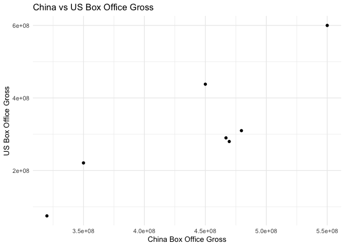
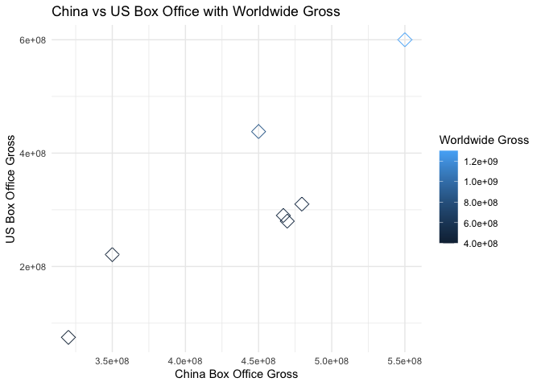
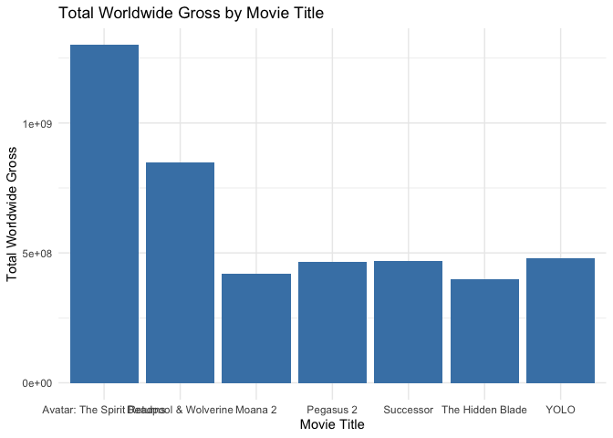
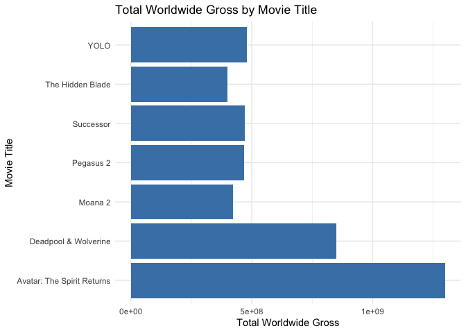
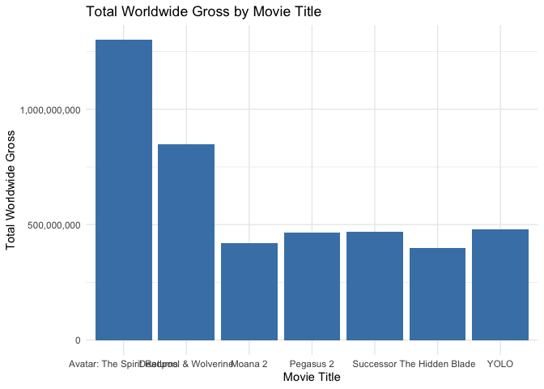
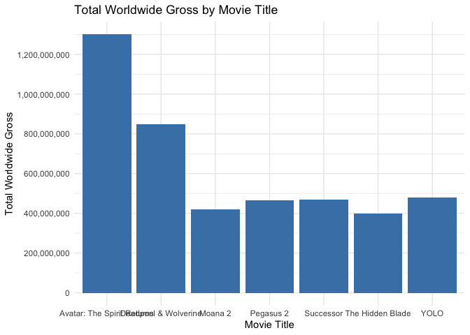
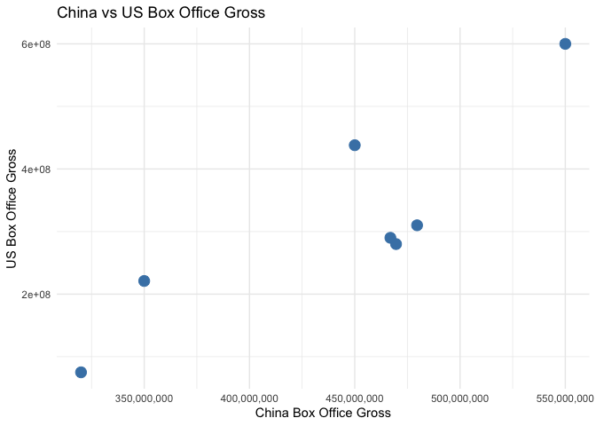
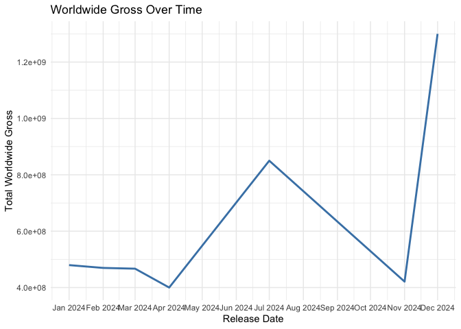

Big Data: Data Collection and Wrangling
================
Dr. Ayse D. Lokmanoglu
Lecture 2, (B) Jan 29, (A) Feb 2

## R Exercises

------------------------------------------------------------------------

### 1. Create Data Frames

- We can create our own or use ones already in tidy (e.g., `mtcars`,
  `iris`)

``` r
df <- data.frame(
  Movie_Title = c(
    "YOLO", "Successor", "Pegasus 2", "Deadpool & Wolverine", "Moana 2", 
    "The Hidden Blade", "Avatar: The Spirit Returns"
  ),
  Release_Date = c(
    "January 2024", "February 2024", "March 2024", "July 2024", 
    "November 2024", "April 2024", "December 2024"
  ),
  China_Box_Office_Gross = c(
    479597304, 469612890, 466930272, 450000000, 350000000, 320000000, 550000000
  ),
  US_Box_Office_Gross = c(
    310000000, 280000000, 290000000, 438000000, 221000000, 75000000, 600000000
  ),
  Total_Worldwide_Gross = c(
    479597304, 469612890, 466930272, 850000000, 421000000, 400000000, 1300000000
  )
)

# Print the dataframe
head(df)
```

    ##            Movie_Title  Release_Date China_Box_Office_Gross US_Box_Office_Gross
    ## 1                 YOLO  January 2024              479597304            3.10e+08
    ## 2            Successor February 2024              469612890            2.80e+08
    ## 3            Pegasus 2    March 2024              466930272            2.90e+08
    ## 4 Deadpool & Wolverine     July 2024              450000000            4.38e+08
    ## 5              Moana 2 November 2024              350000000            2.21e+08
    ## 6     The Hidden Blade    April 2024              320000000            7.50e+07
    ##   Total_Worldwide_Gross
    ## 1             479597304
    ## 2             469612890
    ## 3             466930272
    ## 4             850000000
    ## 5             421000000
    ## 6             400000000

``` r
# Load a built-in dataset
data("mtcars")
head(mtcars)
```

    ##                    mpg cyl disp  hp drat    wt  qsec vs am gear carb
    ## Mazda RX4         21.0   6  160 110 3.90 2.620 16.46  0  1    4    4
    ## Mazda RX4 Wag     21.0   6  160 110 3.90 2.875 17.02  0  1    4    4
    ## Datsun 710        22.8   4  108  93 3.85 2.320 18.61  1  1    4    1
    ## Hornet 4 Drive    21.4   6  258 110 3.08 3.215 19.44  1  0    3    1
    ## Hornet Sportabout 18.7   8  360 175 3.15 3.440 17.02  0  0    3    2
    ## Valiant           18.1   6  225 105 2.76 3.460 20.22  1  0    3    1

------------------------------------------------------------------------

#### Hint: To find built-in datasets

``` r
data()
```

------------------------------------------------------------------------

#### 1.1 We can load from csv, excel or txt

Using URL

``` r
library(readr)

# Load the data from the URL
url <- "https://raw.githubusercontent.com/aysedeniz09/Social_Media_Listening/refs/heads/main/MSC_social_media_list_data/Starbucks_User_Data.csv"
starbucks_user_data <- read_csv(url)

head(starbucks_user_data)
```

    ## # A tibble: 6 × 16
    ##   author_id conversation_id created_at          hashtag lang  like_count mention
    ##       <dbl>           <dbl> <dttm>              <chr>   <chr>      <dbl> <chr>  
    ## 1     30973         1.61e18 2022-12-27 15:43:16 <NA>    en            10 <NA>   
    ## 2     30973         1.60e18 2022-11-29 05:23:55 <NA>    en             9 Mo_sha…
    ## 3     30973         1.59e18 2022-11-28 20:14:09 <NA>    en             2 Mixxed…
    ## 4     30973         1.60e18 2022-11-28 12:51:28 <NA>    en             0 BihhKa…
    ## 5     30973         1.60e18 2022-11-27 15:14:26 <NA>    en             0 BihhKa…
    ## 6     30973         1.60e18 2022-11-24 17:47:24 <NA>    en             1 therea…
    ## # ℹ 9 more variables: quote_count <dbl>, referenced_status_id <dbl>,
    ## #   referenced_user_id <dbl>, reply_count <dbl>, retweet_count <dbl>,
    ## #   row_id <dbl>, status_id <dbl>, text <chr>, type <chr>

From your computer

``` r
starbucks_user_data <- read_csv("data/Starbucks_User_Data.csv")
head(starbucks_user_data)
```

------------------------------------------------------------------------

#### 1.2 You can also load it from your computer using R Studio Files


------------------------------------------------------------------------

### 2. Tidy Data

Tidy data ensures consistency by following these principles:

- Each variable is a column.

- Each observation is a row.

- Each type of observational unit forms a table.

Why Tidy Data?

- Simplifies data manipulation and visualization.

- Facilitates integration with R packages like dplyr and ggplot2.


*image from: Hassan, F. (2023, March 21). Tidy Data in Python. Medium.
<https://blog.devgenius.io/tidy-data-in-python-1f20db66f427>*

------------------------------------------------------------------------

#### 2.1 Tidying Data with tidyr

[Tidy Cheat
Sheet](https://raw.githubusercontent.com/rstudio/cheatsheets/main/tidyr.pdf)

The **pipe** operator `|>`

*N.b. old version of the pipe is `%>%`*

- Instead of nesting multiple functions, you can write the code in a
  sequence that mirrors the flow of data. Shortcut:

- Mac: <span class="inline-button">**Cmd + Shift + M**</span> -
  Windows:<span class="inline-button">**Ctrl + Shift + M**</span>

------------------------------------------------------------------------

### 3. DPLYR

What is dplyr?

- A part of the `tidyverse` package, `dplyr` provides a powerful toolkit
  for data manipulation.
- Designed for efficiency, readability, and compatibility with tidy
  data.
- Key Features:
  - Works seamlessly with the pipe operator (\|\> or %\>%).
  - Offers simple and intuitive verbs for common data manipulation tasks

``` r
library(tidyverse)
library(dplyr)
```

------------------------------------------------------------------------

#### 3.1 Common `dplyr` functions

| Function      | Description                                               |
|---------------|-----------------------------------------------------------|
| `filter()`    | Select rows based on conditions                           |
| `select()`    | Choose specific columns                                   |
| `mutate()`    | Create or transform columns                               |
| `summarize()` | Compute summary statistics for data                       |
| `group_by()`  | Group data by one or more variables for grouped summaries |
| `arrange()`   | Sort rows by one or more variables                        |
| `rename()`    | Rename columns in the dataset                             |

------------------------------------------------------------------------

#### `filter()`

- Select rows based on specific conditions.
- Useful for subsetting your dataset.

``` r
df |> 
  dplyr::filter(China_Box_Office_Gross > 400000000)
```

    ##                  Movie_Title  Release_Date China_Box_Office_Gross
    ## 1                       YOLO  January 2024              479597304
    ## 2                  Successor February 2024              469612890
    ## 3                  Pegasus 2    March 2024              466930272
    ## 4       Deadpool & Wolverine     July 2024              450000000
    ## 5 Avatar: The Spirit Returns December 2024              550000000
    ##   US_Box_Office_Gross Total_Worldwide_Gross
    ## 1            3.10e+08             479597304
    ## 2            2.80e+08             469612890
    ## 3            2.90e+08             466930272
    ## 4            4.38e+08             850000000
    ## 5            6.00e+08            1300000000

------------------------------------------------------------------------

#### `select()`

- Choose specific columns from a dataset.
- Useful for reducing the number of columns for analysis.

``` r
df |> 
  dplyr::select(Movie_Title, Total_Worldwide_Gross)
```

    ##                  Movie_Title Total_Worldwide_Gross
    ## 1                       YOLO             479597304
    ## 2                  Successor             469612890
    ## 3                  Pegasus 2             466930272
    ## 4       Deadpool & Wolverine             850000000
    ## 5                    Moana 2             421000000
    ## 6           The Hidden Blade             400000000
    ## 7 Avatar: The Spirit Returns            1300000000

------------------------------------------------------------------------

#### `mutate()`

- Create or transform columns.
- Add calculated columns to your dataset.

``` r
df |> 
  mutate(Profit = Total_Worldwide_Gross - US_Box_Office_Gross)
```

    ##                  Movie_Title  Release_Date China_Box_Office_Gross
    ## 1                       YOLO  January 2024              479597304
    ## 2                  Successor February 2024              469612890
    ## 3                  Pegasus 2    March 2024              466930272
    ## 4       Deadpool & Wolverine     July 2024              450000000
    ## 5                    Moana 2 November 2024              350000000
    ## 6           The Hidden Blade    April 2024              320000000
    ## 7 Avatar: The Spirit Returns December 2024              550000000
    ##   US_Box_Office_Gross Total_Worldwide_Gross    Profit
    ## 1            3.10e+08             479597304 169597304
    ## 2            2.80e+08             469612890 189612890
    ## 3            2.90e+08             466930272 176930272
    ## 4            4.38e+08             850000000 412000000
    ## 5            2.21e+08             421000000 200000000
    ## 6            7.50e+07             400000000 325000000
    ## 7            6.00e+08            1300000000 700000000

------------------------------------------------------------------------

#### `summarize()`

- Compute summary statistics for your data.
- Often used with `group_by()` for grouped summaries.

``` r
df |> 
  summarize(Total = sum(China_Box_Office_Gross))
```

    ##        Total
    ## 1 3086140466

------------------------------------------------------------------------

#### `group_by()`

- Group data by one or more variables for grouped operations.
- Commonly used before applying functions like `summarize()`,
  `mutate()`.

``` r
df |> 
  group_by(Movie_Title) |> 
  summarize(Total = sum(Total_Worldwide_Gross))
```

    ## # A tibble: 7 × 2
    ##   Movie_Title                     Total
    ##   <chr>                           <dbl>
    ## 1 Avatar: The Spirit Returns 1300000000
    ## 2 Deadpool & Wolverine        850000000
    ## 3 Moana 2                     421000000
    ## 4 Pegasus 2                   466930272
    ## 5 Successor                   469612890
    ## 6 The Hidden Blade            400000000
    ## 7 YOLO                        479597304

------------------------------------------------------------------------

#### `arrange()`

- Sort rows by one or more variables.
- Can be used to order data in ascending or descending order.

``` r
df |> 
  arrange(desc(Total_Worldwide_Gross))
```

    ##                  Movie_Title  Release_Date China_Box_Office_Gross
    ## 1 Avatar: The Spirit Returns December 2024              550000000
    ## 2       Deadpool & Wolverine     July 2024              450000000
    ## 3                       YOLO  January 2024              479597304
    ## 4                  Successor February 2024              469612890
    ## 5                  Pegasus 2    March 2024              466930272
    ## 6                    Moana 2 November 2024              350000000
    ## 7           The Hidden Blade    April 2024              320000000
    ##   US_Box_Office_Gross Total_Worldwide_Gross
    ## 1            6.00e+08            1300000000
    ## 2            4.38e+08             850000000
    ## 3            3.10e+08             479597304
    ## 4            2.80e+08             469612890
    ## 5            2.90e+08             466930272
    ## 6            2.21e+08             421000000
    ## 7            7.50e+07             400000000

------------------------------------------------------------------------

#### `rename()`

- Rename columns in a dataset.
- `rename(new_name = old_name)`

``` r
df_renamed <- df |> 
  rename(
    China_Gross = China_Box_Office_Gross,
    US_Gross = US_Box_Office_Gross,
    Worldwide_Gross = Total_Worldwide_Gross
  )

# Print the updated dataframe
print(df_renamed)
```

    ##                  Movie_Title  Release_Date China_Gross US_Gross Worldwide_Gross
    ## 1                       YOLO  January 2024   479597304 3.10e+08       479597304
    ## 2                  Successor February 2024   469612890 2.80e+08       469612890
    ## 3                  Pegasus 2    March 2024   466930272 2.90e+08       466930272
    ## 4       Deadpool & Wolverine     July 2024   450000000 4.38e+08       850000000
    ## 5                    Moana 2 November 2024   350000000 2.21e+08       421000000
    ## 6           The Hidden Blade    April 2024   320000000 7.50e+07       400000000
    ## 7 Avatar: The Spirit Returns December 2024   550000000 6.00e+08      1300000000

------------------------------------------------------------------------

#### <span style="color: purple;">Class Exercise:</span>

Use the movies dataset and perform the following operations, create a
new dataframe for each:

1.  `filter()`: Select movies with a total worldwide gross greater than
    \$500M.
2.  `summarize()`: Compute the total gross for both China and the U.S.
3.  `mutate()`: Add a new column for the profit (worldwide gross - U.S.
    gross).

Use `mtcars` dataset, create a new dataframe for each:

4.  Use `group_by()` and `summarize()` to calculate the average `gear`
    per `mpg` per country.
5.  Use `rename()` to rename columns to whatever you want

------------------------------------------------------------------------

### 4. Data Reshaping


------------------------------------------------------------------------

#### 4.1 Pivot Longer

- `pivot_longer()` transforms data from wide format to long format. In
  wide format, variables are spread across multiple columns, while in
  long format, they are stacked into two key columns: one for variable
  names and one for their corresponding values.
- When to Use:
  - When you have many columns representing variables (e.g., scores,
    metrics) that you want to consolidate into fewer columns.
  - Ideal for tidying datasets to meet the principles of tidy data.
- Key Arguments:
  - `cols`: Columns to pivot into rows.
  - `names_to`: Name of the new column that will hold the original
    column names.
  - `values_to`: Name of the new column that will hold the data values.

------------------------------------------------------------------------

#### Convert our movie dataframe to long

``` r
# Convert to long format
long_df <- df |> 
  pivot_longer(
    cols = China_Box_Office_Gross:Total_Worldwide_Gross,
    names_to = "Box_Office_Type",
    values_to = "Gross"
  )

print(long_df)
```

    ## # A tibble: 21 × 4
    ##    Movie_Title          Release_Date  Box_Office_Type            Gross
    ##    <chr>                <chr>         <chr>                      <dbl>
    ##  1 YOLO                 January 2024  China_Box_Office_Gross 479597304
    ##  2 YOLO                 January 2024  US_Box_Office_Gross    310000000
    ##  3 YOLO                 January 2024  Total_Worldwide_Gross  479597304
    ##  4 Successor            February 2024 China_Box_Office_Gross 469612890
    ##  5 Successor            February 2024 US_Box_Office_Gross    280000000
    ##  6 Successor            February 2024 Total_Worldwide_Gross  469612890
    ##  7 Pegasus 2            March 2024    China_Box_Office_Gross 466930272
    ##  8 Pegasus 2            March 2024    US_Box_Office_Gross    290000000
    ##  9 Pegasus 2            March 2024    Total_Worldwide_Gross  466930272
    ## 10 Deadpool & Wolverine July 2024     China_Box_Office_Gross 450000000
    ## # ℹ 11 more rows

------------------------------------------------------------------------

#### 4.2 Pivot wider

- `pivot_wider()` is the reverse of `pivot_longer()`. It transforms data
  from long format to wide format by spreading values across multiple
  columns.
- When to Use:
  - When data is in long format and you need a more compact or
    spreadsheet-like representation.
  - Useful for presenting summary tables or reshaping data for analysis.
- Key Arguments:
  - `names_from`: Column whose unique values will become new column
    names.
  - `values_from`: Column whose values will populate the new columns.

Let’s change the long df to wide df again

``` r
# Convert back to wide format

wide_df <- long_df |> 
  pivot_wider(
    names_from = Box_Office_Type,
    values_from = Gross
  )

print(wide_df)
```

    ## # A tibble: 7 × 5
    ##   Movie_Title            Release_Date China_Box_Office_Gross US_Box_Office_Gross
    ##   <chr>                  <chr>                         <dbl>               <dbl>
    ## 1 YOLO                   January 2024              479597304           310000000
    ## 2 Successor              February 20…              469612890           280000000
    ## 3 Pegasus 2              March 2024                466930272           290000000
    ## 4 Deadpool & Wolverine   July 2024                 450000000           438000000
    ## 5 Moana 2                November 20…              350000000           221000000
    ## 6 The Hidden Blade       April 2024                320000000            75000000
    ## 7 Avatar: The Spirit Re… December 20…              550000000           600000000
    ## # ℹ 1 more variable: Total_Worldwide_Gross <dbl>

------------------------------------------------------------------------

#### Differences between pivot longer and wider

| Feature | `pivot_longer()` | `pivot_wider()` |
|----|----|----|
| **Direction** | Wide → Long | Long → Wide |
| **Purpose** | Condense multiple columns into fewer columns. | Spread values across new columns. |
| **Key Arguments** | `cols`, `names_to`, `values_to` | `names_from`, `values_from` |
| **Typical Use Case** | Tidying data for analysis. | Summarizing or reshaping for presentation. |

------------------------------------------------------------------------

#### 4.3 `separate()`

- Splits the contents of a single column into multiple columns.
- Useful when a column contains combined values (e.g., “Month Year”).

**TRY: Separate Release_Date into Month and Year**

``` r
# Separate Release_Date into Month and Year
df_separated <- df |> 
  separate(Release_Date, into = c("Month", "Year"), sep = " ")

# Print the updated dataframe
print(df_separated)
```

    ##                  Movie_Title    Month Year China_Box_Office_Gross
    ## 1                       YOLO  January 2024              479597304
    ## 2                  Successor February 2024              469612890
    ## 3                  Pegasus 2    March 2024              466930272
    ## 4       Deadpool & Wolverine     July 2024              450000000
    ## 5                    Moana 2 November 2024              350000000
    ## 6           The Hidden Blade    April 2024              320000000
    ## 7 Avatar: The Spirit Returns December 2024              550000000
    ##   US_Box_Office_Gross Total_Worldwide_Gross
    ## 1            3.10e+08             479597304
    ## 2            2.80e+08             469612890
    ## 3            2.90e+08             466930272
    ## 4            4.38e+08             850000000
    ## 5            2.21e+08             421000000
    ## 6            7.50e+07             400000000
    ## 7            6.00e+08            1300000000

------------------------------------------------------------------------

#### 4.4 `unite()`

- Combines multiple columns into a single column.
- Useful when you need to merge information for simplicity.

### <span style="color: purple;">Class Exercise</span>

Use the movies df to separate the date

``` r
# Combine Month and Year into Release_Date again
df_united <- df_separated |> 
  unite("Release_Date", Month, Year, sep = " ")

# Print the updated dataframe
print(df_united)
```

    ##                  Movie_Title  Release_Date China_Box_Office_Gross
    ## 1                       YOLO  January 2024              479597304
    ## 2                  Successor February 2024              469612890
    ## 3                  Pegasus 2    March 2024              466930272
    ## 4       Deadpool & Wolverine     July 2024              450000000
    ## 5                    Moana 2 November 2024              350000000
    ## 6           The Hidden Blade    April 2024              320000000
    ## 7 Avatar: The Spirit Returns December 2024              550000000
    ##   US_Box_Office_Gross Total_Worldwide_Gross
    ## 1            3.10e+08             479597304
    ## 2            2.80e+08             469612890
    ## 3            2.90e+08             466930272
    ## 4            4.38e+08             850000000
    ## 5            2.21e+08             421000000
    ## 6            7.50e+07             400000000
    ## 7            6.00e+08            1300000000

------------------------------------------------------------------------

### 5. Joins in Tidyverse

[Joins](https://dplyr.tidyverse.org/reference/mutate-joins.html) combine
two datasets based on a common key (column).

- Merging additional data into an existing dataset.

- Identifying differences or commonalities between datasets.

| Join Type | Description |
|----|----|
| `left_join()` | Keeps all rows from the **left dataset**, adding matching rows from the right. |
| `right_join()` | Keeps all rows from the **right dataset**, adding matching rows from the left. |
| `inner_join()` | Keeps only rows that have matches in **both datasets**. |
| `full_join()` | Keeps all rows from **both datasets**, filling missing values with `NA`. |
| `anti_join()` | Returns rows from the **left dataset** that **do not** match in the right. |


------------------------------------------------------------------------

#### 5.1 `left_join()`

Create a new dataset

``` r
# Additional dataset with Directors
df_directors <- tibble(
  Movie_Title = c("YOLO", "Successor", "Deadpool & Wolverine", "Moana 2"),
  Director = c("John Doe", "Jane Smith", "Ryan Coogler", "Ron Clements")
)
```

Let’s `left_join()` with our dataset

``` r
# Join the directors' dataset to the main dataset
df_left <- left_join(df, df_directors, by = "Movie_Title")

# Preview the result
print(df_left)
```

    ##                  Movie_Title  Release_Date China_Box_Office_Gross
    ## 1                       YOLO  January 2024              479597304
    ## 2                  Successor February 2024              469612890
    ## 3                  Pegasus 2    March 2024              466930272
    ## 4       Deadpool & Wolverine     July 2024              450000000
    ## 5                    Moana 2 November 2024              350000000
    ## 6           The Hidden Blade    April 2024              320000000
    ## 7 Avatar: The Spirit Returns December 2024              550000000
    ##   US_Box_Office_Gross Total_Worldwide_Gross     Director
    ## 1            3.10e+08             479597304     John Doe
    ## 2            2.80e+08             469612890   Jane Smith
    ## 3            2.90e+08             466930272         <NA>
    ## 4            4.38e+08             850000000 Ryan Coogler
    ## 5            2.21e+08             421000000 Ron Clements
    ## 6            7.50e+07             400000000         <NA>
    ## 7            6.00e+08            1300000000         <NA>

------------------------------------------------------------------------

#### 5.2 `right_join()`

Do the same but now `right_join()` so what we want to join will be on
the right

``` r
# Join the main dataset to the directors' dataset
df_right <- 
  right_join(df, df_directors, by = "Movie_Title")

# Preview the result
print(df_right)
```

    ##            Movie_Title  Release_Date China_Box_Office_Gross US_Box_Office_Gross
    ## 1                 YOLO  January 2024              479597304            3.10e+08
    ## 2            Successor February 2024              469612890            2.80e+08
    ## 3 Deadpool & Wolverine     July 2024              450000000            4.38e+08
    ## 4              Moana 2 November 2024              350000000            2.21e+08
    ##   Total_Worldwide_Gross     Director
    ## 1             479597304     John Doe
    ## 2             469612890   Jane Smith
    ## 3             850000000 Ryan Coogler
    ## 4             421000000 Ron Clements

------------------------------------------------------------------------

#### 5.3 `anti_join()`

Now we remove or `anti_join()`

``` r
# Find movies in the main dataset without directors
df_anti <- df |> 
  anti_join(df_directors, by = "Movie_Title")

# Preview the result
print(df_anti)
```

    ##                  Movie_Title  Release_Date China_Box_Office_Gross
    ## 1                  Pegasus 2    March 2024              466930272
    ## 2           The Hidden Blade    April 2024              320000000
    ## 3 Avatar: The Spirit Returns December 2024              550000000
    ##   US_Box_Office_Gross Total_Worldwide_Gross
    ## 1             2.9e+08             466930272
    ## 2             7.5e+07             400000000
    ## 3             6.0e+08            1300000000

------------------------------------------------------------------------

### <span style="color: purple;">Class Exercise</span>

Use the provided datasets (df and df_directors). Perform the following
joins:

1.  `left_join()`: Merge the directors into the main dataset.

2.  `right_join()`: Merge the main dataset into the directors’ dataset.

3.  `anti_join()`: Identify movies without directors.

------------------------------------------------------------------------

### 6. Ggplot

#### 6.1 `ggplot2()`

- A part of the `tidyverse`, `ggplot2` is a powerful tool for creating
  complex and elegant visualizations.
- Follows the Grammar of Graphics:
  - Data: The input dataset.
  - Aesthetics: Mappings between variables and visual properties (e.g.,
    x, y, color).
  - Geometries: The type of plot (e.g., points, bars, lines).

[GGPlot Cheat
Sheet](https://posit.co/wp-content/uploads/2022/10/data-visualization-1.pdf)

**Load the package**

``` r
library(ggplot2)
```

------------------------------------------------------------------------

### `Geoms`: the type of graph

| Geom Function | Description | Key `aes()` Arguments |
|----|----|----|
| `geom_blank()` | Ensures that limits include values across all plots. | None |
| `geom_curve()` | Draw a curved line from `(x, y)` to `(xend, yend)`. | `x`, `xend`, `y`, `yend`, `curvature`, `color`, `size` |
| `geom_path()` | Connect observations in the order they appear. | `x`, `y`, `alpha`, `color`, `group`, `linetype`, `size` |
| `geom_polygon()` | Connect points into polygons. | `x`, `y`, `alpha`, `color`, `fill`, `group`, `subgroup`, `linetype`, `size` |
| `geom_rect()` | Draw rectangles by connecting four corners (`xmin`, `xmax`, `ymin`, `ymax`). | `xmin`, `xmax`, `ymin`, `ymax`, `alpha`, `color`, `fill`, `size` |
| `geom_ribbon()` | Plot intervals for each `x` from `ymin` to `ymax`. | `x`, `ymin`, `ymax`, `alpha`, `color`, `fill`, `group`, `linetype`, `size` |
| `geom_abline()` | Draw a diagonal reference line with a given slope and intercept. | `intercept`, `slope`, `color`, `size`, `linetype` |
| `geom_hline()` | Draw a horizontal reference line with a given `yintercept`. | `yintercept`, `color`, `size`, `linetype` |
| `geom_vline()` | Draw a vertical reference line with a given `xintercept`. | `xintercept`, `color`, `size`, `linetype` |
| `geom_segment()` | Draw a straight line from `(x, y)` to `(xend, yend)`. | `x`, `xend`, `y`, `yend`, `alpha`, `color`, `linetype`, `size` |
| `geom_spoke()` | Draw line segments using polar coordinates (`angle` and `radius`). | `x`, `y`, `angle`, `radius`, `color`, `size` |

------------------------------------------------------------------------

### Creating a Basic ggplot

**TRY: Scatter Plot**

``` r
# Create a scatter plot of China vs US Box Office Gross
ggplot(data = df, aes(x = China_Box_Office_Gross, y = US_Box_Office_Gross)) +
  geom_point() +
  labs(
    title = "China vs US Box Office Gross",
    x = "China Box Office Gross",
    y = "US Box Office Gross"
  ) +
  theme_minimal()
```

<!-- -->

------------------------------------------------------------------------

#### 6.2 Let’s make it prettier: Customizing Visualizations

- Adding Aesthetic Mappings
  - Use `aes()` to map data to visual properties like color, size, and
    shape.

| Aesthetic | Description | Example Values |
|----|----|----|
| **`color`** | Color of points, lines, or text | `"red"`, `"#RRGGBB"`, `"blue"` |
| **`fill`** | Fill color for shapes (e.g., bars, areas) | `"green"`, `"yellow"`, `"#FF5733"` |
| **`linetype`** | Style of lines | `"solid"`, `"dashed"`, `"dotted"` |
| **`size`** | Size of points or text (in mm) | `2`, `4`, `6` |
| **`linewidth`** | Thickness of lines (in mm) | `1`, `2`, `3` |
| **`shape`** | Shape of points (integer, shape name, or character) | `16` = `"circle"`, `17` = `"triangle"` |

------------------------------------------------------------------------

**Point Shapes (Integer or Name)**:

- Integers represent specific shapes, e.g., `shape = 16` produces a
  circle.

| Shape Integer | Shape Name             | Shape Visualization |
|---------------|------------------------|---------------------|
| 0             | `"square open"`        | □                   |
| 1             | `"circle open"`        | ○                   |
| 2             | `"triangle open"`      | △                   |
| 3             | `"plus"`               | \+                  |
| 4             | `"cross"`              | ✕                   |
| 5             | `"diamond open"`       | ◇                   |
| 6             | `"triangle down open"` | ▽                   |
| 15            | `"square"`             | ■                   |
| 16            | `"circle"`             | ●                   |
| 17            | `"triangle"`           | ▲                   |
| 18            | `"diamond"`            | ◆                   |

------------------------------------------------------------------------

``` r
# Add color mapping based on Total Worldwide Gross
ggplot(data = df, aes(x = China_Box_Office_Gross, 
                      y = US_Box_Office_Gross, 
                      color = Total_Worldwide_Gross)) +
  geom_point(size = 4, 
             shape = 5) +
  labs(
    title = "China vs US Box Office with Worldwide Gross",
    x = "China Box Office Gross",
    y = "US Box Office Gross",
    color = "Worldwide Gross"
  ) +
  theme_minimal()
```

<!-- -->

**TRY: Change the shapes and colors**

------------------------------------------------------------------------

#### 6.3 Bar Charts

``` r
# Create a bar chart of Total Worldwide Gross by Movie Title
ggplot(data = df, aes(x = Movie_Title, y = Total_Worldwide_Gross)) +
  geom_bar(stat = "identity", fill = "steelblue") +
  labs(
    title = "Total Worldwide Gross by Movie Title",
    x = "Movie Title",
    y = "Total Worldwide Gross"
  ) +
  theme_minimal()
```

<!-- -->

**TRY: Change the colors**

------------------------------------------------------------------------

**TRY: Flip the y and x axis**

``` r
# Create a bar chart of Total Worldwide Gross by Movie Title
ggplot(data = df, aes(x = Movie_Title, y = Total_Worldwide_Gross)) +
  geom_bar(stat = "identity", fill = "steelblue") +
  coord_flip() +
  labs(
    title = "Total Worldwide Gross by Movie Title",
    x = "Movie Title",
    y = "Total Worldwide Gross"
  ) +
  theme_minimal()
```

<!-- -->

------------------------------------------------------------------------

### <span style="color: purple;">Class Exercise</span>

1.  Create a scatter plot showing the relationship between `hp`
    (horsepower) and `mpg` (miles per gallon).
2.  Modify the scatter plot by:
    - Changing point size based on `wt` (weight).
    - Coloring points based on `cyl` (number of cylinders).
    - Adjusting transparency (alpha) for better visibility.
3.  Create a bar chart showing how many cars belong to each `cyl`
    (number of cylinders) category.
4.  Customize the chart by:
    - Changing the bar fill color.
    - Adding axis labels and a title.
    - Flipping the coordinates (`coord_flip()`) to make the bars
      horizontal.
5.  Create a line plot showing the trend of mpg (miles per gallon) as wt
    (weight) increases.
6.  Modify the line plot by:
    - Changing the line color based on the number of cylinders (`cyl`).
    - Adjusting line thickness for better visibility.

------------------------------------------------------------------------

#### 6.4 Adjusting Labels with `labs()`

Use labs() to set plot labels:

- `title`: Main title of the plot.

- `subtitle`: Secondary description.

- `caption`: Notes or source information.

- `x and y`: Axis labels.

- `color`, `fill`, `size`: Legend titles.

------------------------------------------------------------------------

#### 6.5 Customizing Axis

- Default axes in `ggplot2` are often sufficient but might need
  adjustment for:
  - Readability e.g., showing full numbers instead of scientific
    notation.
  - Specific analysis needs e.g., custom breaks or labels.
  - Improved presentation e.g., date formats.

------------------------------------------------------------------------

#### `scale_y_continuous()` & `scale_x_continuous()`

- Functions used to customize the y-axis (`scale_y_continuous()`) and
  x-axis (`scale_x_continuous()`).
- These functions are part of the `scales` package, which is included
  with `ggplot2`.

``` r
install.packages("scales")
```

**N.B. if you are using a package only once or twice in the script
rather than loading the package, you can just use it for the specific
function by `::`. So in this case, since I will only use scales for one
instance, I will not load the package but will tell R to go to the
package just for the function `comma()`, by `scales::comma()`.**

------------------------------------------------------------------------

**What Can Scales Package Do?**

1.  Set Breaks: Specify where the axis labels appear using breaks.

    - E.g., Show labels at every \$100 million.

2.  Format Labels:

    - Use functions like `scales::comma()` to display full numbers or
      add custom formatting.

    - E.g., Convert scientific notation (e.g., 1e+06) into 1,000,000.

3.  Limits: - Specify the range of the axis using limits.

    - E.g., Limit the y-axis to values between \$200 million and \$1
      billion.

4.  Other Customizations:

    - Adjust scales for log-transformed data (`scale_y_log10()`).

    - Handle reversed axes using `scale_y_reverse()`.

------------------------------------------------------------------------

#### Scale Syntax:

``` r
scale_y_continuous(
  breaks = c(...),  # Define custom breaks
  labels = c(...),  # Define custom labels or use functions like scales::comma()
  limits = c(min, max)  # Set minimum and maximum axis limits
)

scale_x_continuous(
  breaks = c(...),  # Same as y-axis but for x-axis
  labels = c(...),  # Same as y-axis but for x-axis
  limits = c(min, max)  # Same as y-axis but for x-axis
)
```

------------------------------------------------------------------------

#### How to Change Y-Axis Labels to Full Numbers

- By default, ggplot abbreviates large numbers (e.g., 1e+06 for
  millions). Use `comma()` from `scales` package to display full
  numbers.

``` r
# Example: Bar chart with full numbers on y-axis
ggplot(data = df, aes(x = Movie_Title, y = Total_Worldwide_Gross)) +
  geom_bar(stat = "identity", fill = "steelblue") +
  scale_y_continuous(labels = scales::comma) + ### I added scales:: before the comma
  labs(
    title = "Total Worldwide Gross by Movie Title",
    x = "Movie Title",
    y = "Total Worldwide Gross"
  ) +
  theme_minimal()
```

<!-- -->

------------------------------------------------------------------------

#### Customizing Axis Breaks

Use `scale_y_continuous(breaks = c(...))` to manually set axis breaks.

``` r
library(scales) # this time I used library to load it

# Example: Custom y-axis breaks
ggplot(data = df, aes(x = Movie_Title, y = Total_Worldwide_Gross)) +
  geom_bar(stat = "identity", fill = "steelblue") +
  scale_y_continuous(
    breaks = seq(0, 1500000000, by = 200000000),
    labels = comma # so kept the function as it is
  ) +
  labs(
    title = "Total Worldwide Gross by Movie Title",
    x = "Movie Title",
    y = "Total Worldwide Gross"
  ) +
  theme_minimal()
```

<!-- -->

------------------------------------------------------------------------

#### Customizing the X-Axis

##### Adjust X-Axis for Continuous Variables

Use `scale_x_continuous()` to control breaks and labels for numerical
x-axes.

``` r
# Example: Scatter plot with custom x-axis breaks
ggplot(data = df, aes(x = China_Box_Office_Gross, y = US_Box_Office_Gross)) +
  geom_point(size = 4, color = "steelblue") +
  scale_x_continuous(
    breaks = seq(300000000, 600000000, by = 50000000),
    labels = comma
  ) +
  labs(
    title = "China vs US Box Office Gross",
    x = "China Box Office Gross",
    y = "US Box Office Gross"
  ) +
  theme_minimal()
```

<!-- -->

------------------------------------------------------------------------

#### Adjusting Date Scales

Use `scale_x_date()` for Date Variables:

- When working with date columns, scale_x_date() allows you to format
  axis labels and control breaks.

- [Cheat Sheet](https://ggplot2.tidyverse.org/reference/scale_date.html)

**Notes:**

- For this we first need to change our Release Date to a ***date*** type
  object using package `lubridate`. Install the package
  `install.packages("lubridate")`.
  [`Lubridate`](https://rstudio.github.io/cheatsheets/html/lubridate.html)
  is a very useful package.

  Before we do it let’s learn these functions:

- `paste()` function:

  - The `paste0()` function has space as its default separator and
    limits your opportunities in the output as well.

  - e.g.,

``` r
paste(1,'two',3,'four',5,'six')
```

    ## [1] "1 two 3 four 5 six"

- `paste0()` function:

  - The `paste0()` function acts just like `paste` function but with a
    default separator.

``` r
paste0(1,'two',3,'four',5,'six')
```

    ## [1] "1two3four5six"

- so, we need to add a seperator using the `collapse` argument, and you
  need to make the values a vector

``` r
paste0(c(1, 'two', 3, 'four', 5, 'six'), collapse = " ")
```

    ## [1] "1 two 3 four 5 six"

- or,

``` r
paste0(c(1, 'two', 3, 'four', 5, 'six'), collapse = "_")
```

    ## [1] "1_two_3_four_5_six"

------------------------------------------------------------------------

1\. First we need to create a date column and make it into a date using
date-month-year function `dmy()`.

- However our data only has month and year

- Let’s create a ***Day*** by adding 01 in front of it using `paste()`,
  then converting to date.

``` r
# Example: Line chart with date scale
library(lubridate)

# Add a new column with parsed dates
df_dates <- df |> 
  mutate(Release_Date_Parsed = dmy(paste("01", Release_Date))) 

print(df_dates$Release_Date_Parsed)
```

    ## [1] "2024-01-01" "2024-02-01" "2024-03-01" "2024-07-01" "2024-11-01"
    ## [6] "2024-04-01" "2024-12-01"

------------------------------------------------------------------------

2\. Now let’s graph it!

``` r
ggplot(data = df_dates, aes(x = Release_Date_Parsed, y = Total_Worldwide_Gross)) +
  geom_line(group = 1, color = "steelblue", size = 1) +
  scale_x_date(
    date_breaks = "1 month",
    date_labels = "%b %Y"
  ) +
  labs(
    title = "Worldwide Gross Over Time",
    x = "Release Date",
    y = "Total Worldwide Gross"
  ) +
  theme_minimal()
```

<!-- -->

------------------------------------------------------------------------

### <span style="color: purple;">Class Exercises</span>:

Modify a bar chart to:

1.  Display y-axis values as full numbers (e.g., 1,000,000 instead of
    1e+06).

2.  Add custom y-axis breaks every \$200 million.

Create a scatter plot:

1.  Adjust x-axis breaks for China Box Office Gross.

2.  Use `seq()` to set breaks in \$50 million increments.

Create a line chart:

1.  Parse Release_Date as dates using `lubridate::dmy()`.

2.  Use `scale_x_date()` to display one label per month.

------------------------------------------------------------------------

### Lecture 2 Cheat Sheet

| **Topic** | **Key Points** |
|----|----|
| Tidy Data Principles | Each variable is a column; Each observation is a row; Each type of observational unit forms a table. |
| Pipe Operator (`|>` or `%>%`) | Simplifies sequential data transformations; Shortcuts: Cmd + Shift + M (Mac), Ctrl + Shift + M (Windows). |
| DPLYR Functions | `filter()`: Select rows based on conditions; `select()`: Choose specific columns; `mutate()`: Add or transform columns; `summarize()`: Compute summary statistics; `group_by()`: Group data for grouped operations; `arrange()`: Sort rows by variables; `rename()`: Rename columns. |
| Data Reshaping | `pivot_longer()`: Wide → Long format; `pivot_wider()`: Long → Wide format. Arguments: `cols`, `names_to`, `values_to` (longer) / `names_from`, `values_from` (wider). |
| Column Operations | `separate()`: Split a column into multiple columns; `unite()`: Combine multiple columns into one. |
| Joins in Tidyverse | `left_join()`: Keeps all rows from the left dataset; `right_join()`: Keeps all rows from the right dataset; `inner_join()`: Rows with matches in both datasets; `full_join()`: Keeps all rows from both datasets; `anti_join()`: Rows from the left dataset not in the right. |
| GGPlot2 Basics | Data: Input dataset; Aesthetics: Mappings (e.g., x, y, color, size); Geometries: Plot types (e.g., `geom_point()`, `geom_bar()`, `geom_line()`). |
| GGPlot Customization | Use `aes()` for mappings (e.g., color, size, shape). Adjust axis labels with `scale_y_continuous()` or `scale_x_continuous()` (e.g., breaks, labels, limits). Format full numbers with `scales::comma`. Customize date axes with `scale_x_date()` after converting to date. |
| Lubridate Package | Parse dates with `dmy()`, `mdy()`, `ymd()`. Extract components: `year()`, `month()`, `day()`. Manipulate with `today()`, `now()`. |
| Regex Basics | Match patterns in text with `stringr`. Key patterns: `.` (any character), `^` (start), `$` (end), `*` (zero or more), `+` (one or more), `[]` (set). |
