Advanced Data Cleaning & Wrangling, + GGplot
================
Dr. Ayse D. Lokmanoglu
Lecture 4, (B) Feb 12, (A) Feb 18

## R Exercises

------------------------------------------------------------------------

### Let’s load our libraries and data

``` r
library(tidyr)
library(dplyr)
library(ggplot2)
library(lubridate)
library(stringr)
library(readr)
```

    ## spc_tbl_ [12,548 × 16] (S3: spec_tbl_df/tbl_df/tbl/data.frame)
    ##  $ author_id           : num [1:12548] 30973 30973 30973 30973 30973 ...
    ##  $ conversation_id     : num [1:12548] 1.61e+18 1.60e+18 1.59e+18 1.60e+18 1.60e+18 ...
    ##  $ created_at          : POSIXct[1:12548], format: "2022-12-27 15:43:16" "2022-11-29 05:23:55" ...
    ##  $ hashtag             : chr [1:12548] NA NA NA NA ...
    ##  $ lang                : chr [1:12548] "en" "en" "en" "en" ...
    ##  $ like_count          : num [1:12548] 10 9 2 0 0 1 0 1 1 0 ...
    ##  $ mention             : chr [1:12548] NA "Mo_shakur" "MixxedBreeed_" "BihhKatie,StarbucksCare" ...
    ##  $ quote_count         : num [1:12548] 10962 0 0 0 0 ...
    ##  $ referenced_status_id: num [1:12548] 1.61e+18 1.60e+18 1.59e+18 1.60e+18 1.60e+18 ...
    ##  $ referenced_user_id  : num [1:12548] 1.08e+18 2.59e+09 3.57e+08 1.03e+18 1.03e+18 ...
    ##  $ reply_count         : num [1:12548] 11 9 9 2 1 1 0 2 1 0 ...
    ##  $ retweet_count       : num [1:12548] 0 0 1 0 0 0 0 0 1 1 ...
    ##  $ row_id              : num [1:12548] 1 2 3 4 5 6 7 8 9 10 ...
    ##  $ status_id           : num [1:12548] 1.61e+18 1.60e+18 1.60e+18 1.60e+18 1.60e+18 ...
    ##  $ text                : chr [1:12548] "@kuronesa Hello, I am so sorry we missed your special day, I can imagine your disappointment. I'd like the plea"| __truncated__ "@Mo_shakur We may be biased, but the Pumpkin Loaf is delicious." "@MixxedBreeed_ If you do, let us know what you think!" "@BihhKatie Thank you for reaching out. We will advise the @StarbucksCare Team that you require assistance." ...
    ##  $ type                : chr [1:12548] "replied_to" "replied_to" "replied_to" "replied_to" ...
    ##  - attr(*, "spec")=
    ##   .. cols(
    ##   ..   author_id = col_double(),
    ##   ..   conversation_id = col_double(),
    ##   ..   created_at = col_datetime(format = ""),
    ##   ..   hashtag = col_character(),
    ##   ..   lang = col_character(),
    ##   ..   like_count = col_double(),
    ##   ..   mention = col_character(),
    ##   ..   quote_count = col_double(),
    ##   ..   referenced_status_id = col_double(),
    ##   ..   referenced_user_id = col_double(),
    ##   ..   reply_count = col_double(),
    ##   ..   retweet_count = col_double(),
    ##   ..   row_id = col_double(),
    ##   ..   status_id = col_double(),
    ##   ..   text = col_character(),
    ##   ..   type = col_character()
    ##   .. )
    ##  - attr(*, "problems")=<externalptr>

------------------------------------------------------------------------

### Handling Missing Data

Key Functions: - `is.na()` returns TRUE of x is missing

``` r
y <- data.frame(
  a = c(1,2,3,NA),
  b = c(1, 5, 6, 7))
is.na(y) # returns a vector (F and T)
```

    ##          a     b
    ## [1,] FALSE FALSE
    ## [2,] FALSE FALSE
    ## [3,] FALSE FALSE
    ## [4,]  TRUE FALSE

- [`replace_na()`](https://tidyr.tidyverse.org/reference/replace_na.html)
  or [`recode()`](https://dplyr.tidyverse.org/reference/recode.html)
  with `mutate()` to rewrite the columns: Replace missing values with
  specific values.

``` r
y2 <- y |>  mutate(a = replace_na(a, 0))
print(y2$a)
```

    ## [1] 1 2 3 0

------------------------------------------------------------------------

### Handling Missing Data

Key functions continued:

- `fill()`: Fill missing values with the previous or next observation.

``` r
# Fill missing values in the data frame
y3 <- y |>  fill(a, .direction = "down") # Fills NA in column 'a' with the previous value
print(y3$a)
```

    ## [1] 1 2 3 3

- `drop_na()`: Remove rows with missing values.

``` r
y4 <- y  |> drop_na()
print(y4)
```

    ##   a b
    ## 1 1 1
    ## 2 2 5
    ## 3 3 6

------------------------------------------------------------------------

### Let’s practise

We will use `airquality` data `Solar.R` columns

Before we start find the `mean` and `median` and create a boxplot to see

``` r
print(mean(airquality$Solar.R))
```

    ## [1] NA

``` r
print(median(airquality$Solar.R))
```

    ## [1] NA

<mark>Question: Why are we getting NA’s</mark>

Hint: We need to add `na.rm=TRUE`

``` r
print(mean(airquality$Solar.R, na.rm = TRUE))
```

    ## [1] 185.9315

``` r
print(median(airquality$Solar.R, na.rm = TRUE))
```

    ## [1] 205

``` r
ggplot(airquality, aes(x = Solar.R)) +
  geom_histogram(binwidth = 50, fill = "#999", color = "black", alpha = 0.7) +
  labs(
    title = "Histogram of Solar Radiation",
    x = "Solar.R",
    y = "Count"
  ) +
  theme_minimal()
```

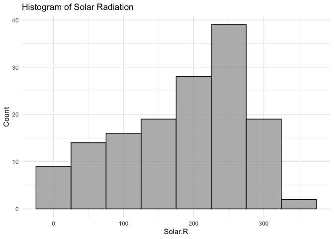<!-- -->

------------------------------------------------------------------------

1\. Detect missing values:

``` r
is.na(airquality$Solar.R)
```

    ##   [1] FALSE FALSE FALSE FALSE  TRUE  TRUE FALSE FALSE FALSE FALSE  TRUE FALSE
    ##  [13] FALSE FALSE FALSE FALSE FALSE FALSE FALSE FALSE FALSE FALSE FALSE FALSE
    ##  [25] FALSE FALSE  TRUE FALSE FALSE FALSE FALSE FALSE FALSE FALSE FALSE FALSE
    ##  [37] FALSE FALSE FALSE FALSE FALSE FALSE FALSE FALSE FALSE FALSE FALSE FALSE
    ##  [49] FALSE FALSE FALSE FALSE FALSE FALSE FALSE FALSE FALSE FALSE FALSE FALSE
    ##  [61] FALSE FALSE FALSE FALSE FALSE FALSE FALSE FALSE FALSE FALSE FALSE FALSE
    ##  [73] FALSE FALSE FALSE FALSE FALSE FALSE FALSE FALSE FALSE FALSE FALSE FALSE
    ##  [85] FALSE FALSE FALSE FALSE FALSE FALSE FALSE FALSE FALSE FALSE FALSE  TRUE
    ##  [97]  TRUE  TRUE FALSE FALSE FALSE FALSE FALSE FALSE FALSE FALSE FALSE FALSE
    ## [109] FALSE FALSE FALSE FALSE FALSE FALSE FALSE FALSE FALSE FALSE FALSE FALSE
    ## [121] FALSE FALSE FALSE FALSE FALSE FALSE FALSE FALSE FALSE FALSE FALSE FALSE
    ## [133] FALSE FALSE FALSE FALSE FALSE FALSE FALSE FALSE FALSE FALSE FALSE FALSE
    ## [145] FALSE FALSE FALSE FALSE FALSE FALSE FALSE FALSE FALSE

------------------------------------------------------------------------

2\. `Replace_na` missing values:

``` r
# select rows where Ozone or Solar.R is 99 and recode column Ozone and Solar.R

airquality2 <- airquality |> 
  mutate(
    Solar.R = replace_na(Solar.R, 0)## column name is inside replace_na and what to replace with is 0
  )

is.na(airquality2$Solar.R)
```

    ##   [1] FALSE FALSE FALSE FALSE FALSE FALSE FALSE FALSE FALSE FALSE FALSE FALSE
    ##  [13] FALSE FALSE FALSE FALSE FALSE FALSE FALSE FALSE FALSE FALSE FALSE FALSE
    ##  [25] FALSE FALSE FALSE FALSE FALSE FALSE FALSE FALSE FALSE FALSE FALSE FALSE
    ##  [37] FALSE FALSE FALSE FALSE FALSE FALSE FALSE FALSE FALSE FALSE FALSE FALSE
    ##  [49] FALSE FALSE FALSE FALSE FALSE FALSE FALSE FALSE FALSE FALSE FALSE FALSE
    ##  [61] FALSE FALSE FALSE FALSE FALSE FALSE FALSE FALSE FALSE FALSE FALSE FALSE
    ##  [73] FALSE FALSE FALSE FALSE FALSE FALSE FALSE FALSE FALSE FALSE FALSE FALSE
    ##  [85] FALSE FALSE FALSE FALSE FALSE FALSE FALSE FALSE FALSE FALSE FALSE FALSE
    ##  [97] FALSE FALSE FALSE FALSE FALSE FALSE FALSE FALSE FALSE FALSE FALSE FALSE
    ## [109] FALSE FALSE FALSE FALSE FALSE FALSE FALSE FALSE FALSE FALSE FALSE FALSE
    ## [121] FALSE FALSE FALSE FALSE FALSE FALSE FALSE FALSE FALSE FALSE FALSE FALSE
    ## [133] FALSE FALSE FALSE FALSE FALSE FALSE FALSE FALSE FALSE FALSE FALSE FALSE
    ## [145] FALSE FALSE FALSE FALSE FALSE FALSE FALSE FALSE FALSE

------------------------------------------------------------------------

Now let’s look at `mean`, `median`, and histogram

``` r
print(mean(airquality2$Solar.R))
```

    ## [1] 177.4248

``` r
##old value
print(mean(airquality$Solar.R, na.rm = TRUE))
```

    ## [1] 185.9315

``` r
print(median(airquality2$Solar.R))
```

    ## [1] 194

``` r
##old value
print(median(airquality$Solar.R, na.rm = TRUE))
```

    ## [1] 205

``` r
ggplot(airquality2, aes(x = Solar.R)) +
  geom_histogram(binwidth = 50, fill = "green", color = "black", alpha = 0.7) +
  labs(
    title = "Histogram of Solar Radiation",
    x = "Solar.R",
    y = "Count"
  ) +
  theme_minimal()
```

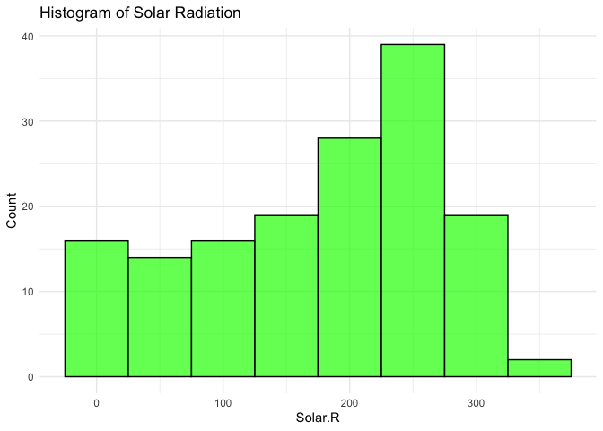<!-- -->

------------------------------------------------------------------------

3\. Remove missing values from data - ***Airquality3 will have less
values!***

``` r
# select rows where Ozone or Solar.R is 99 and recode column Ozone and Solar.R

airquality3 <- airquality |> 
  drop_na(Solar.R)
nrow(airquality) ##old dataset
```

    ## [1] 153

``` r
nrow(airquality3) ## dropped NA dataset
```

    ## [1] 146

``` r
is.na(airquality3$Solar.R)
```

    ##   [1] FALSE FALSE FALSE FALSE FALSE FALSE FALSE FALSE FALSE FALSE FALSE FALSE
    ##  [13] FALSE FALSE FALSE FALSE FALSE FALSE FALSE FALSE FALSE FALSE FALSE FALSE
    ##  [25] FALSE FALSE FALSE FALSE FALSE FALSE FALSE FALSE FALSE FALSE FALSE FALSE
    ##  [37] FALSE FALSE FALSE FALSE FALSE FALSE FALSE FALSE FALSE FALSE FALSE FALSE
    ##  [49] FALSE FALSE FALSE FALSE FALSE FALSE FALSE FALSE FALSE FALSE FALSE FALSE
    ##  [61] FALSE FALSE FALSE FALSE FALSE FALSE FALSE FALSE FALSE FALSE FALSE FALSE
    ##  [73] FALSE FALSE FALSE FALSE FALSE FALSE FALSE FALSE FALSE FALSE FALSE FALSE
    ##  [85] FALSE FALSE FALSE FALSE FALSE FALSE FALSE FALSE FALSE FALSE FALSE FALSE
    ##  [97] FALSE FALSE FALSE FALSE FALSE FALSE FALSE FALSE FALSE FALSE FALSE FALSE
    ## [109] FALSE FALSE FALSE FALSE FALSE FALSE FALSE FALSE FALSE FALSE FALSE FALSE
    ## [121] FALSE FALSE FALSE FALSE FALSE FALSE FALSE FALSE FALSE FALSE FALSE FALSE
    ## [133] FALSE FALSE FALSE FALSE FALSE FALSE FALSE FALSE FALSE FALSE FALSE FALSE
    ## [145] FALSE FALSE

------------------------------------------------------------------------

Now let’s look at `mean`, `median`, and histogram

``` r
print(mean(airquality3$Solar.R))
```

    ## [1] 185.9315

``` r
##old value
print(mean(airquality$Solar.R, na.rm = TRUE))
```

    ## [1] 185.9315

``` r
print(median(airquality3$Solar.R))
```

    ## [1] 205

``` r
##old value
print(median(airquality$Solar.R, na.rm = TRUE))
```

    ## [1] 205

``` r
ggplot(airquality3, aes(x = Solar.R)) +
  geom_histogram(binwidth = 50, fill = "green", color = "black", alpha = 0.7) +
  labs(
    title = "Histogram of Solar Radiation",
    x = "Solar.R",
    y = "Count"
  ) +
  theme_minimal()
```

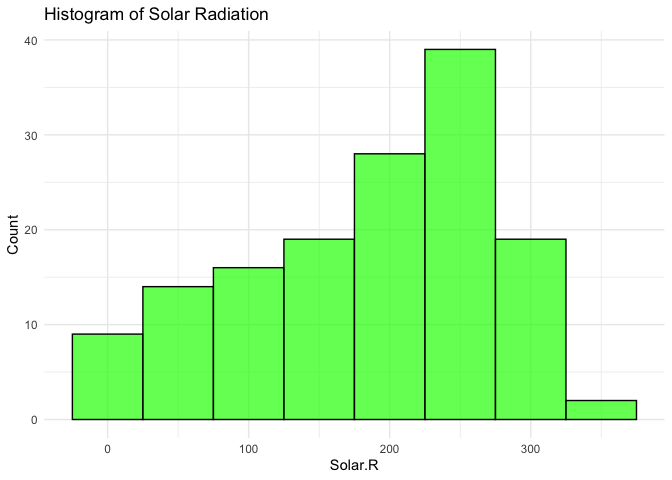<!-- -->

<mark>Why do we have the same `mean` and `median` but we have less
rows?</mark>

------------------------------------------------------------------------

## Class Exercise: Using the Starbucks dataset:

1.  Calculate the percentage of NA’s in text column.

2.  Replace missing values in the text column with “No content”.

3.  Remove rows where the created_at column is missing.

``` r
# Percentage of missing data in the text column
starbucks_user_data_with_na |> 
  summarize(text_missing_percent = mean(is.na(text)) * 100)

# Replace missing values
starbucks_clean <- starbucks_user_data_with_na |> 
  mutate(text = replace_na(text, "No content"))

# Drop rows with missing created_at
starbucks_clean <- starbucks_clean |> 
  drop_na(created_at)
```

------------------------------------------------------------------------

### Visualizing Missing Data with Heatmaps

Visualizing where missing data occurs is crucial for identifying
patterns. We will use the [`naniar`
package](https://cran.r-project.org/web/packages/naniar/vignettes/getting-started-w-naniar.html),
\``gg_miss_var()` function. `install.packages("naniar")`

``` r
library(naniar)

# Visualize missing data with naniar
gg_miss_var(airquality, show_pct = TRUE) +
  labs(
    title = "Missing Data Visualization",
    x = "Variable",
    y = "Number of Missing Values"
  ) +
  theme_minimal()
```

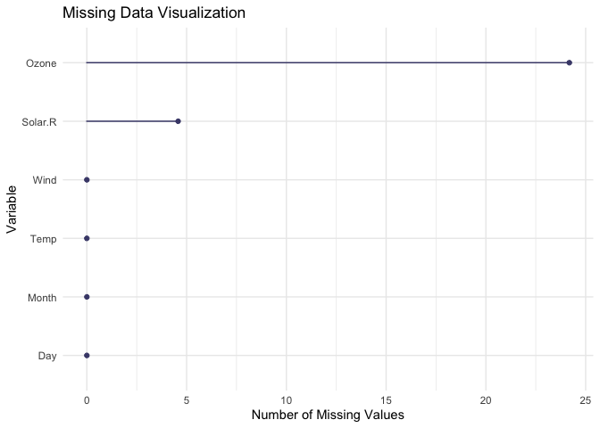<!-- -->

------------------------------------------------------------------------

### Handling Outliers

- An outlier is a data point that significantly differs from the other
  data points in a dataset. It can be unusually large, small, or
  unexpected compared to the majority of the data. Why do outliers
  matter?
- It can occur due to:
  - Measurement errors
  - Data entry errors
  - Natural variability
- Outliers can heavily affect statistical calculations (e.g., mean,
  standard deviation).
- They may indicate errors in data collection or entry.
- Sometimes, outliers represent unique cases that provide meaningful
  insights (e.g., viral social media posts).

------------------------------------------------------------------------

### How to Identify Outliers

1.  Visual Methods:
    - Boxplots
    - Scatterplots
2.  Statistical Methods:
    - Z-scores (values with a Z-score \> 3 or \< -3 are often outliers).
    - Interquartile Range (IQR) Rule:
      - Outliers are values below `Q1 - 1.5 × IQR` or above
        `Q3 + 1.5 × IQR`.

------------------------------------------------------------------------

### 1. Using boxplots

A boxplot visualizes the distribution of data:

- Median: Line in the middle of the box.

- Interquartile Range (IQR): Box represents Q1 (25th percentile) to Q3
  (75th percentile).

- Whiskers: Extend to 1.5 \* IQR from Q1 and Q3.

- Outliers: Points beyond whiskers.

You can graph a boxplot using `geom_boxplot()` and overlay all the data
points using `geom_jitter()`

------------------------------------------------------------------------

Note: We will use the R dataset`mtcars` the `mpg` column

``` r
colnames(mtcars)
```

    ##  [1] "mpg"  "cyl"  "disp" "hp"   "drat" "wt"   "qsec" "vs"   "am"   "gear"
    ## [11] "carb"

``` r
head(mtcars)
```

    ##                    mpg cyl disp  hp drat    wt  qsec vs am gear carb
    ## Mazda RX4         21.0   6  160 110 3.90 2.620 16.46  0  1    4    4
    ## Mazda RX4 Wag     21.0   6  160 110 3.90 2.875 17.02  0  1    4    4
    ## Datsun 710        22.8   4  108  93 3.85 2.320 18.61  1  1    4    1
    ## Hornet 4 Drive    21.4   6  258 110 3.08 3.215 19.44  1  0    3    1
    ## Hornet Sportabout 18.7   8  360 175 3.15 3.440 17.02  0  0    3    2
    ## Valiant           18.1   6  225 105 2.76 3.460 20.22  1  0    3    1

------------------------------------------------------------------------

### Visualizing Outliers with Boxplots

``` r
ggplot(mtcars, aes(x = 1, y = mpg)) +
  geom_boxplot(color = "black", fill = "lightblue", outlier.color = "blue") +
    geom_jitter(
    width = 0.2, 
    alpha = 0.8, 
    shape = 21,      
    color = "black", 
    fill = "yellow", 
    size = 3         
  ) +
  scale_y_continuous(trans = "log10", name = "MPG") +
  labs(title = "Boxplot of MPG with Jitter ") +
  theme_minimal()
```

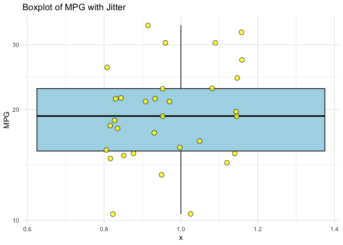<!-- -->

Graph Explanation:

- Box: Represents the interquartile range (IQR), the middle 50% of data.

- Line in the Box: Median value.

- Whiskers: Extend to data points within 1.5 × IQR.

- Red Dots: Outliers (points beyond the whiskers).

Questions for class:

- Identify the median and interquartile range from the boxplot.

- Why outliers are occuring in this dataset?

------------------------------------------------------------------------

### Steps to Remove Outliers:

1.  Calculate the Interquartile Range (IQR):
2.  Define upper and lower bounds:
3.  Filter data within bounds:

------------------------------------------------------------------------

### 1. Calculate the Interquartile Range (IQR):

``` r
iqr <- IQR(mtcars$mpg, na.rm = TRUE)
print(iqr)
```

    ## [1] 7.375

------------------------------------------------------------------------

### 2. Define upper and lower bounds

``` r
q1 <- quantile(mtcars$mpg, 0.25, na.rm = TRUE)
print(q1)
```

    ##    25% 
    ## 15.425

``` r
q3 <- quantile(mtcars$mpg, 0.75, na.rm = TRUE)
print(q3)
```

    ##  75% 
    ## 22.8

``` r
lower_bound <- q1 - 1.5 * iqr
print(lower_bound)
```

    ##    25% 
    ## 4.3625

``` r
upper_bound <- q3 + 1.5 * iqr
print(upper_bound)
```

    ##     75% 
    ## 33.8625

------------------------------------------------------------------------

### 3. Filter data within bounds:

``` r
cleaned_mtcars_data <- mtcars |>
  filter(mpg >= lower_bound & mpg <= upper_bound)
```

let’s revisualize it

``` r
ggplot(cleaned_mtcars_data, aes(x = 1, y = mpg)) +
  geom_boxplot(color = "black", fill = "lightblue", outlier.color = "blue") +
  geom_jitter(width = 0.2, alpha = 0.5, color = "yellow") +
  scale_y_continuous(trans = "log10", name = "MPG") +
  labs(title = "Boxplot of MPG with Jitter ") +
  theme_minimal()
```

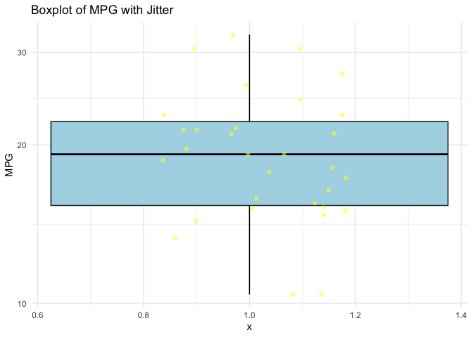<!-- -->

Let’s remember the old one WITH outliers

``` r
ggplot(mtcars, aes(x = 1, y = mpg)) +
  geom_boxplot(color = "black", fill = "lightblue", outlier.color = "blue") +
  geom_jitter(width = 0.2, alpha = 0.5, color = "yellow") +
  scale_y_continuous(trans = "log10", name = "MPG") +
  labs(title = "Boxplot of MPG with Jitter ") +
  theme_minimal()
```

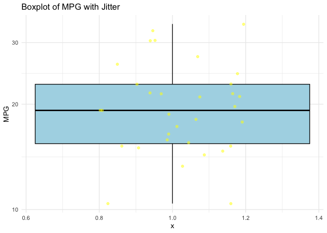<!-- -->

------------------------------------------------------------------------

### 4. Replace outliers with mean - less popular method

``` r
# Replace outliers with mean value
mean_mpg <- mean(mtcars$mpg, na.rm = TRUE)
mtcars_outliers_replaced <- mtcars |> 
  mutate(mpg = ifelse(
    mpg < lower_bound | mpg > upper_bound, 
    mean_mpg, 
    mpg
  ))
```

let’s revisualize it

``` r
ggplot(mtcars_outliers_replaced, aes(x = 1, y = mpg)) +
  geom_boxplot(color = "black", fill = "lightblue", outlier.color = "blue") +
  geom_jitter(width = 0.2, alpha = 0.5, color = "yellow") +
  scale_y_continuous(trans = "log10", name = "Retweet Count") +
  labs(title = "Boxplot of Retweet Counts with Jitter ") +
  theme_minimal()
```

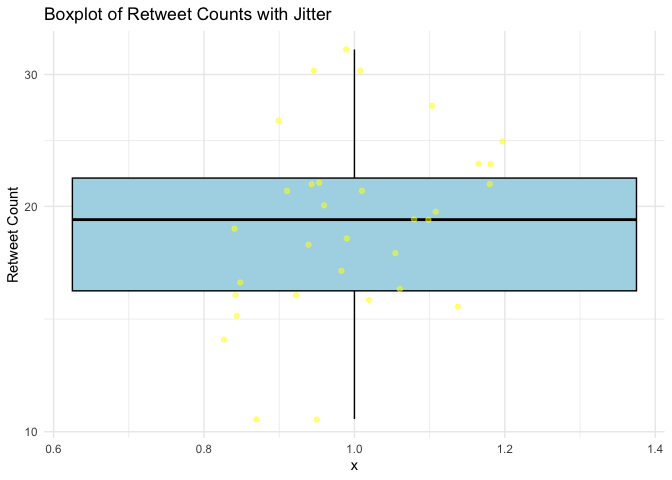<!-- -->

Let’s remember the old one WITH outliers

``` r
ggplot(mtcars, aes(x = 1, y = mpg)) +
  geom_boxplot(color = "black", fill = "lightblue", outlier.color = "blue") +
  geom_jitter(width = 0.2, alpha = 0.5, color = "yellow") +
  scale_y_continuous(trans = "log10", name = "Retweet Count") +
  labs(title = "Boxplot of Retweet Counts with Jitter ") +
  theme_minimal()
```

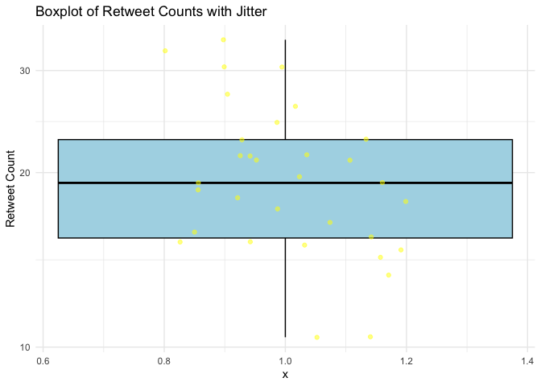<!-- -->

------------------------------------------------------------------------

## Class Exercise: Outlier Detection and Removal

1.  Identify Outliers of the dataset `iris` of columns `Sepal.Length` or
    `Petal.Width`
2.  Find the lower and upper bounds using the IQR method.
3.  Count the number of outliers in `Sepal.Length` or `Petal.Width`
4.  Visualize Without Outliers
    - Create a boxplot of after `Sepal.Length` or `Petal.Width`removing
      outliers.
    - Overlay jittered points on the cleaned dataset.

------------------------------------------------------------------------

### GGplot - Working with themes

Customizing your ggplot visualizations can make them more professional
and easier to interpret.

| Theme | Description |
|:---|:---|
| theme_minimal() | Clean and minimal design, great for presentations. |
| theme_classic() | Classic theme with a simple black-and-white grid. |
| theme_light() | Lighter gridlines with a clean background. |
| theme_dark() | Dark background with white gridlines, good for presentations. |
| theme_bw() | Black-and-white theme, great for printing. |
| theme_void() | No background or axes, perfect for minimalist plots like maps or pie charts. |

Built-in ggplot2 Themes and Descriptions

------------------------------------------------------------------------

### Let’s play with data

Change axis text, size, and theme and see what happens

``` r
ggplot(mtcars, aes(x = wt, y = mpg)) +
  geom_point(color = "blue", size = 3) +
  labs(
    title = "Relationship Between Weight and MPG",
    x = "Weight",
    y = "MPG"
  ) +
  theme_minimal() +
  theme(
    plot.title = element_text(size = 14, face = "bold", hjust = 0.5),
    axis.title = element_text(size = 12),
    axis.text = element_text(size = 10, color = "gray")
  )
```

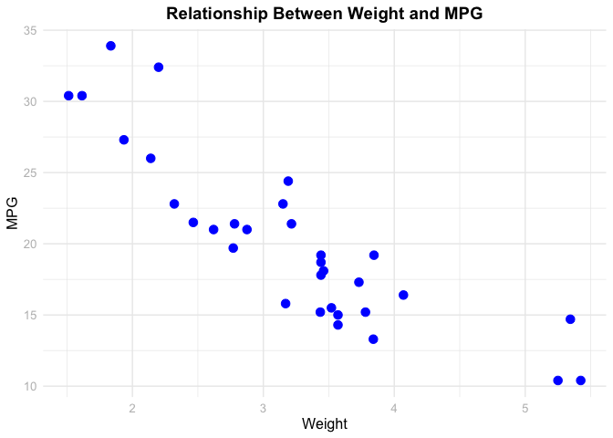<!-- -->

------------------------------------------------------------------------

### Customizing Theme Elements

Key Theme Customization Options:

- `plot.title` and `plot.subtitle`: Customize font size, color, and
  alignment of titles.

- `axis.text` and `axis.title`: Adjust axis text appearance.

- `legend.position`: Change the position of the legend (e.g., top,
  bottom, left, or right).

- `panel.grid`: Modify gridline appearance.

------------------------------------------------------------------------

``` r
ggplot(mtcars, aes(x = wt, y = mpg, color = factor(cyl))) +
  geom_point(size = 4) +
  labs(
    title = "Fuel Efficiency by Vehicle Weight",
    subtitle = "Data from mtcars dataset",
    x = "Weight (1000 lbs)",
    y = "Miles Per Gallon",
    color = "Cylinders"
  ) +
  theme_light() +
  theme(
    plot.title = element_text(face = "bold", size = 14, hjust = 0.5, color = "darkblue"),
    plot.subtitle = element_text(size = 12, hjust = 0.5, face = "italic"),
    axis.text = element_text(size = 12),
    axis.title = element_text(face = "italic"),
    legend.position = "top",
    panel.grid.major = element_line(color = "gray", linetype = "dashed")
  )
```

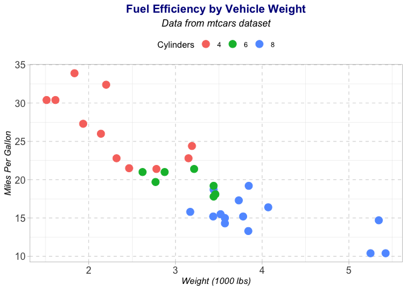<!-- -->

------------------------------------------------------------------------

### Applying Themes with Customization

You can combine themes with other customization options.

``` r
# Minimal theme with custom axis labels
ggplot(mtcars, aes(x = wt, y = mpg, color = factor(cyl))) +
  geom_point(size = 3) +
  labs(
    title = "Scatter Plot with Minimal Theme",
    x = "Weight",
    y = "Miles Per Gallon",
    color = "Cylinders"
  ) +
  theme_minimal(base_size = 14) +
  theme(
    panel.grid.major = element_line(color = "gray"),
    axis.text = element_text(color = "blue")
  )
```

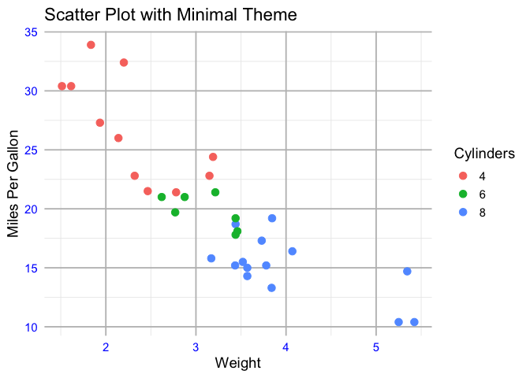<!-- -->

------------------------------------------------------------------------

### Adding External Themes with ggthemes

Using [`ggthemes`
package](https://yutannihilation.github.io/allYourFigureAreBelongToUs/ggthemes/)
`install.packages("ggthemes")`

e.g.

``` r
library(ggthemes)

# Economist Theme
ggplot(mtcars, aes(x = wt, y = mpg, color = factor(cyl))) +
  geom_point(size = 3) +
  labs(title = "Economist Theme") +
  theme_economist() +
  scale_color_economist()
```

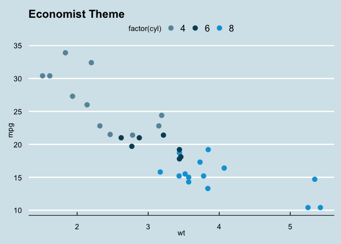<!-- -->

``` r
# Wall Street Journal Theme
ggplot(mtcars, aes(x = wt, y = mpg, color = factor(cyl))) +
  geom_point(size = 3) +
  labs(title = "Wall Street Journal Theme") +
  theme_wsj()
```

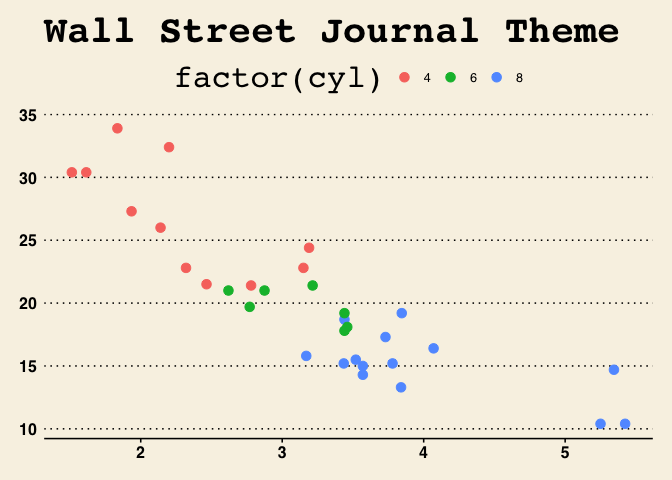<!-- -->

------------------------------------------------------------------------

### Customizing `ggthemes`

We can text size, font, etc…

``` r
# Tufte theme with customizations
ggplot(mtcars, aes(x = wt, y = mpg, color = factor(cyl))) +
  geom_point(size = 3) +
  labs(
    title = "Scatter Plot with Tufte Theme",
    x = "Weight",
    y = "Miles Per Gallon",
    color = "Cylinders"
  ) +
  theme_tufte() +
  theme(
    text = element_text(size = 14, face = "bold"),
    legend.position = "top"
  )
```

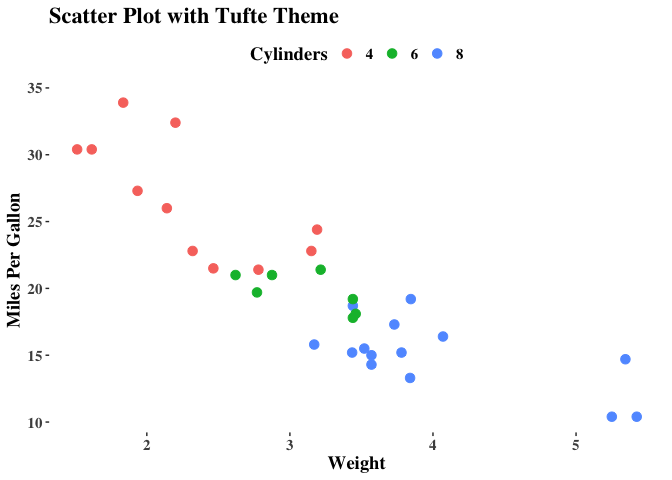<!-- -->

------------------------------------------------------------------------

### Creating Multi-panel Plots with Facets

[Facets](https://www.datacamp.com/tutorial/facets-ggplot-r?utm_source=google&utm_medium=paid_search&utm_campaignid=19589720830&utm_adgroupid=157156377351&utm_device=c&utm_keyword=&utm_matchtype=&utm_network=g&utm_adpostion=&utm_creative=726015683901&utm_targetid=dsa-2218886984060&utm_loc_interest_ms=&utm_loc_physical_ms=1022762&utm_content=&utm_campaign=230119_1-sea~dsa~tofu_2-b2c_3-us_4-prc_5-na_6-na_7-le_8-pdsh-go_9-nb-e_10-na_11-na-jan25&gad_source=1&gclid=Cj0KCQiAyoi8BhDvARIsAO_CDsCYy-y4ZrytsjBhlRpZSh00TcyLL72NUZsnNRU-QO00y8hs1FswjWQaAlLwEALw_wcB)
allow you to split data into panels by a variable.

- Use `facet_wrap()` for a single variable.

  - `facet_wrap(facets, nrow = NULL, ncol = NULL, scales = "fixed", shrink = TRUE, as.table = TRUE, drop = TRUE)`

- Use `facet_grid()` for two variables.

  - `facet_grid(rows = NULL, cols = NULL, scales = "fixed", space = "fixed", shrink = TRUE, labeller = "label_value", as.table = TRUE, switch = NULL, drop = TRUE, margins = FALSE, axes = "margins", axis.labels = "all", facets = deprecated())`

------------------------------------------------------------------------

#### Using facet_wrap() for Single Variables

- Each panel represents one cylinder type (`cyl`).
- Color distinguishes groups within the scatter plot.

``` r
library(wesanderson)
# Visualize MPG vs Weight for each cylinder type
ggplot(mtcars, aes(x = wt, y = mpg, color = factor(cyl))) +
  geom_point(size = 3) +
    scale_color_manual(values = wes_palette("GrandBudapest1", n = 3)) +
  facet_wrap(~ cyl,
             ncol=3,
             nrow=1) +
  labs(
    title = "Faceted Scatter Plot by Cylinders",
    x = "Weight",
    y = "Miles Per Gallon (MPG)",
    color = "Cylinders"
  ) +
  theme_minimal()
```

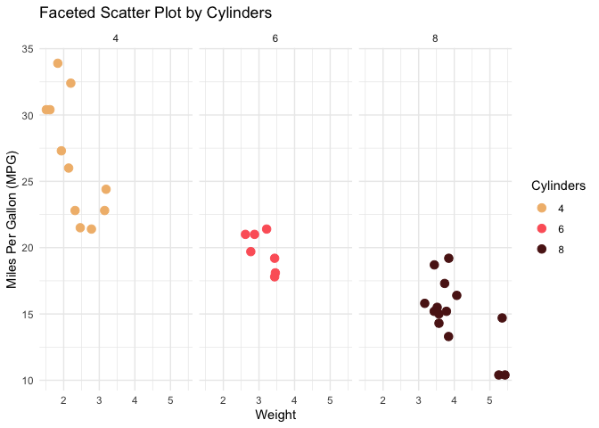<!-- -->

------------------------------------------------------------------------

### Using facet_wrap() with Free Scales

You can let axes scales vary across panels using the scales argument.
Scales:

- `free`: Axes can vary across panels.

- `fixed`: Same scale for all panels (default).

``` r
# Facet by gear with free scales
ggplot(mtcars, aes(x = wt, y = mpg, color = factor(gear))) +
  geom_point(size = 3) +
  facet_wrap(~ gear, scales = "free") +
  scale_color_viridis_d(option = "C") +
  labs(
    title = "Faceted Scatter Plot by Gears (Free Scales)",
    x = "Weight",
    y = "Miles Per Gallon (MPG)",
    color = "Gears"
  ) +
  theme_light()
```

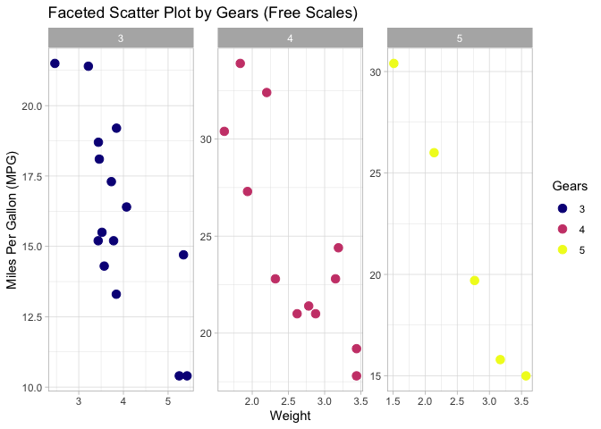<!-- -->

------------------------------------------------------------------------

### Using facet_grid() for Two Variables

The `facet_grid()` function creates a grid of panels for combinations of
two variables.

- Rows represent cyl (cylinders).

- Columns represent gear (gears).

``` r
# Facet by number of cylinders (rows) and gears (columns)
ggplot(mtcars, aes(x = wt, y = mpg, color = factor(cyl))) +
  geom_point(size = 3) +
  facet_grid(cyl ~ gear) +
  labs(
    title = "Facet Grid: Cylinders vs Gears",
    x = "Weight",
    y = "Miles Per Gallon (MPG)",
    color = "Cylinders"
  ) +
  theme_minimal()
```

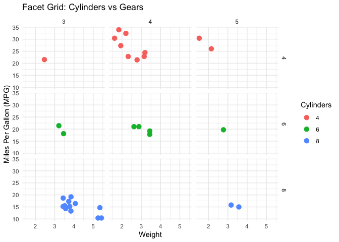<!-- -->

------------------------------------------------------------------------

### Facet Grid with One Variable

**Facet by Rows Only**

``` r
ggplot(mtcars, aes(x = wt, y = mpg, color = factor(gear))) +
  geom_point(size = 3) +
  facet_grid(cyl ~ .) +
  labs(
    title = "Facet Grid: Rows by Cylinders",
    x = "Weight",
    y = "Miles Per Gallon (MPG)",
    color = "Gears"
  ) +
  theme_minimal()
```

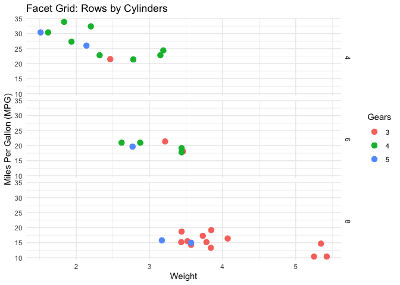<!-- -->

**Facet by Columns Only**

``` r
ggplot(mtcars, aes(x = wt, y = mpg, color = factor(gear))) +
  geom_point(size = 3) +
  facet_grid(. ~ gear) +
  labs(
    title = "Facet Grid: Columns by Gears",
    x = "Weight",
    y = "Miles Per Gallon (MPG)",
    color = "Gears"
  ) +
  theme_minimal()
```

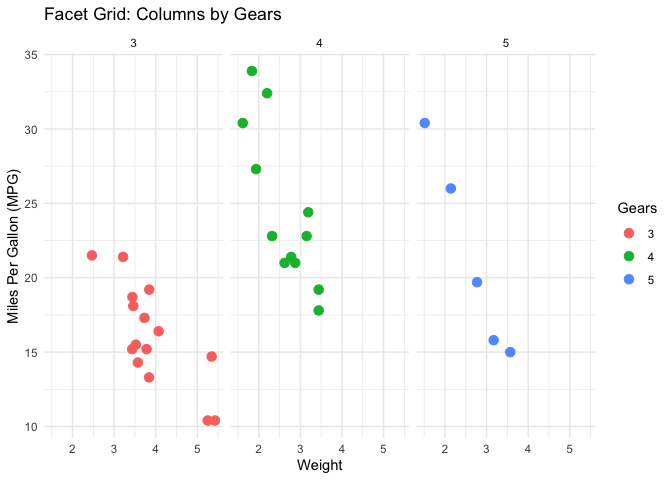<!-- -->

------------------------------------------------------------------------

### Adding Margins with facet_grid()

To include marginal data for row or column variables, use
`margins = TRUE`.

``` r
# Add margins to show totals for rows and columns
ggplot(mtcars, aes(x = wt, y = mpg, color = factor(gear))) +
  geom_point(size = 3) +
  facet_grid(cyl ~ gear, margins = TRUE) +
  labs(
    title = "Facet Grid with Margins",
    x = "Weight",
    y = "Miles Per Gallon (MPG)",
    color = "Gears"
  ) +
  theme_classic()
```

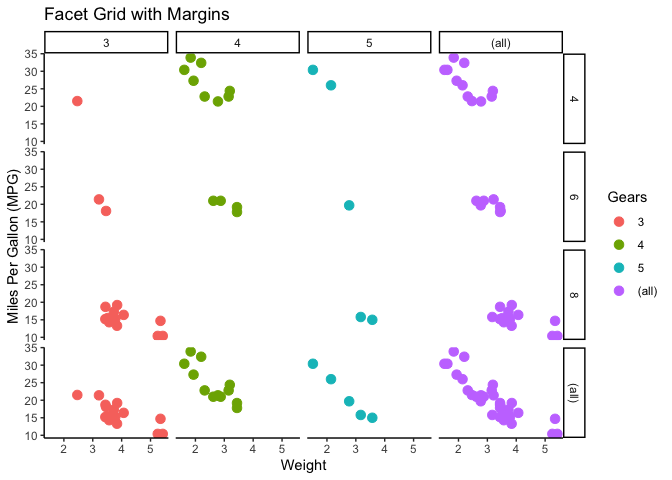<!-- -->

------------------------------------------------------------------------

### Faceting with Custom Labels

**Note: This is something I use alot**

Use the `labeller` argument to customize facet labels.

``` r
# Customize facet labels
ggplot(mtcars, aes(x = wt, y = mpg, color = factor(cyl))) +
  geom_point(size = 3) +
  facet_wrap(
    ~ cyl,
    labeller = labeller(cyl = c("4" = "4 Cylinders", "6" = "6 Cylinders", "8" = "8 Cylinders"))
  ) +
  labs(
    title = "Custom Facet Labels for Cylinders",
    x = "Weight",
    y = "Miles Per Gallon (MPG)",
    color = "Cylinders"
  ) +
  theme_minimal()
```

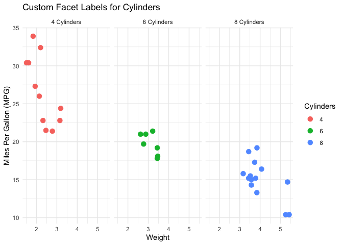<!-- -->

------------------------------------------------------------------------

### Class Exercise: Customize a ggplot

Use the `iris` dataset to create a scatter plot of `Sepal.Length` vs
`Sepal.Width`, colored by `Species`.

1.  Customize: - Use `theme_minimal()` for clean aesthetics.

    - Try `ggthemes` for other aesthetics.

2.  Adjust the plot title and axis labels using `labs()`.

3.  Use `scale_color_manual()` to apply custom colors (e.g., Wesanderson
    palette `c("purple", "orange", "green")`).

4.  Add a caption to explain the data source.

``` r
ggplot(iris, aes(x = Sepal.Length, y = Sepal.Width, color = Species)) +
  geom_point(size = 3) +
  labs(
    title = "Sepal Dimensions in Iris Dataset",
    subtitle = "Grouped by Species",
    x = "Sepal Length (cm)",
    y = "Sepal Width (cm)",
    color = "Species",
    caption = "Source: iris dataset"
  ) +
  scale_color_manual(values = c("purple", "orange", "green")) +
  theme_minimal()
```

------------------------------------------------------------------------

### Lecture 4 Cheat Sheet

| **Function/Concept** | **Description** | **Code Example** |
|----|----|----|
| `is.na()` | Checks for missing values in the dataset and returns TRUE if missing. | `is.na(data$column)` |
| `replace_na()` | Replaces missing values in a column with specified values. | `mutate(column = replace_na(column, 0))` |
| `fill()` | Fills missing values with the previous or next observation in a column. | `fill(column, .direction = 'down')` |
| `drop_na()` | Removes rows with missing values in specified columns. | `drop_na(column)` |
| `gg_miss_var()` (naniar) | Visualizes missing values as a heatmap (requires the naniar package). | `gg_miss_var(data, show_pct = TRUE)` |
| `geom_boxplot()` | Creates a boxplot to visualize data distribution and identify outliers. | `geom_boxplot(outlier.color = 'red', fill = 'blue')` |
| `geom_jitter()` | Adds jittered points to a plot for better visualization of overlapping data. | `geom_jitter(width = 0.2, alpha = 0.5, color = 'red')` |
| `facet_wrap()` | Creates facets (panels) for single variable categories. | `facet_wrap(~ variable)` |
| `facet_grid()` | Creates a grid of panels for combinations of two variables. | `facet_grid(rows ~ cols)` |
| `theme_minimal()` | A clean, minimal theme suitable for presentations. | `theme_minimal()` |
| `theme_classic()` | A classic black-and-white theme with gridlines. | `theme_classic()` |
| `labs()` | Sets plot title, axis labels, legend titles, and captions. | `labs(title = 'Plot Title', x = 'X-Axis Label', y = 'Y-Axis Label')` |
| `theme_economist()` (ggthemes) | Applies the Economist theme and color palette for professional-style plots. | `theme_economist() + scale_color_economist()` |
| `theme_wsj()` (ggthemes) | Applies the Wall Street Journal theme for publication-style plots. | `theme_wsj()` |
| `theme_tufte()` (ggthemes) | Applies Edward Tufte’s minimalist theme for clean and elegant visualizations. | `theme_tufte()` |
