Statistics, coefficient plots, trend data
================
Dr. Ayse D. Lokmanoglu
Lecture 4, (B) Feb 12, (A) Feb 18

## R Exercises

------------------------------------------------------------------------

**ALWAYS** load our libraries

``` r
library(tidyverse)
library(dplyr)
library(ggplot2)
```

## 1. Summary Statistics

### What Are Summary Statistics?

Summary statistics are numbers that summarize key aspects of your data:

- **Mean** `mean()`: The average value.

- **Median** `median()`: The middle value when data is sorted.

- **Standard Deviation (SD)** `sd()`: How spread out the data is.

- **IQR (Interquartile Range) `IQR()`**: The range of the middle 50% of
  data.

------------------------------------------------------------------------

**TRY** Let’s analyze the weekly study hours of students in different
majors: Computer Science, Business, and Biology.

``` r
# Create a dataset
student_data <- data.frame(
  major = rep(c("CS", "Business", "Biology"), each = 10),
  gender = rep(c("Male", "Female"), 15),
  study_hours = c(16, 19, 20, 23, 22, 18, 21, 24, 20, 19, 
                  12, 15, 14, 18, 17, 10, 16, 14, 11, 15,
                  25, 28, 26, 30, 27, 29, 31, 25, 28, 26),
  exam_score = c(80, 85, 88, 92, 90, 86, 91, 94, 89, 87, 
                 70, 72, 75, 78, 76, 71, 73, 74, 70, 72,
                 95, 97, 96, 98, 97, 99, 100, 94, 96, 95),
  count_books = c(4, 8, 7, 10, 10, 8, 18,
                  16, 9, 8, 7, 7, 7, 12,
                  14, 0, 7, 3, 2, 4,
                  9, 11, 17, 12, 15,
                  15, 9, 15, 7, 14)
)
# Quick summary
summary(student_data$study_hours)
```

    ##    Min. 1st Qu.  Median    Mean 3rd Qu.    Max. 
    ##   10.00   16.00   20.00   20.63   25.75   31.00

------------------------------------------------------------------------

### 1.1 Grouped Summary Statistics

We can also group by subgroups and run summary statistis with that.

- `group_by()`: Groups the data by major.

- `summarize()`: Calculates statistics for each group.

**TRY** Let’s calculate the average study hours for each major.

``` r
# Grouped statistics
student_data |> 
  group_by(major) |> 
  summarize(
    mean_hours = mean(study_hours),
    sd_hours = sd(study_hours)
  )
```

    ## # A tibble: 3 × 3
    ##   major    mean_hours sd_hours
    ##   <chr>         <dbl>    <dbl>
    ## 1 Biology        27.5     2.07
    ## 2 Business       14.2     2.57
    ## 3 CS             20.2     2.39

------------------------------------------------------------------------

### 1.2 Visualizing Summary Statistics

We can use a boxplot to compare study hours across majors.

``` r
ggplot(student_data, aes(x = major, y = study_hours, fill = major)) +
  geom_boxplot() +
  labs(
    title = "Weekly Study Hours by Major",
    x = "Major",
    y = "Study Hours"
  ) +
    scale_fill_manual(values = wesanderson::wes_palette("BottleRocket2", n = 3)) + 

  theme_minimal()
```

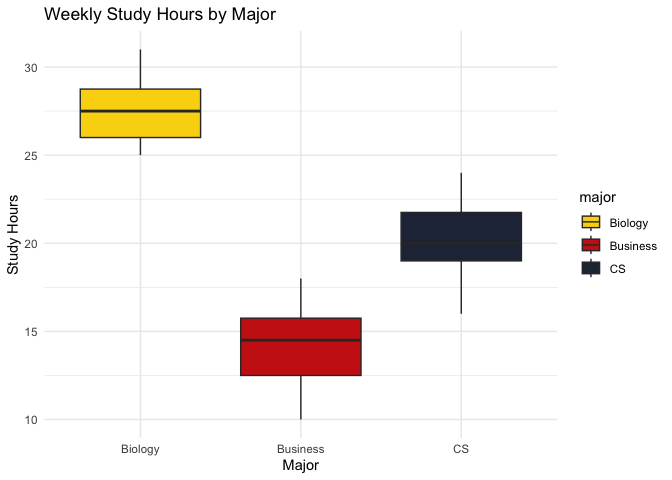<!-- -->

------------------------------------------------------------------------

#### Class Exercise: Practice with Summary Statistics

1.  Create a dataset with two columns: `Hobby` (e.g., gaming, gym,
    reading) and `Hours` (random numbers between 1 and 10).
2.  Calculate the `mean`, `median`, and `standard deviation` for each
    hobby.
3.  Create a boxplot to visualize the differences.

``` r
### Your workshpace
```

------------------------------------------------------------------------

## 2. Hypothesis Testing: Making Comparisons

- A hypothesis is a statement we test using data.Hypothesis testing
  allows you to compare groups and decide if their differences are
  statistically significant. It has two parts:
  - Null Hypothesis (H₀): There is no effect or difference.
  - Alternative Hypothesis (H₁): There is an effect or difference.
- e.g., Hypothesis:
  - H₀: Students from all majors study the same number of hours.
  - H₁: Students from different majors study different numbers of hours.

**Steps in Hypothesis Testing**: - Define the null and alternative
hypotheses.

1.  \- Choose a significance level (α), typically 0.05.

2.  \- Use a statistical test to calculate the p-value.

3.  \- Compare the p-value with α:

    - If p \< α, reject the null hypothesis.

    - If p ≥ α, fail to reject the null hypothesis.

------------------------------------------------------------------------

### 2.1 T-Test: Comparing Means Between Two Groups

A t-test is a statistical test used to compare the means of two groups.
It answers the question: Are the differences between the two groups
statistically significant, or are they due to chance?

- Null Hypothesis (H₀): The means of the two groups are equal.

- Alternative Hypothesis (H₁): The means of the two groups are not
  equal.

**Types of T-Tests**:

- Independent T-Test: Compares two unrelated groups (e.g., males vs.
  females).

- Paired T-Test: Compares two related groups (e.g., test scores before
  and after tutoring).

**How to Interpret the Results**:

- p-value:

  - If p-value \< 0.05: Reject the null hypothesis (H₀). This means
    there is a significant difference in study hours between genders.

  - If p-value ≥ 0.05: Fail to reject H₀. This means there is no
    significant difference.

- Confidence Interval (CI):

  - The range within which the true difference in means lies, with a
    certain level of confidence (usually 95%).

- t-statistic:

  - Measures the size of the difference relative to the variation in
    your sample data.

------------------------------------------------------------------------

**TRY** Study Hours Between Genders

- Do male and female students in Computer Science study for similar
  hours? *We want to compare the average study hours of male and female
  students in Computer Science.*

``` r
# Filter data for Computer Science students
cs_students <- student_data |> filter(major == "CS")

# Perform a t-test
t_test_result <- t.test(
  study_hours ~ gender,
  data = cs_students
)

t_test_result
```

    ## 
    ##  Welch Two Sample t-test
    ## 
    ## data:  study_hours by gender
    ## t = 0.50596, df = 7.7804, p-value = 0.6269
    ## alternative hypothesis: true difference in means between group Female and group Male is not equal to 0
    ## 95 percent confidence interval:
    ##  -2.864103  4.464103
    ## sample estimates:
    ## mean in group Female   mean in group Male 
    ##                 20.6                 19.8

In our data:

- The p-value of 0.6269 indicates a statistically **NO** significant
  difference in study hours between genders. **we fail to reject the
  null hypothesis (H₀).**

- On average, females study 20.6 hours, while males study 19.8 hours.

- The confidence interval suggests the difference in means is between
  -2.9 and 4.5. Since the interval includes 0, it further supports the
  conclusion that there is no significant difference.

**How to report these results in an academic paper**: *A Welch
two-sample t-test was conducted to compare study hours between male and
female students. The results showed no statistically significant
difference between genders, t(7.78) = .51, p = 0.63. The 95% confidence
interval for the difference in means was \[-2.86, 7.78\]. On average,
female students studied 20.6 hours, while male students studied 19.8
hours.*

------------------------------------------------------------------------

#### Visualizing T-Tests

You can visualize t-test using:

- Viusalize Distribution
  - Boxplot with Means
  - Violin plot

<!-- -->

- Group means

  - Bar Charts

  - Dot Charts

- Statistical uncertainty

  - Plotting Confidence Intervals

------------------------------------------------------------------------

**Box Plot with Means**

- Play with different colors, shapes, sizes

``` r
# Boxplot with mean points
ggplot(student_data, aes(x = gender, y = study_hours, fill = gender)) +
  geom_boxplot(outlier.color = "red", alpha = 0.7) +
  stat_summary(fun = mean, geom = "point", shape = 18, size = 4, color = "black") +
  scale_fill_manual(values = c("navy", "beige")) +
  labs(
    title = "Comparison of Study Hours by Gender",
    x = "Gender",
    y = "Study Hours"
  ) +
  theme_minimal() +
  theme(legend.position = "none")
```

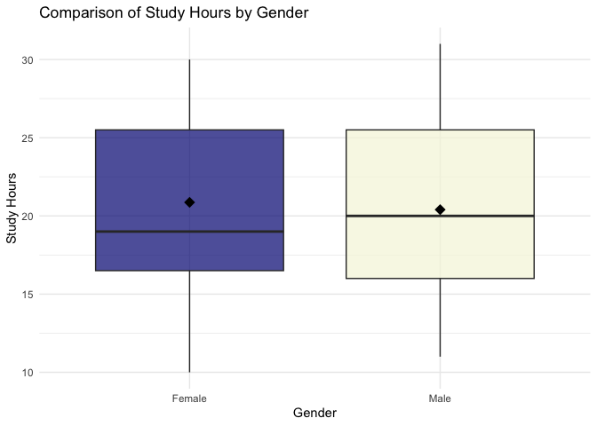<!-- -->

------------------------------------------------------------------------

**Violin Plot**

``` r
ggplot(student_data, aes(x = gender, y = study_hours, fill = gender)) +
  geom_violin(trim = FALSE, alpha = 0.7) +
  stat_summary(fun = mean, geom = "point", shape = 18, size = 4, color = "black") +
  labs(
    title = "Study Hours by Gender (Violin Plot)",
    x = "Gender",
    y = "Study Hours"
  ) +
  scale_fill_manual(values = c("pink", "yellow")) +
  theme_minimal() +
  theme(legend.position = "none")
```

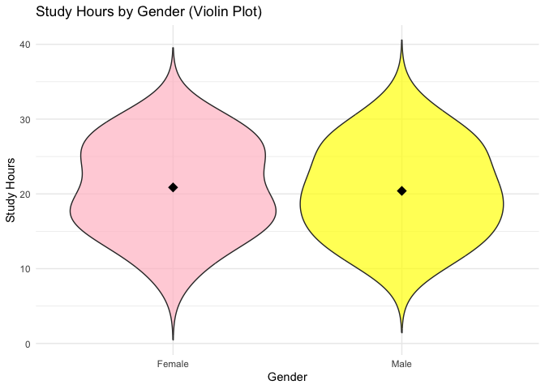<!-- -->

------------------------------------------------------------------------

**Bar plot with means**

``` r
# Calculate means
mean_hours <- student_data |>
  group_by(gender) |>
  summarize(mean_study_hours = mean(study_hours))

# Bar plot of means
ggplot(mean_hours, aes(x = gender, y = mean_study_hours, fill = gender)) +
  geom_col(alpha = 0.7) +
  geom_text(aes(label = round(mean_study_hours, 1)), vjust = -0.5, size = 4) + ## I added the values
  labs(
    title = "Mean Study Hours by Gender",
    x = "Gender",
    y = "Mean Study Hours"
  ) +
  theme_minimal() +
  theme(legend.position = "none")
```

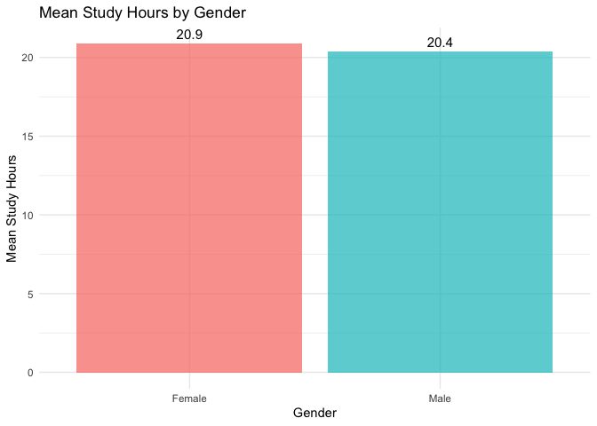<!-- -->

------------------------------------------------------------------------

**Confidence intervals**

``` r
# extract confidence intervals
ci <- t_test_result$conf.int

# Confidence interval plot
ggplot(mean_hours, aes(x = gender, y = mean_study_hours, fill = gender)) +
  geom_col(alpha = 0.7) +
  geom_errorbar(aes(
    ymin = c(mean_hours$mean_study_hours[1] - abs(ci[1]),
             mean_hours$mean_study_hours[2] - abs(ci[1])),
    ymax = c(mean_hours$mean_study_hours[1] + abs(ci[2]),
             mean_hours$mean_study_hours[2] + abs(ci[2]))
  ), width = 0.2, color = "black") +
  labs(
    title = "Mean Study Hours with Confidence Intervals",
    x = "Gender",
    y = "Mean Study Hours"
  ) +
  scale_fill_manual(values = c("darkred", "cyan")) +
  theme_minimal() +
  theme(legend.position = "none")
```

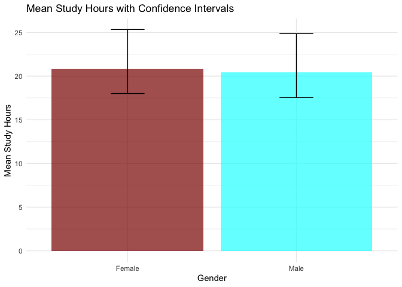<!-- -->

------------------------------------------------------------------------

### 2.2 ANOVA: Comparing Means Across Multiple Groups

ANOVA (Analysis of Variance) is a statistical method used to compare the
means of three or more groups. ANOVA as a regression with categorical
predictors. It determines whether at least one group is different.

- Null Hypothesis (H₀): All group means are equal.

- Alternative Hypothesis (H₁): At least one group mean is different.

**When do we use ANOVA?**

1.  A continuous dependent variable (e.g., study hours).

2.  A categorical independent variable with three or more levels (e.g.,
    major).

**How to Interpret the Results**:

- p-value:

  - If p-value \< 0.05: Reject H₀. This means at least one group mean is
    significantly different.

  - If p-value ≥ 0.05: Fail to reject H₀. This means there is no
    significant difference among the group means.

- F-Statistic:

  - A ratio of between-group variance to within-group variance. Higher
    values indicate greater differences among groups.

- Post-hoc Tests (if p \< 0.05):

  - If ANOVA shows a significant result, post-hoc tests (e.g., Tukey’s
    HSD) can identify which groups are different.

------------------------------------------------------------------------

**TRY** Do Students from Different Majors Study for Similar Hours? We
want to compare the average study hours of students across Computer
Science, Business, and Biology.

``` r
# Perform ANOVA
anova_result <- aov(study_hours ~ major, data = student_data)

# View the summary
summary(anova_result)
```

    ##             Df Sum Sq Mean Sq F value   Pr(>F)    
    ## major        2  887.3   443.6   80.01 4.49e-12 ***
    ## Residuals   27  149.7     5.5                     
    ## ---
    ## Signif. codes:  0 '***' 0.001 '**' 0.01 '*' 0.05 '.' 0.1 ' ' 1

Our data:

- Degrees of Freedom (Df):

  - `major`: 2

  - *There are 3 majors in the dataset: CS, Business, and Biology.
    Degrees of freedom = Number of groups - 1*.

- `Residuals`: 27

  - *The total number of observations is 30, and we lose 3 degrees of
    freedom for the 3 groups: 30 - 3 = 27*.

- Sum of Squares (`Sum Sq`):

  - `major`: 572.9
  - *This measures the variation in study hours between majors - the
    explained variance*.
  - `Residuals`: 280.5
    - T*his measures the variation in study hours within each major -
      the unexplained variance*.

- Mean Squares (`Mean Sq`): - `Sum Sq / Df`

- F-statistic: `F value` = 27.57

  - This measures how much the variation between groups (majors) exceeds
    the variation within groups (residuals).

  - A higher F-value indicates a greater difference between group means
    relative to the within-group variation.

- p-value: `Pr(>F)` = 3e-07:

  - This is the probability of observing an F-statistic as extreme as
    27.57 if the null hypothesis (no difference between groups) were
    true.

- A p-value of 3e-07 (0.0000003) is much smaller than the standard
  significance threshold of 0.05, indicating strong evidence to reject
  the null hypothesis.

- Significance Codes:

  - The `***` next to the p-value shows the result is highly significant
    (`p < 0.001`).

The p-value (3e-07) is highly significant, so we reject the null
hypothesis. This means there is strong evidence that study hours differ
significantly between the majors.

**How to report these results in an academic paper:** *A one-way ANOVA
was conducted to compare the study hours among students in three majors
(Computer Science, Business, and Biology). The results showed a
statistically significant difference in mean study hours between majors,
F(2, 27) = 27.57, p \< 0.001. This suggests that students’ study hours
are influenced by their major. Post-hoc comparisons should be conducted
to identify specific group differences.*

------------------------------------------------------------------------

#### Visualizing ANOVA Results

You can use a boxplot to visualize the differences in study hours across
majors.

``` r
ggplot(student_data, aes(x = major, y = study_hours, fill = major)) +
  geom_boxplot(alpha = 0.7, outlier.color = "red") +
  labs(
    title = "Study Hours Across Majors",
    x = "Major",
    y = "Study Hours"
  ) +
  theme_minimal()
```

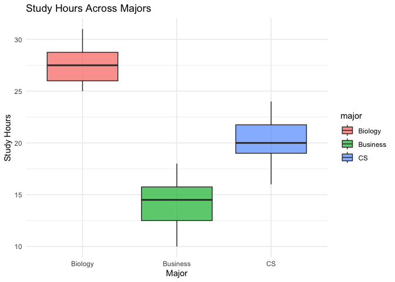<!-- -->

------------------------------------------------------------------------

| **Aspect** | **T-Test** | **ANOVA** |
|----|----|----|
| **Number of Groups** | Compares 2 groups. | Compares 3 or more groups. |
| **Output** | t-statistic and p-value. | F-statistic and p-value. |
| **E.g.** | Gender differences in study hours. | Study hours across majors. |

------------------------------------------------------------------------

### Class Exercise:

1.  Use a t-test to compare study hours between genders in the “Biology”
    major.
2.  Perform an ANOVA to test if study hours differ by major.
3.  Visualize the results using boxplots and interpret your findings.

------------------------------------------------------------------------

## 3. Regression Models

Regression analysis is a powerful statistical method for examining the
relationship between variables. In this section, we will explore simple
and multiple linear regression models. We’ll also discuss how to
interpret the results and visualize them.

- Dependent Variable (y) (Outcome): The variable we are trying to
  predict or explain.

- Independent Variable (x) (Predictor): The variable(s) we use to
  explain or predict the dependent variable.

**Types of Regression**:

- Simple Linear Regression: Examines the relationship between one
  predictor and the outcome.

- Multiple Linear Regression: Examines the relationship between multiple
  predictors and the outcome.

- Generalized Linear Models (GLMs): Extension to handle non-normal data.

------------------------------------------------------------------------

### 3.1 Simple Linear Regression

Model:

$Exam\ Score = \beta_0 + \beta_1 \times Study\ Hours + \epsilon$

- $β0$: Intercept (predicted score when study hours = 0).

- $β1$: Slope (change in score for each additional study hour).

- $ϵ$: Error term.

**TRY:** Is there a relationship between study hours and exam scores?

``` r
# Fit a simple linear regression model
simple_model <- lm(exam_score ~ study_hours, data = student_data)

# Summary of the model
summary(simple_model)
```

    ## 
    ## Call:
    ## lm(formula = exam_score ~ study_hours, data = student_data)
    ## 
    ## Residuals:
    ##     Min      1Q  Median      3Q     Max 
    ## -5.3148 -2.0842  0.2691  1.9951  4.3918 
    ## 
    ## Coefficients:
    ##             Estimate Std. Error t value Pr(>|t|)    
    ## (Intercept)  51.7758     1.9630   26.38   <2e-16 ***
    ## study_hours   1.6587     0.0915   18.13   <2e-16 ***
    ## ---
    ## Signif. codes:  0 '***' 0.001 '**' 0.01 '*' 0.05 '.' 0.1 ' ' 1
    ## 
    ## Residual standard error: 2.946 on 28 degrees of freedom
    ## Multiple R-squared:  0.9215, Adjusted R-squared:  0.9187 
    ## F-statistic: 328.6 on 1 and 28 DF,  p-value: < 2.2e-16

Output:

$Exam\ Score = 51.776 + 1.659 \times Study\ Hours + \epsilon$

- $β0$: 51.7758

- The predicted exam score when study hours = 0.

- $β1$: 1.6587

- For every additional hour studied, the exam score increases by 1.6587
  points.

- `t-value`: Indicates how many standard deviations the coefficient is
  away from 0. Higher absolute values suggest stronger evidence against
  the null hypothesis.

- `p-value`: Both coefficients have p-values \< 0.001 (denoted by
  \*\*\*), indicating they are statistically significant.

Model Fit :

- Residual Standard Error (RSE): 2.946

  - On average, the predicted exam scores deviate from the actual scores
    by about 2.946 points.

- R-squared:0.9215

  - This means 92.15% of the variance in exam scores is explained by the
    number of study hours.

- Adjusted R-squared: 0.9187

  - This adjusts for the number of predictors in the model and indicates
    a very strong model fit.

- F-statistic: 328.6, p-value \< 2.2e-16

**The model as a whole is highly statistically significant.**

------------------------------------------------------------------------

#### Visualizing Linear Regression Models

1\.
[`geom_smooth()`](https://ggplot2.tidyverse.org/reference/geom_smooth.html)

``` r
ggplot(student_data, aes(x = study_hours, y = exam_score)) +
  geom_point() +
  geom_smooth(method = "lm", se = TRUE, color = "blue") +
  labs(
    title = "Relationship Between Study Hours and Exam Scores",
    x = "Study Hours",
    y = "Exam Scores"
  ) +
  ggthemes::theme_wsj(color="white") + 
      theme(axis.text.x=element_text(size=10, family="times"), #### These are some of the adjustments i do to make graps prettier feel free to use them
            plot.title = element_text(size=12, family="times"),
        axis.text.y=element_text(size=10, family="times"),
        axis.title.x=element_text(size=10, family="times"),
        axis.title.y=element_text(vjust=-0.50, size=10, family="times"),
        legend.position="none", 
        legend.box="vertical", 
        legend.title = element_blank(),
        legend.margin=margin(),
        legend.key = element_rect(fill=NA), 
        legend.background = element_rect(fill=NA),
        legend.box.background = element_blank())
```

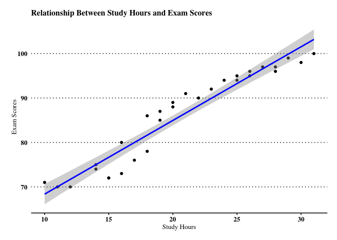<!-- -->

------------------------------------------------------------------------

2\.
[`geom_abline()`](https://ggplot2.tidyverse.org/reference/geom_abline.html)

- For this we first have to get the model coefficients

``` r
# Check model coefficients:
coef(simple_model)
```

    ## (Intercept) study_hours 
    ##   51.775821    1.658684

``` r
# Add regression line to plot:
ggplot(student_data, aes(x = study_hours, y = exam_score)) +
      geom_point() +
      geom_abline(aes(intercept = coef(simple_model)[1], slope = coef(simple_model)[2]),
                colour = "red") +
    labs(
    title = "Relationship Between Study Hours and Exam Scores",
    x = "Study Hours",
    y = "Exam Scores"
  ) +
    ggthemes::theme_wsj(color="white") + 
      theme(axis.text.x=element_text(size=10, family="times"), 
            plot.title = element_text(size=12, family="times"),
        axis.text.y=element_text(size=10, family="times"),
        axis.title.x=element_text(size=10, family="times"),
        axis.title.y=element_text(vjust=-0.50, size=10, family="times"),
        legend.position="none", 
        legend.box="vertical", 
        legend.title = element_blank(),
        legend.margin=margin(),
        legend.key = element_rect(fill=NA), 
        legend.background = element_rect(fill=NA),
        legend.box.background = element_blank())
```

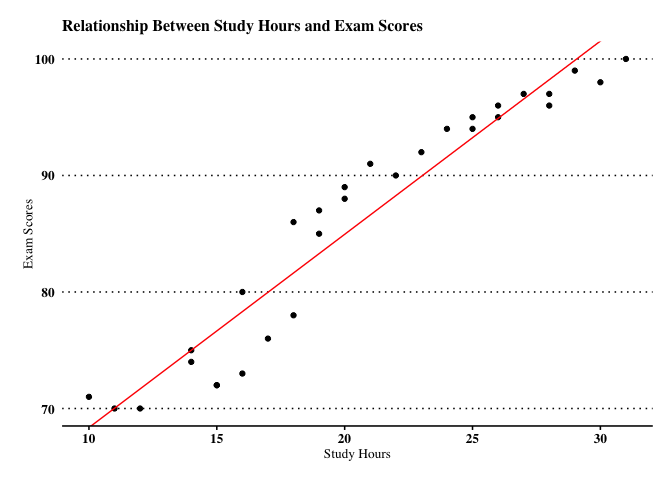<!-- -->

------------------------------------------------------------------------

### 3.2 Multiple Linear Regression

Why add more predictors? - Including additional variables can improve
predictions and help control for confounding factors.

Example: Predicting exam scores based on study hours and major.

Model:

$Exam\ Score = \beta_0 + \beta_1 \times Study\ Hours + \beta_2 \times Major\ + \epsilon$

``` r
# Fit a multiple linear regression model
multiple_model <- lm(exam_score ~ study_hours + major, data = student_data)

# Summary of the model
summary(multiple_model)
```

    ## 
    ## Call:
    ## lm(formula = exam_score ~ study_hours + major, data = student_data)
    ## 
    ## Residuals:
    ##     Min      1Q  Median      3Q     Max 
    ## -3.5735 -0.6463  0.0878  0.9269  2.5265 
    ## 
    ## Coefficients:
    ##               Estimate Std. Error t value Pr(>|t|)    
    ## (Intercept)    66.4077     3.3594  19.768  < 2e-16 ***
    ## study_hours     1.1015     0.1210   9.106 1.44e-09 ***
    ## majorBusiness  -8.9496     1.7397  -5.144 2.30e-05 ***
    ## majorCS        -0.4588     1.1036  -0.416    0.681    
    ## ---
    ## Signif. codes:  0 '***' 0.001 '**' 0.01 '*' 0.05 '.' 0.1 ' ' 1
    ## 
    ## Residual standard error: 1.48 on 26 degrees of freedom
    ## Multiple R-squared:  0.9816, Adjusted R-squared:  0.9795 
    ## F-statistic: 462.4 on 3 and 26 DF,  p-value: < 2.2e-16

<mark>In the multiple regression above **categorical variables (like
major)** are automatically converted into dummy variables (e.g.,
Business and Biology relative to CS as the baseline). The coefficients
for major show how much the exam scores differ for each major compared
to the baseline (CS). </mark>

Output:

$Exam\ Score = 66.401 + 1.102 \times Study\ Hours + -8.9496 \times majorBusiness + -0.4588 \times majorCS + \epsilon$

- $β0$: 66.4077
- The predicted exam score when study hours = 0.
- Study Hours: Statistically significant positive relationship with exam
  scores (`p-value < 0.001`).
- Major (Business): Business students score significantly lower than
  Biology students (`p-value < 0.001`).
- Major (CS): CS students do not have a statistically significant
  difference in scores compared to Biology students (`p-value = 0.681`).

Model Fit:

- Residual Standard Error (RSE): 1.48

  - On average, the predicted exam scores deviate by about 1.48 points
    from the actual scores.

- R-squared: 0.9816

  - 98.16% of the variance in exam scores is explained by the
    predictors.

- Adjusted R-squared: 0.9795

  - Adjusts for the number of predictors, indicating a very strong model
    fit.

- F-statistic: 462.4, p-value \< 2.2e-16.

The overall model is statistically significant.

------------------------------------------------------------------------

#### Understanding Dummy Variables

- Dummy variables encode categorical information numerically for
  regression analysis.
- Each level of a categorical variable is assigned a value of 0 or 1.
- This enables the inclusion of categorical predictors in models where
  only numerical variables are accepted.

e.g. in our data major is a categorical variable

``` r
head(student_data$major)
```

    ## [1] "CS" "CS" "CS" "CS" "CS" "CS"

For a categorical variable like Major with three levels (`Business`,
`CS`, `Biology`):

- R automatically creates $c-1$ dummy variables, where $c$ is the number
  of categories.

- If `Biology` is the reference category:

  - $Major_{Business}=1$, if `Major = Business`, `0` otherwise.

  - $Major_{CS}=1$, if `Major = CS`, `0` otherwise.

  - If both $Major_{Business}=0$ and $Major_{CS}=0$ the observation
    belongs to `Biology`.

We can change the reference category using
[`factor()`](https://www.rdocumentation.org/packages/base/versions/3.6.2/topics/factor)

Whatever we write first on the levels will be our reference category.

Arguments:`factor(x = character(), levels, labels = levels, exclude = NA, ordered = is.ordered(x), nmax = NA)`

``` r
student_data$major <- factor(student_data$major,
                             levels = c("CS", "Biology", "Business"))

# Fit a multiple linear regression model
multiple_model2 <- lm(exam_score ~ study_hours + major, data = student_data)

# Summary of the model
summary(multiple_model2)
```

    ## 
    ## Call:
    ## lm(formula = exam_score ~ study_hours + major, data = student_data)
    ## 
    ## Residuals:
    ##     Min      1Q  Median      3Q     Max 
    ## -3.5735 -0.6463  0.0878  0.9269  2.5265 
    ## 
    ## Coefficients:
    ##               Estimate Std. Error t value Pr(>|t|)    
    ## (Intercept)    65.9490     2.4880  26.507  < 2e-16 ***
    ## study_hours     1.1015     0.1210   9.106 1.44e-09 ***
    ## majorBiology    0.4588     1.1036   0.416    0.681    
    ## majorBusiness  -8.4908     0.9823  -8.644 4.02e-09 ***
    ## ---
    ## Signif. codes:  0 '***' 0.001 '**' 0.01 '*' 0.05 '.' 0.1 ' ' 1
    ## 
    ## Residual standard error: 1.48 on 26 degrees of freedom
    ## Multiple R-squared:  0.9816, Adjusted R-squared:  0.9795 
    ## F-statistic: 462.4 on 3 and 26 DF,  p-value: < 2.2e-16

**Class Questions:** Is this model better than previous or worst? What
are the differences?

------------------------------------------------------------------------

#### Visualizing Multiple Linear Regression

Scatter plot to see the effect of study hours on different majors

``` r
ggplot(student_data, aes(x = study_hours, y = exam_score, color = major)) +
  geom_point(size = 3) +
  geom_smooth(method = "lm", aes(color = major), se = TRUE) +
  labs(
    title = "Regression of Exam Scores by Study Hours and Major",
    x = "Study Hours",
    y = "Exam Score",
    color = "Major"
  ) +
  theme_minimal() +
        theme(axis.text.x=element_text(size=10, family="times"), 
            plot.title = element_text(size=12, family="times"),
        axis.text.y=element_text(size=10, family="times"),
        axis.title.x=element_text(size=10, family="times"),
        axis.title.y=element_text(vjust=-0.50, size=10, family="times"),
        legend.position="bottom", 
        legend.box="vertical", 
        legend.title = element_blank(),
        legend.margin=margin(),
        legend.key = element_rect(fill=NA), 
        legend.background = element_rect(fill=NA),
        legend.box.background = element_blank())
```

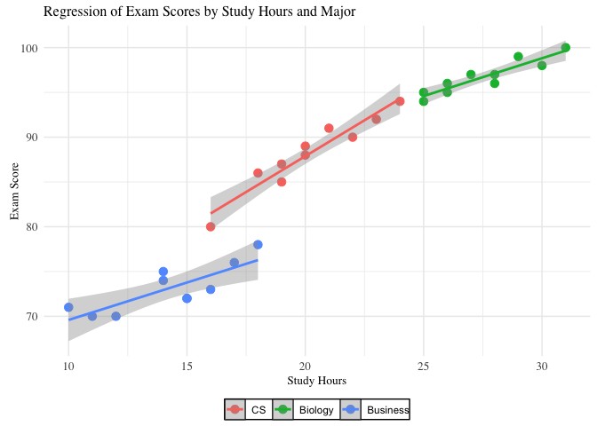<!-- -->

------------------------------------------------------------------------

Residual Plots

``` r
residuals <- residuals(multiple_model)
ggplot(data.frame(residuals = residuals), aes(x = residuals)) +
  geom_histogram(fill = "lightblue", color = "black", bins = 10) +
  labs(
    title = "Residual Distribution",
    x = "Residuals",
    y = "Frequency"
  ) +
  theme_minimal() +
  theme(axis.text.x=element_text(size=10, family="times"), 
        plot.title = element_text(size=12, family="times"),
        axis.text.y=element_text(size=10, family="times"),
        axis.title.x=element_text(size=10, family="times"),
        axis.title.y=element_text(vjust=-0.50, size=10, family="times"),
        legend.position="none", 
        legend.box="vertical", 
        legend.title = element_blank(),
        legend.margin=margin(),
        legend.key = element_rect(fill=NA), 
        legend.background = element_rect(fill=NA),
        legend.box.background = element_blank())
```

<!-- -->

------------------------------------------------------------------------

Boxplots of exam scores across majors can visually highlight
differences:

``` r
ggplot(student_data, aes(x = major, y = exam_score, fill = major)) +
  geom_boxplot() +
  labs(
    title = "Exam Scores by Major",
    x = "Major",
    y = "Exam Score"
  ) +
  theme_minimal() +
  theme(axis.text.x=element_text(size=10, family="times"), 
        plot.title = element_text(size=12, family="times"),
        axis.text.y=element_text(size=10, family="times"),
        axis.title.x=element_text(size=10, family="times"),
        axis.title.y=element_text(vjust=-0.50, size=10, family="times"),
        legend.position="none", 
        legend.box="vertical", 
        legend.title = element_blank(),
        legend.margin=margin(),
        legend.key = element_rect(fill=NA), 
        legend.background = element_rect(fill=NA),
        legend.box.background = element_blank())
```

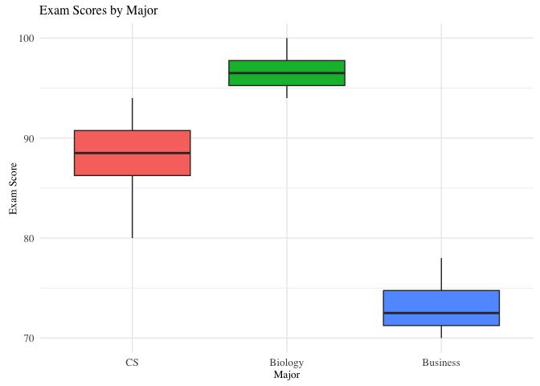<!-- -->

------------------------------------------------------------------------

### 3.3 Generalized Linear Models (GLMs)

Linear regression assumes the dependent variable is continuous and
normally distributed. GLMs extend this framework to handle:

- Count data (e.g., Poisson regression for event counts).

- Binary data (e.g., logistic regression for yes/no outcomes).

- Other non-normal outcomes.

Modeling Count Data:

1.  Poisson Regression: Use when the dependent variable is a count.

    - Assumes mean and variance are equal.

    - E.g., Number of books read per month.

2.  Quasi-Poisson Regression: Use when there is overdispersion (variance
    \> mean).

    - E.g., Number of visits to a website per day.

3.  Negative Binomial Regression: Another solution for overdispersion.

------------------------------------------------------------------------

**TRY: Count Data Example We want to model the number of books read per
month based on study hours.**

``` r
# Fit a Poisson regression model
poisson_model <- glm(count_books ~ study_hours, family = poisson, data = student_data)

# Summary of the model
summary(poisson_model)
```

    ## 
    ## Call:
    ## glm(formula = count_books ~ study_hours, family = poisson, data = student_data)
    ## 
    ## Coefficients:
    ##             Estimate Std. Error z value Pr(>|z|)    
    ## (Intercept)  1.07417    0.23969   4.481 7.41e-06 ***
    ## study_hours  0.05457    0.01033   5.285 1.26e-07 ***
    ## ---
    ## Signif. codes:  0 '***' 0.001 '**' 0.01 '*' 0.05 '.' 0.1 ' ' 1
    ## 
    ## (Dispersion parameter for poisson family taken to be 1)
    ## 
    ##     Null deviance: 74.978  on 29  degrees of freedom
    ## Residual deviance: 46.319  on 28  degrees of freedom
    ## AIC: 167.2
    ## 
    ## Number of Fisher Scoring iterations: 4

------------------------------------------------------------------------

#### 3.3.1 Visualizing Marginal Effects

Marginal effects plots show how the predicted values of the dependent
variable change as one predictor changes, holding other variables
constant.

We will be using [`ggeffects`
package](https://strengejacke.github.io/ggeffects/)

``` r
# install.packages("ggeffects")
library(ggeffects)

# Generate marginal effects for the Poisson model
marginal_effects_glm <- ggpredict(poisson_model, terms = "study_hours")

# Plot marginal effects
ggplot(marginal_effects_glm, aes(x = x, y = predicted)) +
  geom_line(size = 1, color = "blue") +
  geom_ribbon(aes(ymin = conf.low, ymax = conf.high), alpha = 0.2, fill = "lightblue") +
  labs(
    title = "Marginal Effects for Poisson Model",
    x = "Study Hours",
    y = "Predicted Count (Books Read)"
  ) +
  theme_minimal()
```

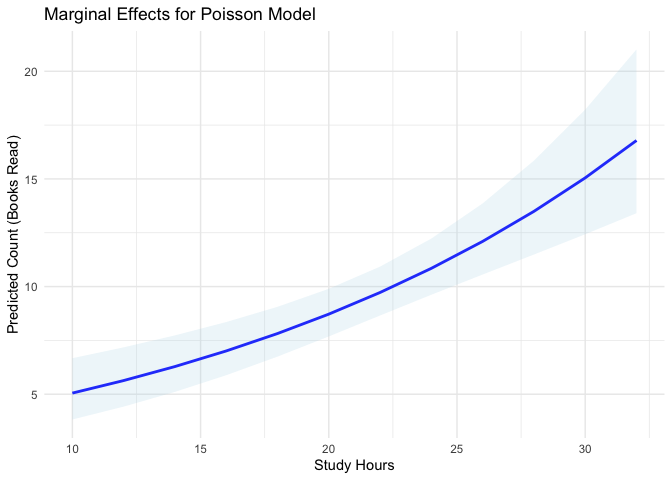<!-- -->

- Lines show the predicted values of exam_score for different genders as
  study_hours increase.
- Shaded ribbons represent confidence intervals.
- Diverging slopes indicate an interaction effect (e.g., the effect of
  study hours differs by gender).

------------------------------------------------------------------------

### 3.4 Visualizing Coefficients

**Coefficient plots visually represent the size and direction of
regression coefficients.**

[We will use the `broom` package.](https://broom.tidymodels.org/)

``` r
library(broom)

# Tidy the model output
coef_data <- broom::tidy(multiple_model)

# Plot coefficients with confidence intervals
ggplot(coef_data, aes(x = term, y = estimate, ymin = estimate - std.error, ymax = estimate + std.error)) +
  geom_point(size = 3, color = "blue") +
  geom_errorbar(width = 0.2, color = "black") +
  labs(
    title = "Regression Coefficients with Confidence Intervals",
    x = "Predictors",
    y = "Coefficient Estimate"
  ) +
  theme_minimal() +
  theme(axis.text.x=element_text(size=10, family="times"), 
            plot.title = element_text(size=12, family="times"),
        axis.text.y=element_text(size=10, family="times"),
        axis.title.x=element_text(size=10, family="times"),
        axis.title.y=element_text(vjust=-0.50, size=10, family="times"),
        legend.position="none", 
        legend.box="vertical", 
        legend.title = element_blank(),
        legend.margin=margin(),
        legend.key = element_rect(fill=NA), 
        legend.background = element_rect(fill=NA),
        legend.box.background = element_blank())
```

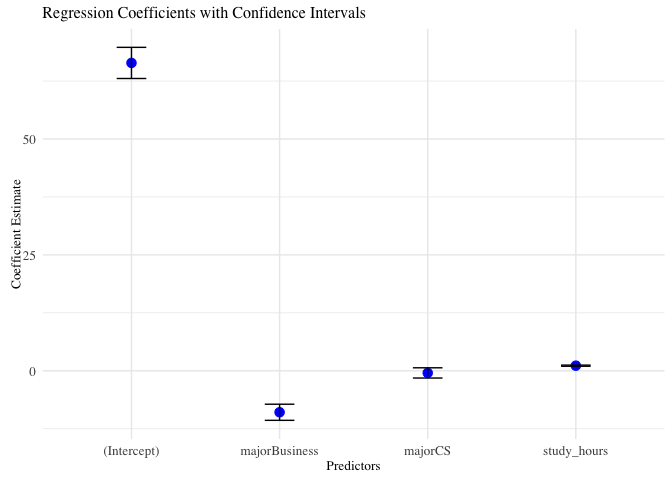<!-- -->

- Helps visualize the magnitude and direction of effects.
- Error bars indicate uncertainty (confidence intervals).
- **If the bar crosses zero**, the effect is not statistically
  significant.

N.B. I always create a vertical line for zero in different color so
people can see and flip the axis in the plot

``` r
ggplot(coef_data, aes(y = reorder(term, estimate), x = estimate, xmin = estimate - std.error, xmax = estimate + std.error)) +
  geom_point(size = 3, color = "blue") +
  geom_errorbarh(height = 0.2, color = "black") + # Horizontal error bars
  geom_vline(xintercept = 0, linetype = "dashed", color = "red") + # Vertical line at 0
  scale_x_continuous(breaks = seq(-10, 100, by = 5), minor_breaks = seq(-10, 100, by = 1)) + # Major and minor breaks
  labs(
    title = "Regression Coefficients with Confidence Intervals",
    x = "Coefficient Estimate",
    y = "Predictors"
  ) +
  theme_minimal() +
  theme(
    axis.text.x = element_text(size = 10, family = "times"),
    plot.title = element_text(size = 12, family = "times"),
    axis.text.y = element_text(size = 10, family = "times"),
    axis.title.x = element_text(size = 10, family = "times"),
    axis.title.y = element_text(vjust = -0.50, size = 10, family = "times"),
    legend.position = "none",
    legend.box = "vertical",
    legend.title = element_blank(),
    legend.margin = margin(),
    legend.key = element_rect(fill = NA),
    legend.background = element_rect(fill = NA),
    legend.box.background = element_blank()
  )
```

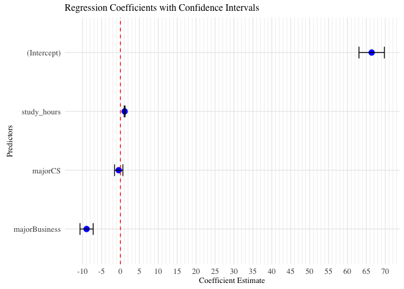<!-- -->

------------------------------------------------------------------------

### Class EXERCISE

1.  Create a coefficient plot for simple_model and multiple_model.
2.  Identify predictors with significant effects (bars not crossing
    zero).
3.  Discuss how confidence intervals help interpret statistical
    significance.

*How do the confidence intervals for majorBusiness and majorCS differ?
Which predictors are statistically significant?*

------------------------------------------------------------------------

### 3.5 Interaction Terms

- Interaction terms capture how the effect of one predictor changes
  depending on another.
- Commonly used for exploring relationships between numeric and
  categorical variables.

**TRY Interaction Between Study Hours and Gender**

Regression model:

$Exam Hours= \beta_0 + \beta_1 \times Study Hours + \beta_2 \times Gender + \beta_3 \times (Study Hours \times Gender) + \epsilon$

- $\beta_1$: Effect of study hours for the reference gender (e.g.,
  `Male`).
- $\beta_3$: How the effect of study hours differs for `Female` compared
  to `Male`.

So if:

1.  $Gender=Male$ (Gender=0):

    - $Exam Hours= \beta_0 + \beta_1 \times Study Hours + \epsilon$
    - $Slope=\beta_1$ and $Intercept=\beta_0$

2.  $Gender=Female$ (Gender=1):

- $Exam Score = (\beta_0 + \beta_2) + (\beta_1 + \beta_3) \times Study Hours$
- $Slope=\beta_1 + \beta_3$ and $Intercept= \beta_0 + \beta_2$

``` r
### First make gender into a categorical variable

student_data$gender <- factor(student_data$gender)

## we can write like this
interaction_model <- lm(exam_score ~ study_hours*gender, data = student_data)
interaction_model <- lm(exam_score ~ study_hours + gender + study_hours:gender, data = student_data)

summary(interaction_model)
```

    ## 
    ## Call:
    ## lm(formula = exam_score ~ study_hours + gender + study_hours:gender, 
    ##     data = student_data)
    ## 
    ## Residuals:
    ##     Min      1Q  Median      3Q     Max 
    ## -5.3272 -2.2929  0.2473  2.1297  4.4221 
    ## 
    ## Coefficients:
    ##                        Estimate Std. Error t value Pr(>|t|)    
    ## (Intercept)            52.13715    2.91207  17.904 3.83e-16 ***
    ## study_hours             1.63560    0.13435  12.174 3.04e-12 ***
    ## genderMale             -0.74146    4.06901  -0.182    0.857    
    ## study_hours:genderMale  0.04762    0.18965   0.251    0.804    
    ## ---
    ## Signif. codes:  0 '***' 0.001 '**' 0.01 '*' 0.05 '.' 0.1 ' ' 1
    ## 
    ## Residual standard error: 3.051 on 26 degrees of freedom
    ## Multiple R-squared:  0.9218, Adjusted R-squared:  0.9128 
    ## F-statistic: 102.2 on 3 and 26 DF,  p-value: 1.642e-14

------------------------------------------------------------------------

#### 3.5.1 Visualizing Marginal Effects:

Marginal effects plots show how the predicted values of the dependent
variable change as one predictor changes, holding other variables
constant.

``` r
library(ggeffects)

# Generate marginal effects for the interaction model
marginal_effects <- ggpredict(interaction_model, terms = c("study_hours", "gender"))

# Plot marginal effects
ggplot(marginal_effects, aes(x = x, y = predicted, color = group)) +
  geom_line(size = 1) +
  geom_ribbon(aes(ymin = conf.low, ymax = conf.high, fill = group), alpha = 0.2) +
  labs(
    title = "Marginal Effects of Study Hours by Gender",
    x = "Study Hours",
    y = "Predicted Exam Score",
    color = "Gender",
    fill = "Gender"
  ) +
  theme_minimal()
```

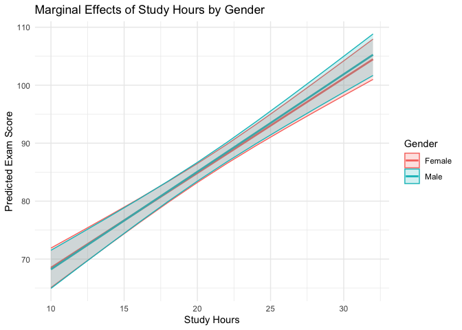<!-- -->

- Lines show the predicted values of exam_score for different genders as
  study_hours increase.
- Shaded ribbons represent confidence intervals.
- Diverging slopes indicate an interaction effect (e.g., the effect of
  study hours differs by gender).

------------------------------------------------------------------------

### CLASS Exercise

1.  Fit a multiple regression model to predict exam scores using study
    hours and gender. Interpret the results.

2.  Fit a Poisson regression model to predict counts of books read using
    study hours. Check for overdispersion.

3.  Visualize interaction effects between study hours and gender.

------------------------------------------------------------------------

### 3.6 Boot-Strapping

Traditional regression assumes normally distributed residuals. However,
real-world data often violates this assumption:

- Errors may not be normally distributed.

- Variance may not be constant (heteroscedasticity).

- There may be missing explanatory variables or non-linear
  relationships.

To address these challenges, bootstrap and permutation tests provide
alternative ways to compute p-values and confidence intervals, without
relying on the assumption of normality.

Bootstrapping is a resampling method that provides robust estimates of:

- Confidence intervals.

- Model coefficients.

- Standard errors.

<mark>Note: Instead of relying on theoretical assumptions, bootstrapping
generates multiple *resampled datasets* by sampling with replacement
from the original dataset. This simulates the variability in your
data.</mark>


Image from:
“<https://blogs.sas.com/content/iml/2018/12/12/essential-guide-bootstrapping-sas.html>”

------------------------------------------------------------------------

### 3.6.1 Types of Bootstrapping

- Case Resampling:
  - Entire rows are resampled (useful for heteroscedasticity or missing
    normality).
- Residual Resampling:
  - Residuals are resampled, which assumes the model is correctly
    specified.

------------------------------------------------------------------------

**Bootstrapping Coefficients**

Let’s bootstrap the coefficients for a regression model predicting exam
scores based on study hours and major.

We will use the [`boot`
package](https://cran.r-project.org/web/packages/boot/boot.pdf)

``` r
# Load required library
library(boot)

# Define a bootstrap function
bootstrap_coefficients <- function(formula, data, indices) {
  d <- data[indices, ]  # Resample rows
  model <- lm(formula, data = d)
  return(coef(model))  # Return coefficients
}

# Fit a regression model
model <- lm(exam_score ~ study_hours + major, data = student_data)

# Perform bootstrapping (1000 replications)
boot_results <- boot(data = student_data, statistic = bootstrap_coefficients, 
                     R = 1000, formula = exam_score ~ study_hours + major)

# View results
print(boot_results)
```

    ## 
    ## ORDINARY NONPARAMETRIC BOOTSTRAP
    ## 
    ## 
    ## Call:
    ## boot(data = student_data, statistic = bootstrap_coefficients, 
    ##     R = 1000, formula = exam_score ~ study_hours + major)
    ## 
    ## 
    ## Bootstrap Statistics :
    ##       original       bias    std. error
    ## t1* 65.9489646  0.060677828   3.3721331
    ## t2*  1.1015364 -0.002015023   0.1557605
    ## t3*  0.4587842  0.015405964   1.0891366
    ## t4* -8.4907816 -0.071197414   1.3171187

------------------------------------------------------------------------

### CLASS Exercise

Compare the results of boot_results with multiple_model:

``` r
print(multiple_model) ## i started for you
```

    ## 
    ## Call:
    ## lm(formula = exam_score ~ study_hours + major, data = student_data)
    ## 
    ## Coefficients:
    ##   (Intercept)    study_hours  majorBusiness        majorCS  
    ##       66.4077         1.1015        -8.9496        -0.4588

------------------------------------------------------------------------

#### 3.6.2 Visualizing Bootstrap Results

Bootstrap confidence intervals give a better understanding of the
variability in your estimates.

``` r
# Confidence intervals for coefficients
boot.ci(boot_results, type = "perc", index = 2)  # Study Hours
```

    ## BOOTSTRAP CONFIDENCE INTERVAL CALCULATIONS
    ## Based on 1000 bootstrap replicates
    ## 
    ## CALL : 
    ## boot.ci(boot.out = boot_results, type = "perc", index = 2)
    ## 
    ## Intervals : 
    ## Level     Percentile     
    ## 95%   ( 0.798,  1.403 )  
    ## Calculations and Intervals on Original Scale

``` r
# Visualize coefficient distributions
bootstrap_data <- data.frame(estimate = boot_results$t[, 2])  # Extract estimates for study_hours

ggplot(bootstrap_data, aes(x = estimate)) +
  geom_histogram(fill = "blue", color = "black", bins = 30) +
  labs(
    title = "Bootstrap Distribution of Study Hours Coefficient",
    x = "Coefficient Estimate",
    y = "Frequency"
  ) +
  theme_minimal()
```

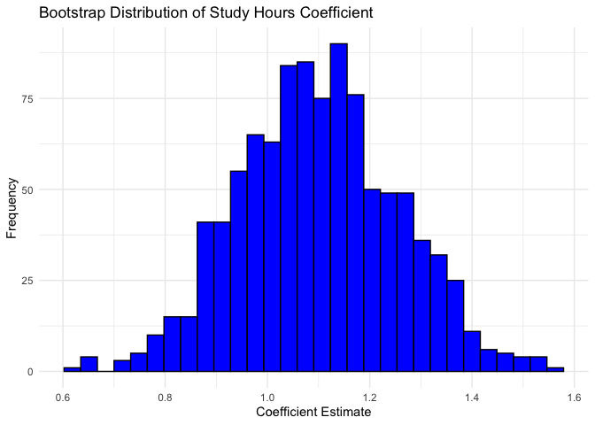<!-- -->

Interpreting Bootstrap Results

- Bootstrap Mean Estimate:

  - The average value of the bootstrapped coefficients.

- Bootstrap Confidence Intervals:

  - If the interval excludes 0, the predictor is likely significant.

- Histogram:

  - Shows the variability in coefficient estimates.

------------------------------------------------------------------------

### CLASS EXERCISE

1.  Perform bootstrapping for a simple regression model predicting
    `exam_score` using `study_hours`.
2.  Compare the bootstrapped confidence intervals with the traditional
    confidence intervals from `summary(lm(...))`.
3.  Interpret the bootstrap results.

------------------------------------------------------------------------

### 3.7 Permutation Tests

Permutation tests are a non-parametric alternative to traditional
hypothesis testing. They are especially useful when:

- Data assumptions (e.g., normality, independence) are violated.

- Sample sizes are small.

- You want to test whether observed relationships are stronger than
  random chance.

<mark>The dependent variable (response) is shuffled randomly to break
any existing relationships between the variables. This creates a *null
distribution* of test statistics, allowing comparison with the observed
value.</mark>

------------------------------------------------------------------------

### 3.7.1 Steps in a Permutation Test

1.  Fit the original model and calculate a test statistic (e.g., $R^2$,
    coefficient value).
2.  Randomly shuffle the dependent variable and refit the model.
3.  Calculate the test statistic for the permuted data.
4.  Repeat the process many times (e.g., 1000 permutations) to generate
    a null distribution.
5.  Compare the original test statistic to the null distribution:
    - If the observed value is extreme, the relationship is unlikely to
      be due to chance.

------------------------------------------------------------------------

**TRY:We’ll test whether the relationship between `exam_score`and
`study_hours` is stronger than would be expected by random chance.**

We will use [`lmPerm`
package](https://cran.r-project.org/web/packages/lmPerm/lmPerm.pdf)

``` r
# Install and load the lmPerm package (if not already installed)
# install.packages("lmPerm")
library(lmPerm)

# Fit a model with permutation tests
perm_model <- lmp(exam_score ~ study_hours + major, data = student_data, 
                  Ca = 0.001, maxIter = 1000)
```

    ## [1] "Settings:  unique SS : numeric variables centered"

``` r
# View summary
summary(perm_model)
```

    ## 
    ## Call:
    ## lmp(formula = exam_score ~ study_hours + major, data = student_data, 
    ##     Ca = 0.001, maxIter = 1000)
    ## 
    ## Residuals:
    ##      Min       1Q   Median       3Q      Max 
    ## -3.57355 -0.64631  0.08784  0.92692  2.52645 
    ## 
    ## Coefficients:
    ##             Estimate Iter Pr(Prob)    
    ## study_hours    1.102 1000   <2e-16 ***
    ## major1         2.677 1000   <2e-16 ***
    ## major2         3.136 1000    0.011 *  
    ## ---
    ## Signif. codes:  0 '***' 0.001 '**' 0.01 '*' 0.05 '.' 0.1 ' ' 1
    ## 
    ## Residual standard error: 1.48 on 26 degrees of freedom
    ## Multiple R-Squared: 0.9816,  Adjusted R-squared: 0.9795 
    ## F-statistic: 462.4 on 3 and 26 DF,  p-value: < 2.2e-16

Interpreting Permutation Test Results

- Coefficients: The estimated effects of predictors.

- P-values:

  - $p<0.05$: The relationship is statistically significant.

  - $𝑝≥0.05$: The relationship is not statistically significant.

N.B. Comparison to Bootstrap

- Permutation tests test the null hypothesis directly, while
  bootstrapping estimates variability.

So from our output Our p-value for `study_hours` is $p<0.001$, we
conclude that `study_hours` has a statistically significant effect on
`exam_score`.

------------------------------------------------------------------------

**Class Exercise**

1.  Fit a permutation test model for the relationship between
    `exam_score`, `study_hours`, and `major`. 2 Compare the permutation
    p-values with the p-values from `lm(...)`.
2.  Write an interpretation of the results.

------------------------------------------------------------------------

#### N.B. When to Use Bootstrap vs Permutation?

- Bootstrap is better when you believe relationships exist in the data,
  but assumptions (like normality) fail.
- Permutation tests are ideal for testing if observed relationships are
  stronger than random chance.

------------------------------------------------------------------------

### 3.8 Transformations

Transformations are often necessary when:

- The relationship between predictors and the response is non-linear.

- Residuals show signs of heteroscedasticity (non-constant variance).

- Residuals deviate significantly from normality.

Common Transformations:

1.  Log Transformation: $ln(y_i)=\beta_0+\beta_1x_i+\epsilon_i$
    - Use when variability increases with the magnitude of $y$
    - Compresses large values, stabilizes variance, and reduces
      right-skewness.

<!-- -->

2.  Square-Root Transformation: \$ y=\_0+\_1x_i+\_i\$
    - Useful for right-skewed data.
    - Reduces the influence of large outliers.
3.  Box-Cox Transformation:
    - Identifies the best transformation for your data automatically.
    - e.g., when $ln(y)$ is the optimal for $\lambda=0$

------------------------------------------------------------------------

#### 3.8.1 Log-Transformed Model

We’ll log-transform `exam_score` to reduce skewness and re-run a
regression model.

``` r
student_data$log_exam_score <- log(student_data$exam_score)
log_model <- lm(log_exam_score ~ study_hours + major, data=student_data)
summary(log_model)
```

    ## 
    ## Call:
    ## lm(formula = log_exam_score ~ study_hours + major, data = student_data)
    ## 
    ## Residuals:
    ##       Min        1Q    Median        3Q       Max 
    ## -0.041676 -0.013247  0.002896  0.012575  0.028860 
    ## 
    ## Coefficients:
    ##                Estimate Std. Error t value Pr(>|t|)    
    ## (Intercept)    4.214321   0.030182 139.629  < 2e-16 ***
    ## study_hours    0.013086   0.001467   8.918 2.18e-09 ***
    ## majorBiology  -0.002754   0.013388  -0.206    0.839    
    ## majorBusiness -0.108902   0.011917  -9.139 1.34e-09 ***
    ## ---
    ## Signif. codes:  0 '***' 0.001 '**' 0.01 '*' 0.05 '.' 0.1 ' ' 1
    ## 
    ## Residual standard error: 0.01796 on 26 degrees of freedom
    ## Multiple R-squared:  0.981,  Adjusted R-squared:  0.9788 
    ## F-statistic: 447.8 on 3 and 26 DF,  p-value: < 2.2e-16

------------------------------------------------------------------------

#### 3.8.2 Comparing Results After Transformation

- Compare $R^2$, adjusted $R^2$, and p-values.
- Highlight differences in coefficient interpretation.

E.g.,

- In the untransformed model we can say Each additional study hour
  increases exam scores by X points.

- In the log-transformed model - Each additional study hour increases
  exam scores by X%, approximately.

You can also use [`performance`
package](https://easystats.github.io/performance/) to compare models!!

``` r
# install.packages("performance")
library(performance)

compare_performance(multiple_model, log_model)
```

    ## # Comparison of Model Performance Indices
    ## 
    ## Name           | Model |  AIC (weights) | AICc (weights) |  BIC (weights) |    R2 | R2 (adj.) |  RMSE | Sigma
    ## -------------------------------------------------------------------------------------------------------------
    ## multiple_model |    lm |  114.4 (<.001) |  116.9 (<.001) |  121.4 (<.001) | 0.982 |     0.979 | 1.378 | 1.480
    ## log_model      |    lm | -150.3 (>.999) | -147.8 (>.999) | -143.3 (>.999) | 0.981 |     0.979 | 0.017 | 0.018

------------------------------------------------------------------------

#### 3.8.3 Finding the Best Transformation: Box-Cox Method

``` r
# Fit a linear model
multiple_model
```

    ## 
    ## Call:
    ## lm(formula = exam_score ~ study_hours + major, data = student_data)
    ## 
    ## Coefficients:
    ##   (Intercept)    study_hours  majorBusiness        majorCS  
    ##       66.4077         1.1015        -8.9496        -0.4588

``` r
# Load MASS for Box-Cox
library(MASS)

# Perform Box-Cox transformation
boxcox(multiple_model)
```

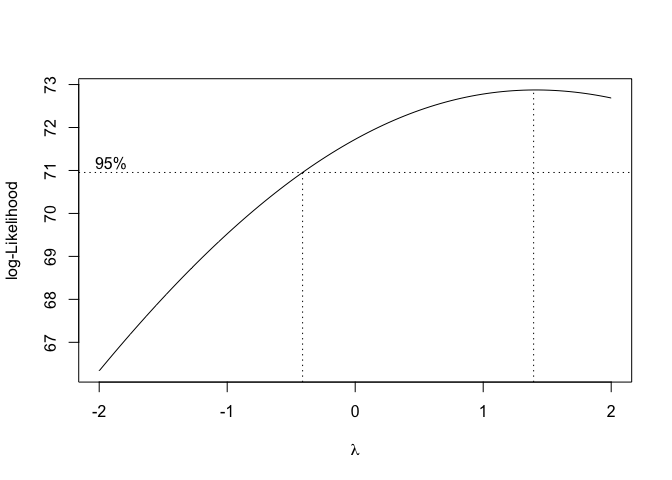<!-- -->

``` r
# Interpretation:
# The peak of the curve indicates the best value of λ.
# λ = 0 suggests log-transformation, while λ = 1 suggests no transformation.
```

------------------------------------------------------------------------

### CLASS EXERCISE:

1.  Perform a log transformation on exam_score and refit the regression
    model. Interpret the coefficients.
2.  Use the Box-Cox method to identify the best transformation for
    exam_score.
3.  Compare the results of the untransformed and transformed models.

------------------------------------------------------------------------

#### Class Exercises

1.  Bootstrap Confidence Intervals:
    - Fit a regression model to the `mtcars` dataset.
    - Use bootstrapping to calculate 95% confidence intervals for the
      coefficients.
2.  Permutation Test:
    - Test the significance of hp and wt predictors in the `mtcars`
      dataset using a permutation test.
3.  Applying Transformations:
    - Perform a Box-Cox analysis on mtcars\$mpg to determine the best
      transformation.

------------------------------------------------------------------------

### 3.9 Assumptions of Linear Regression

Why Are Assumptions Important? Linear regression models rely on
assumptions to ensure that:

1.  Coefficient estimates are unbiased and efficient.

2.  Hypothesis tests (e.g., p-values) are valid.

3.  Predictions are reliable.

Violating these assumptions can lead to:

- Misleading conclusions.

- Invalid statistical inferences.

------------------------------------------------------------------------

#### 3.9.1 Key Assumptions of Linear Regression

1\. Linearity - The relationship between predictors and the outcome is
linear.

- Check: Scatterplots (`geom_point`) of predictors vs. the outcome.

``` r
ggplot(student_data, aes(x = study_hours, y = exam_score)) +
  geom_point() +
  geom_smooth(method = "lm", se = FALSE, color = "blue") +
  labs(
    title = "Linearity Check",
    x = "Study Hours",
    y = "Exam Score"
  ) +
        theme(axis.text.x=element_text(size=10, family="times"), #### These are some of the adjustments i do to make graps prettier feel free to use them
            plot.title = element_text(size=12, family="times"),
        axis.text.y=element_text(size=10, family="times"),
        axis.title.x=element_text(size=10, family="times"),
        axis.title.y=element_text(vjust=-0.50, size=10, family="times"),
        legend.position="none", 
        legend.box="vertical", 
        legend.title = element_blank(),
        legend.margin=margin(),
        legend.key = element_rect(fill=NA), 
        legend.background = element_rect(fill=NA),
        legend.box.background = element_blank())
```

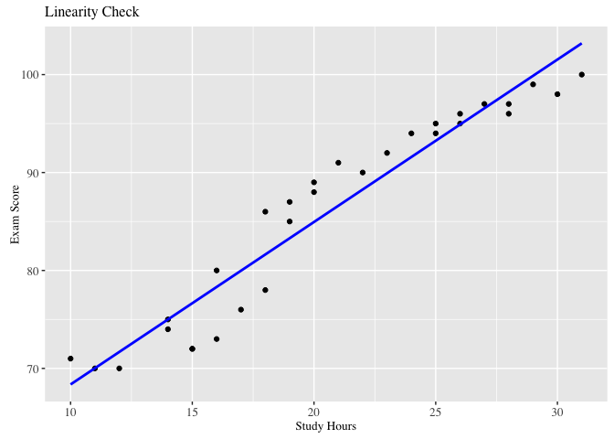<!-- -->

------------------------------------------------------------------------

2\. Independence - Observations are independent of one another.

- Check: Use domain knowledge (e.g., no clustering, repeated measures).

------------------------------------------------------------------------

3\. Homoscedasticity

- Residuals have constant variance across all levels of the predictors.

- Check: Plot residuals vs. fitted values. Look for a random scatter
  around zero.

``` r
# Residuals vs. fitted values
plot(multiple_model, which = 1)
```

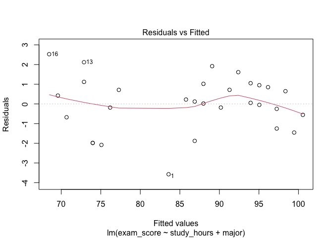<!-- -->

or

``` r
check_heteroscedasticity(multiple_model)
```

    ## OK: Error variance appears to be homoscedastic (p = 0.081).

------------------------------------------------------------------------

4\. Normality of Residuals - Residuals are normally distributed.

- Check: Use a histogram of residuals or a Q-Q plot.

``` r
# Histogram of residuals
residuals <- residuals(multiple_model)
ggplot(data.frame(residuals = residuals), aes(x = residuals)) +
  geom_histogram(fill = "blue", color = "black", bins = 10) +
  labs(
    title = "Histogram of Residuals",
    x = "Residuals",
    y = "Frequency"
  )
```

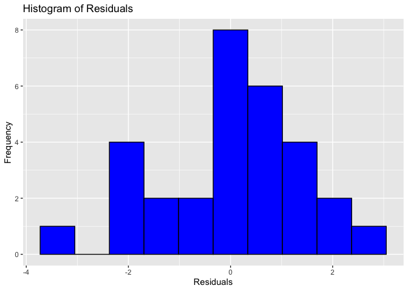<!-- -->

``` r
# Q-Q plot
plot(multiple_model, which = 2)
```

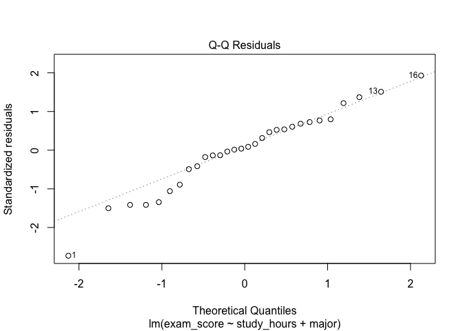<!-- -->

or

``` r
check_residuals(multiple_model)
```

    ## OK: Simulated residuals appear as uniformly distributed (p = 0.814).

------------------------------------------------------------------------

You can also use other functions in [`performance`
package](https://easystats.github.io/performance/) to test and compare
models.

``` r
check_model(multiple_model)
```

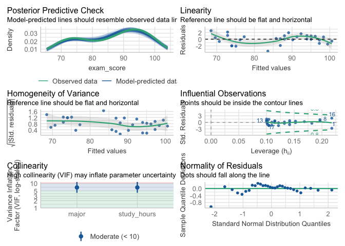<!-- -->

------------------------------------------------------------------------

6\. Count Data Diagnostics

- Overdispersion When working with count models (e.g., Poisson
  regression), assumptions differ slightly. One key check is for
  overdispersion (variance \> mean).

  - A dispersion ratio near 1 indicates no overdispersion.

  - If the ratio \> 1, consider quasi-Poisson or negative binomial
    models.

Overdispersion Check:

``` r
# Calculate dispersion ratio
dispersion_ratio <- sum(residuals(poisson_model, type = "pearson")^2) / df.residual(poisson_model)
dispersion_ratio
```

    ## [1] 1.517608

or

``` r
check_overdispersion(poisson_model)
```

    ## # Overdispersion test
    ## 
    ##        dispersion ratio =  1.518
    ##   Pearson's Chi-Squared = 42.493
    ##                 p-value =  0.039

------------------------------------------------------------------------

Addressing Violations of Assumptions

1.  Linearity: - Use transformations (e.g., log, square root) or include
    interaction terms.

2.  Homoscedasticity: - Use robust standard errors (sandwich package) or
    generalized linear models (GLMs).

3.  Normality: - Transform the dependent variable or use bootstrapping
    for confidence intervals.

4.  Overdispersion (Count Models): - Switch to quasi-Poisson or negative
    binomial regression.

------------------------------------------------------------------------

### CLASS Exercise

1.  Fit a regression model for `exam_score ~ study_hours + gender`.

2.  Check:

    - Linearity and homoscedasticity using diagnostic plots.

    - Overdispersion for a Poisson model of count data.

3.  Write an interpretation of your findings and suggest possible fixes
    for violations.

------------------------------------------------------------------------

### Lecture 5 Cheat Sheet

| **Function/Concept** | **Description** | **Code Example** |
|----|----|----|
| `group_by()` + `summarize()` | Groups data and computes summary statistics for each group. | `data |> group_by(group_col) |> summarize(mean_col = mean(column))` |
| `mean()` | Calculates the mean (average) of a numeric variable. | `mean(data$column)` |
| `median()` | Finds the median (middle value) of a numeric variable. | `median(data$column)` |
| `sd()` | Calculates the standard deviation (spread) of a numeric variable. | `sd(data$column)` |
| `geom_boxplot()` | Creates a boxplot to visualize the distribution and outliers of data. | `geom_boxplot(aes(x = group, y = value, fill = group))` |
| `t.test()` | Performs a t-test to compare means between two groups. | `t.test(value ~ group, data = data)` |
| `aov()` | Performs ANOVA (Analysis of Variance) for comparing means across multiple groups. | `aov(value ~ group, data = data)` |
| `geom_errorbar()` | Visualizes confidence intervals in a plot. | `geom_errorbar(aes(ymin = mean - ci, ymax = mean + ci), width = 0.2)` |
| `lm()` | Fits a linear regression model. | `lm(outcome ~ predictor1 + predictor2, data = data)` |
| `glm()` | Fits a generalized linear model (e.g., Poisson, logistic regression). | `glm(outcome ~ predictor, family = poisson, data = data)` |
| `broom::tidy()` | Tidies regression model output into a data frame for plotting. | `broom::tidy(model)` |
| `geom_point()` | Adds points to a plot (e.g., coefficient estimates). | `geom_point(aes(x = estimate, y = predictor))` |
| `geom_errorbarh()` | Adds horizontal error bars (confidence intervals). | `geom_errorbarh(aes(xmin = estimate - std.error, xmax = estimate + std.error))` |
| `geom_hline()` | Adds a horizontal reference line to a plot. | `geom_hline(yintercept = 0, linetype = "dashed", color = "red")` |
| `ggeffects::ggpredict()` | Computes marginal effects for regression models. | `ggeffects::ggpredict(model, terms = c("predictor1", "predictor2"))` |
| `boot()` | Performs bootstrapping for coefficient estimates. | `boot(data = data, statistic = fn, R = 1000, formula = formula)` |
| `boot.ci()` | Computes confidence intervals for bootstrapped results. | `boot.ci(boot_results, type = "perc")` |
| `lmPerm::lmp()` | Fits a regression model with permutation tests. | `lmp(outcome ~ predictor, data = data, Ca = 0.001, maxIter = 1000)` |
| `log()` | Log transformation of a variable to stabilize variance or reduce skewness. | `log(data$column)` |
| `sqrt()` | Square root transformation to reduce the influence of outliers. | `sqrt(data$column)` |
| `MASS::boxcox()` | Identifies the best transformation for a regression model. | `boxcox(model)` |
| `plot()` | Generates diagnostic plots for a linear model (e.g., residuals vs. fitted). | `plot(model)` |
| `performance::check_model()` | Checks assumptions of a regression model (e.g., linearity, homoscedasticity). | `check_model(model)` |
| `check_heteroscedasticity()` | Tests for heteroscedasticity in residuals. | `check_heteroscedasticity(model)` |
| `check_overdispersion()` | Tests for overdispersion in count models. | `check_overdispersion(poisson_model)` |
