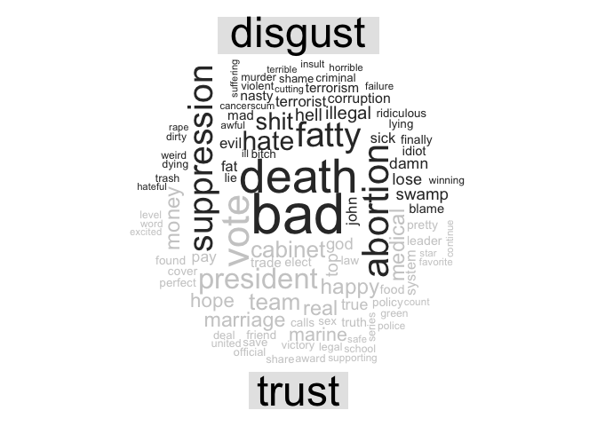
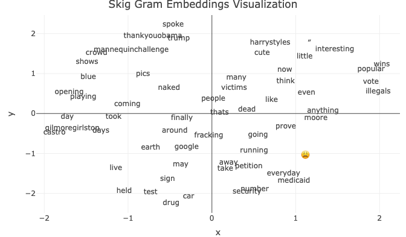

Text as Data: Dictionary Methods and Word Embeddings
================
Dr. Ayse D. Lokmanoglu
Lecture 8, (B) March 19, (A) March 24

# R Exercises

------------------------------------------------------------------------

**ALWAYS** Let’s load our libraries

``` r
library(tidyverse)
library(tidytext)
library(ggplot2)
library(stopwords)
library(data.table)
library(word2vec)
library(umap)
library(reshape2)
library(wordcloud)
library(text2vec)
library(tm)
library(ggrepel)
library(plotly)
```

## 1. Introduction to Text as Data

Text data:

- is unstructured,

- requires preprocessing to be analyzed.


*source:
<https://media.geeksforgeeks.org/wp-content/uploads/20210526142713/BlockDigramofTextMining.png>*

| **Phase** | **Technique** | **Core Question** | **Purpose** | **Methods & R Packages** |
|----|----|----|----|----|
| **Text Preprocessing** | Tokenization | How can we segment text into meaningful units? | Convert text into individual words or phrases. | `tidytext` (`unnest_tokens()`), `stringr` (`str_split()`) |
|  | Stopword Removal | How can we remove redundant words? | Eliminate common words that add little meaning. | `tidytext` (`stop_words`), `tm` (`removeWords()`) |
|  | Lemmatization & Stemming | How can we reduce word variations? | Standardize words to their root forms. | `textstem` (`lemmatize_words()`), `SnowballC` (`wordStem()`) |
| **Feature Engineering** | N-grams | How can we capture word sequences? | Identify multi-word expressions and patterns. | `tidytext` (`unnest_tokens(ngrams = 2)`), `text2vec` |
|  | Part-of-Speech Tagging | How can we recognize word functions? | Assign grammatical categories to words. | `udpipe` (`udpipe_annotate()`), `spacyr` |
| **Content Analysis** | Dictionary-Based Analysis | How can we quantify meaning in text? | Detect linguistic, psychological, or topical patterns. | `tidytext` (`get_sentiments()`), `quanteda` (`dfm_lookup()`) |
| **Machine Learning** | Supervised Classification | How can we predict categories from text? | Assign labels based on prior training examples. | `caret`, `textrecipes`, `tidymodels` |
|  | Unsupervised Clustering | How can we discover hidden patterns? | Group similar documents or topics automatically. | `topicmodels` (LDA), `quanteda` (k-means clustering), `text2vec` (word embeddings) |

We will learn 2 methods today:

1.  **Dictionary Methods** - Using predefined word lists to categorize
    text (e.g., sentiment analysis with lexicons).

2.  **Word Embeddings** - Representing words as numerical vectors to
    capture semantic relationships and similarities.

------------------------------------------------------------------------

## 2. Dictionary Methods

Dictionary-based methods assign predefined categories to words.

### 2.1 Online Dataset: Twitter Data

**Note:** **This dataset is raw and unfiltered, meaning it may contain
explicit language, including swear words. Please proceed with awareness
and discretion.**

We will use a publicly available Twitter Sentiment Analysis Dataset,
which contains tweets labeled as positive, neutral, or negative.

``` r
twitter_data <- read_csv("https://raw.githubusercontent.com/cardiffnlp/tweeteval/main/datasets/sentiment/test_text.txt", col_names = FALSE) |>
  rename(text = X1) ### renaming the first column as text

head(twitter_data)
```

    ## # A tibble: 6 × 1
    ##   text                                                                          
    ##   <chr>                                                                         
    ## 1 @user @user what do these '1/2 naked pics' have to do with anything? They're …
    ## 2 OH: “I had a blue penis while I was this” [playing with Google Earth VR]      
    ## 3 @user @user That's coming, but I think the victims are going to be Medicaid r…
    ## 4 I think I may be finally in with the in crowd #mannequinchallenge  #grads2014…
    ## 5 @user Wow,first Hugo Chavez and now Fidel Castro. Danny Glover, Michael Moore…
    ## 6 Savchenko now Saakashvili took drug test live on Ukraine TV. To prove they ar…

------------------------------------------------------------------------

### 2.2 Text Preprocessing

Since the dataset consists of a **single column of text**, we need to
ensure proper formatting before tokenization. We will also remove
unnecessary whitespace and convert text to lowercase to maintain
consistency. Also always add an index column to later help with the
merging of the data.

``` r
# Ensure text is properly formatted
twitter_data <- twitter_data |>
  mutate(textBU = text,   ### created a backup column so we always have the OG text
    text = str_squish(text)) |>
  filter(!is.na(text)) |>
  mutate(text = str_remove_all(text, "@\\S+")) |> # Remove usernames
  mutate(text = str_remove_all(text, "\\d+")) |>  # remove numbers
  mutate(post_index = seq_len(nrow(twitter_data))) |> ### creating an index
  mutate(nwords = str_count(text, "\\w+")) ### counting number of words you will see why

head(twitter_data)
```

    ## # A tibble: 6 × 4
    ##   text                                                  textBU post_index nwords
    ##   <chr>                                                 <chr>       <int>  <int>
    ## 1 "  what do these '/ naked pics' have to do with anyt… @user…          1     16
    ## 2 "OH: “I had a blue penis while I was this” [playing … OH: “…          2     15
    ## 3 "  That's coming, but I think the victims are going … @user…          3     14
    ## 4 "I think I may be finally in with the in crowd #mann… I thi…          4     13
    ## 5 " Wow,first Hugo Chavez and now Fidel Castro. Danny … @user…          5     22
    ## 6 "Savchenko now Saakashvili took drug test live on Uk… Savch…          6     18

Before applying dictionary methods: - Clean the text by: - Removing stop
words and unnecessary characters.

``` r
# Tokenize text
twitter_tokens <- twitter_data |>
  unnest_tokens(word, text) |>
  anti_join(stop_words, by = "word") ## removing stopwords

# View tokenized words
head(twitter_tokens)
```

    ## # A tibble: 6 × 4
    ##   textBU                                                 post_index nwords word 
    ##   <chr>                                                       <int>  <int> <chr>
    ## 1 @user @user what do these '1/2 naked pics' have to do…          1     16 naked
    ## 2 @user @user what do these '1/2 naked pics' have to do…          1     16 pics 
    ## 3 OH: “I had a blue penis while I was this” [playing wi…          2     15 blue 
    ## 4 OH: “I had a blue penis while I was this” [playing wi…          2     15 penis
    ## 5 OH: “I had a blue penis while I was this” [playing wi…          2     15 play…
    ## 6 OH: “I had a blue penis while I was this” [playing wi…          2     15 goog…

------------------------------------------------------------------------

### 2.3 Sentiment Analysis with Dictionary Methods

To understand how different sentiment analysis lexicons classify text,
we will compare results from multiple dictionaries, including **Bing**,
**AFINN**, and **NRC**. Each lexicon provides different insights:

- [**Bing**](https://www.cs.uic.edu/~liub/FBS/sentiment-analysis.html):
  Binary classification (positive/negative sentiment).
- [**AFINN**](http://www2.imm.dtu.dk/pubdb/views/publication_details.php?id=6010):
  Numeric scores for sentiment intensity.
- [**NRC**](http://saifmohammad.com/WebPages/NRC-Emotion-Lexicon.htm):
  Categorizes words into emotional dimensions (anger, joy, fear, etc.).

**Note: For AFINN you need to select 1 in your console**

``` r
get_sentiments("afinn")
```

    ## # A tibble: 2,477 × 2
    ##    word       value
    ##    <chr>      <dbl>
    ##  1 abandon       -2
    ##  2 abandoned     -2
    ##  3 abandons      -2
    ##  4 abducted      -2
    ##  5 abduction     -2
    ##  6 abductions    -2
    ##  7 abhor         -3
    ##  8 abhorred      -3
    ##  9 abhorrent     -3
    ## 10 abhors        -3
    ## # ℹ 2,467 more rows

``` r
get_sentiments("bing")
```

    ## # A tibble: 6,786 × 2
    ##    word        sentiment
    ##    <chr>       <chr>    
    ##  1 2-faces     negative 
    ##  2 abnormal    negative 
    ##  3 abolish     negative 
    ##  4 abominable  negative 
    ##  5 abominably  negative 
    ##  6 abominate   negative 
    ##  7 abomination negative 
    ##  8 abort       negative 
    ##  9 aborted     negative 
    ## 10 aborts      negative 
    ## # ℹ 6,776 more rows

``` r
get_sentiments("nrc")
```

    ## # A tibble: 13,872 × 2
    ##    word        sentiment
    ##    <chr>       <chr>    
    ##  1 abacus      trust    
    ##  2 abandon     fear     
    ##  3 abandon     negative 
    ##  4 abandon     sadness  
    ##  5 abandoned   anger    
    ##  6 abandoned   fear     
    ##  7 abandoned   negative 
    ##  8 abandoned   sadness  
    ##  9 abandonment anger    
    ## 10 abandonment fear     
    ## # ℹ 13,862 more rows

Let’s now see how is it in our dataset

``` r
# Apply Bing sentiment lexicon
## Step 1:
bing_sentiments_S1 <- twitter_tokens |>
  inner_join(get_sentiments("bing"), by = "word")
head(bing_sentiments_S1)
```

    ## # A tibble: 6 × 5
    ##   textBU                                       post_index nwords word  sentiment
    ##   <chr>                                             <int>  <int> <chr> <chr>    
    ## 1 @user Wow,first Hugo Chavez and now Fidel C…          5     22 wow   positive 
    ## 2 Twitter's #ThankYouObama Shows Heartfelt Gr…          8      8 hear… positive 
    ## 3 Twitter's #ThankYouObama Shows Heartfelt Gr…          8      8 grat… positive 
    ## 4 @user @user @user @user @user @user take aw…         10     12 dead  negative 
    ## 5 @user @user @user @user @user @user take aw…         10     12 trump positive 
    ## 6 @user @user @user @user @user @user take aw…         10     12 wins  positive

``` r
bing_sentiments_S2 <- bing_sentiments_S1 |> 
  count(post_index, sentiment)
head(bing_sentiments_S2)
```

    ## # A tibble: 6 × 3
    ##   post_index sentiment     n
    ##        <int> <chr>     <int>
    ## 1          5 positive      1
    ## 2          8 positive      2
    ## 3         10 negative      1
    ## 4         10 positive      3
    ## 5         13 positive      1
    ## 6         15 negative      2

``` r
bing_sentiments_S3 <- bing_sentiments_S2 |> 
  pivot_wider(names_from = sentiment, values_from = n, values_fill = 0)

head(bing_sentiments_S3)
```

    ## # A tibble: 6 × 3
    ##   post_index positive negative
    ##        <int>    <int>    <int>
    ## 1          5        1        0
    ## 2          8        2        0
    ## 3         10        3        1
    ## 4         13        1        0
    ## 5         15        1        2
    ## 6         17        1        1

``` r
bing_sentiments_S4 <- bing_sentiments_S3 |> 
  mutate(sentiment = positive - negative)
head(bing_sentiments_S4)
```

    ## # A tibble: 6 × 4
    ##   post_index positive negative sentiment
    ##        <int>    <int>    <int>     <int>
    ## 1          5        1        0         1
    ## 2          8        2        0         2
    ## 3         10        3        1         2
    ## 4         13        1        0         1
    ## 5         15        1        2        -1
    ## 6         17        1        1         0

Full Pipe:

``` r
bing_sentiments <- twitter_tokens |>
  inner_join(get_sentiments("bing"), by = "word") |> 
  count(post_index, sentiment) |> 
  pivot_wider(names_from = sentiment, values_from = n, values_fill = 0) |> 
  mutate(sentiment = positive - negative) |> 
  mutate(method = "Bing")
```

Now let’s repeat it with AFINN, from now on I am going to give you the
full pipeline, if you want you can see step by step

``` r
afinn_sentiments <- twitter_tokens |>
  inner_join(get_sentiments("afinn")) |> 
  group_by(post_index) |>  
  summarise(sentiment = sum(value)) |> 
  mutate(method = "AFINN")
```

Now w/ NRC:

``` r
nrc_sentiments <-  twitter_tokens |> 
    inner_join(get_sentiments("nrc") |> 
                 filter(sentiment %in% c("positive", 
                                         "negative"))) |> 
  count(post_index, sentiment) |> 
  pivot_wider(names_from = sentiment, values_from = n, values_fill = 0) |> 
  mutate(sentiment = positive - negative) |> 
  mutate(method = "NRC")
```

------------------------------------------------------------------------

### 2.4 Visualizing and Comparing Sentiment Analysis Results

``` r
all_sentiments <- bind_rows(afinn_sentiments,
          bing_sentiments,
          nrc_sentiments) |> 
  dplyr::select(-positive, -negative)


ggplot(all_sentiments,
       aes(post_index, sentiment, fill = method)) +
  geom_col(show.legend = FALSE) +
  facet_wrap(~method, ncol = 1, scales = "free_y")
```

<!-- -->

------------------------------------------------------------------------

### 2.5 Most common positive and negative words

``` r
bing_word_counts <- twitter_tokens |> 
  inner_join(get_sentiments("bing")) |> 
  count(word, sentiment, sort = TRUE) |> 
  ungroup()

head(bing_word_counts)
```

    ## # A tibble: 6 × 3
    ##   word    sentiment     n
    ##   <chr>   <chr>     <int>
    ## 1 trump   positive   1028
    ## 2 love    positive    213
    ## 3 bad     negative    176
    ## 4 death   negative    143
    ## 5 popular positive    132
    ## 6 protest negative    124

Visualize it:

``` r
bing_word_counts |> 
  group_by(sentiment) |> 
  slice_max(n, n = 10) |> 
  ungroup() |> 
  mutate(word = reorder(word, n)) |> 
  ggplot(aes(n, word, fill = sentiment)) +
  geom_col(show.legend = FALSE) +
  facet_wrap(~sentiment, scales = "free_y") +
  labs(x = "Sentiment Count",
       y = NULL)
```

<!-- -->

We can also do wordclouds

``` r
twitter_tokens |> 
  inner_join(get_sentiments("nrc")) |> 
  filter(sentiment == "disgust" | sentiment == "trust") |> ### try to change these try different ones
  count(word, sentiment, sort = TRUE) |> 
  acast(word ~ sentiment, value.var = "n", fill = 0) |> 
  comparison.cloud(colors = c("gray20", "gray80"),
                   max.words = 100)
```

<!-- -->

------------------------------------------------------------------------

### 2.6 Normalize sentiment scores

- What are some ways I can normalize sentiment scores?
  - Divide by number of words in my document!

``` r
afinn_sentiments2 <- afinn_sentiments |>
  left_join(twitter_data, by = "post_index") |> 
  group_by(post_index) |>
  mutate(normalized_score = sentiment / nwords)

head(afinn_sentiments2)
```

    ## # A tibble: 6 × 7
    ## # Groups:   post_index [6]
    ##   post_index sentiment method text                textBU nwords normalized_score
    ##        <int>     <dbl> <chr>  <chr>               <chr>   <int>            <dbl>
    ## 1          3        -3 AFINN  "  That's coming, … @user…     14           -0.214
    ## 2          5         6 AFINN  " Wow,first Hugo C… @user…     22            0.273
    ## 3          8         3 AFINN  "Twitter's #ThankY… Twitt…      8            0.375
    ## 4         10         4 AFINN  "      take away i… @user…     12            0.333
    ## 5         11        -2 AFINN  "An interesting se… An in…     11           -0.182
    ## 6         13         2 AFINN  "#onedirection #ha… #oned…      5            0.4

``` r
ggplot(afinn_sentiments2, aes(x = normalized_score)) +
  geom_histogram() +
  labs(
    title = "Histogram of AFINN Normalized Sentiment Scores",
    x = "AFINN Normalized Scores",
    y = "Count"
  ) +
  theme_minimal()
```

<!-- -->

To compare the non-normalized scores:

``` r
ggplot(afinn_sentiments2, aes(x = sentiment)) +
  geom_histogram() +
  labs(
    title = "Histogram of AFINN  Sentiment Scores",
    x = "AFINN  Scores",
    y = "Count"
  ) +
  theme_minimal()
```

<!-- -->

------------------------------------------------------------------------

## 3. Word Embeddings

Word embeddings are a powerful method for representing words as
numerical vectors in a high-dimensional space, capturing semantic
relationships based on context. Unlike dictionary-based sentiment
analysis, word embeddings can recognize nuances in meaning, synonyms,
and relationships between words.

------------------------------------------------------------------------

### 3.1 Introduction to Word Embeddings

- [**Word2Vec**](https://cran.r-project.org/web/packages/word2vec/readme/README.html):
  Uses a neural network model to generate word embeddings based on
  context.
- [**GloVe**](https://cran.r-project.org/web/packages/text2vec/vignettes/glove.html):
  Constructs word vectors based on word co-occurrence in a corpus.
- [**FastText**](https://cran.r-project.org/web/packages/fastText/index.html):
  Extends Word2Vec by representing words as subword n-grams, improving
  performance for rare words.

------------------------------------------------------------------------

#### 3.1.1 Continuous Bag of Words (CBOW)

The **CBOW model** predicts a target word based on the surrounding
context words. It works as follows:

1.  **Input Context**: The model takes a window of words surrounding a
    target word.
2.  **Word Representation**: Each word is mapped to a vector embedding
    that captures its semantic and syntactic properties.
3.  **Aggregation**: The individual word vectors in the context window
    are combined into a single vector.
4.  **Prediction**: The model uses this aggregated vector to predict the
    most probable target word.
5.  **Optimization**: The model is trained to minimize the difference
    between predicted and actual words, refining the vector
    representations over time.


*image from:
<https://media.geeksforgeeks.org/wp-content/uploads/20231220164157/Screenshot-2023-12-20-164143.png>*

For example, given the sentence *“The weather is very nice today”* and a
window size of 2, to predict the word **“nice”**, the context words
**“very”** and **“today”** are used as input.

CBOW is efficient for handling large datasets and is useful for tasks
requiring general word representations.

------------------------------------------------------------------------

#### 3.1.2 Skip-Gram Model

Unlike CBOW, the **Skip-Gram model** works in reverse: it predicts
**context words** given a target word. It works as follows:

1.  **Input Target Word**: The model takes a single word as input.
2.  **Word Representation**: The target word is mapped to a
    high-dimensional vector embedding.
3.  **Probability Distribution**: The model generates probabilities for
    words likely to appear in the surrounding context.
4.  **Context Word Prediction**: Words with the highest probability are
    selected as context words.
5.  **Training Optimization**: The model fine-tunes word embeddings by
    maximizing the probability of correctly predicting surrounding
    words.


*image from:
<https://media.geeksforgeeks.org/wp-content/uploads/20231220164505/Screenshot-2023-12-20-164451.png>*

For example, given the target word **“nice”** in the sentence *“The
weather is very nice today”* (with a window size of 2), the model tries
to predict context words **“very”** and **“today”**.

Skip-Gram performs better on small datasets and captures relationships
between rare words more effectively.

------------------------------------------------------------------------

### 3.2 Applying Word Embeddings in R

We will train a **Word2Vec model** on the Twitter dataset using both
**Continuous Bag of Words (CBOW)** and **Skip-Gram** algorithms to
analyze relationships between words. For more on wordembeddings:
<https://s-ai-f.github.io/Natural-Language-Processing/Word-embeddings.html>

*Exercise is from
<https://media.geeksforgeeks.org/wp-content/uploads/20231220164505/Screenshot-2023-12-20-164451.png>*

#### 3.2.1 Training Word2Vec with CBOW

Step 1: Select the text column

``` r
tweets <- twitter_data$text
```

Step 2: Train a Word2Vec model using the CBOW algorithm

``` r
cbow_model <- word2vec(x = tweets, type = "cbow", dim = 15, iter = 20)
```

Step 3: Create embeddings using the trained CBOW model and print

``` r
# checking embeddings
cbow_embedding <- as.matrix(cbow_model)
cbow_embedding <- predict(cbow_model, c("election", "vote"), type = "embedding")
print("The CBOW embedding for election and vote is as follows ")
```

    ## [1] "The CBOW embedding for election and vote is as follows "

``` r
print(cbow_embedding)
```

    ##              [,1]      [,2]       [,3]       [,4]       [,5]      [,6]
    ## election 1.894749 0.2181264 -1.2659570  0.2336746 -0.1040270 0.4802650
    ## vote     1.273705 0.9546443  0.2664885 -0.5742556 -0.8250087 0.7215626
    ##                [,7]       [,8]       [,9]      [,10]      [,11]    [,12]
    ## election  0.8203883 -0.9974752 -0.3524837 0.05942797 -0.5151493 1.313092
    ## vote     -0.4757605 -0.1427887 -0.7494671 1.60043454 -0.1478924 1.056508
    ##               [,13]    [,14]      [,15]
    ## election -0.4961722 1.849756 -1.4179113
    ## vote     -0.6128002 2.269814 -0.9103643

Step 4: Find look alikes

``` r
cbow_lookslike <- predict(cbow_model, c("election", "vote"), 
                          type = "nearest", top_n = 5)
print("The nearest words for election and vote in CBOW model prediction is as follows")
```

    ## [1] "The nearest words for election and vote in CBOW model prediction is as follows"

``` r
print(cbow_lookslike)
```

    ## $election
    ##      term1     term2 similarity rank
    ## 1 election     votes  0.9159456    1
    ## 2 election   popular  0.8967494    2
    ## 3 election       Dem  0.8837223    3
    ## 4 election     swing  0.8835823    4
    ## 5 election Wisconsin  0.8827486    5
    ## 
    ## $vote
    ##   term1   term2 similarity rank
    ## 1  vote   votes  0.9263381    1
    ## 2  vote   count  0.8998390    2
    ## 3  vote million  0.8958079    3
    ## 4  vote  voters  0.8800348    4
    ## 5  vote   price  0.8706796    5

#### 3.2.2 VisualizeCBOW

Step 1: Create a corpus of the reviews.

``` r
text_corpus <- Corpus(VectorSource(tweets))
```

Step 2: Preprocess

``` r
text_corpus <- Corpus(VectorSource(twitter_data$text))
text_corpus <- tm_map(text_corpus, content_transformer(tolower))
text_corpus <- tm_map(text_corpus, removePunctuation)
text_corpus <- tm_map(text_corpus, removeNumbers)
text_corpus <- tm_map(text_corpus, removeWords, stopwords("en"))
text_corpus <- tm_map(text_corpus, stripWhitespace)
```

Step 3: DTM - and take top 100

``` r
# Create a document-term matrix
dtm <- DocumentTermMatrix(text_corpus)

# Get the words
words <- colnames(as.matrix(dtm))

# Create a list of words
word_list <- strsplit(words, " ")
word_list <- unlist(word_list)

# Remove empty strings
word_list <- word_list[word_list != ""]

# Take 100
word_list = head(word_list, 100)
```

Step 4: Match the mebeddings

``` r
# checking embeddings
cbow_embedding <- as.matrix(cbow_model)
cbow_embedding <- predict(cbow_model, word_list, type = "embedding")
cbow_embedding <- na.omit(cbow_embedding)
```

Step 5: Let’s do some interactive plots

``` r
vizualization <- umap(cbow_embedding, n_neighbors = 15, n_threads = 2)

df  <- data.frame(word = rownames(cbow_embedding), 
                  xpos = gsub(".+//", "", rownames(cbow_embedding)), 
                  x = vizualization$layout[, 1], y = vizualization$layout[, 2], 
                  stringsAsFactors = FALSE)

plot_ly(df, x = ~x, y = ~y, type = "scatter", mode = 'text', text = ~word) %>%
  layout(title = "CBOW Embeddings Visualization")
```

<!-- -->

------------------------------------------------------------------------

#### 3.2.3 Training Word2Vec with Skip Gram

Step 1: Select the text column:

``` r
tweets = twitter_data$text
```

Step 2:

``` r
# using skip gram algorithm
skip_gram_model = word2vec(x = tweets, type = "skip-gram", dim = 15, iter = 20)
```

Step 3: Create embeddings using the `predict()` method provided by
word2vec model. Then print the embeddings of any word.

``` r
# checking embeddings
skip_embedding <- as.matrix(skip_gram_model)
skip_embedding <- predict(skip_gram_model, c("election", "vote"), type = "embedding")
print("The SKIP Gram embedding for election and vote is as follows ")
```

    ## [1] "The SKIP Gram embedding for election and vote is as follows "

``` r
print(skip_embedding)
```

    ##                [,1]       [,2]        [,3]     [,4]      [,5]       [,6]
    ## election -0.3449374 -0.1487328 -0.89616328 1.339456 -2.021222 -1.0644269
    ## vote      0.2479456 -0.2773602 -0.02241817 1.485899 -1.352261 -0.7107126
    ##               [,7]       [,8]      [,9]      [,10]     [,11]      [,12]
    ## election -1.299745 -0.5413478 -2.049849 -0.3209173 0.7960896 -0.0746556
    ## vote     -1.525412 -1.1554497 -1.194604  0.3627259 1.8351189  1.2914233
    ##                [,13]      [,14]       [,15]
    ## election -0.09158918  0.3199549 -0.07709639
    ## vote      0.20865631 -0.1267121  0.06206461

Step 4: Find the similar context words that are nearest in meaning by
using the `predict()` method and provide the type as nearest.

``` r
# finding lookalike
skip_lookslike <- predict(skip_gram_model, c("party", "election"), type = "nearest", 
                          top_n = 5)
print("The nearest words for party and election in skip gram model prediction is as follows ")
```

    ## [1] "The nearest words for party and election in skip gram model prediction is as follows "

``` r
print(skip_lookslike)
```

    ## $party
    ##   term1   term2 similarity rank
    ## 1 party      in  0.9385897    1
    ## 2 party donated  0.9363709    2
    ## 3 party     set  0.9352309    3
    ## 4 party      by  0.9350064    4
    ## 5 party    over  0.9314415    5
    ## 
    ## $election
    ##      term1   term2 similarity rank
    ## 1 election victory  0.9326200    1
    ## 2 election    Dems  0.9260718    2
    ## 3 election  voters  0.9258286    3
    ## 4 election    hasn  0.9252130    4
    ## 5 election mention  0.9228504    5

Step 5: Create new embeddings for the words_list. And then draw the
visualization.

``` r
# checking embeddings
skip_embedding <- as.matrix(skip_gram_model)
skip_embedding <- predict(skip_gram_model, word_list, type = "embedding")
skip_embedding <- na.omit(skip_embedding)


vizualization <- umap(skip_embedding, n_neighbors = 15, n_threads = 2)

df  <- data.frame(word = rownames(skip_embedding), 
                  xpos = gsub(".+//", "", rownames(skip_embedding)), 
                  x = vizualization$layout[, 1], y = vizualization$layout[, 2], 
                  stringsAsFactors = FALSE)

plot_ly(df, x = ~x, y = ~y, type = "scatter", mode = 'text', text = ~word) %>%
  layout(title = "Skig Gram Embeddings Visualization")
```

<!-- -->

------------------------------------------------------------------------

## 4. Class Exercises: Sentiment Analysis and Word Embeddings

### Exercise 1: Sentiment Analysis on Twitter Data

- Load the Starbucks dataset.

``` r
url <- "https://raw.githubusercontent.com/aysedeniz09/Social_Media_Listening/refs/heads/main/MSC_social_media_list_data/Starbucks_User_Data.csv"
starbucks_user_data <- read_csv(url)
str(starbucks_user_data)
```

    ## spc_tbl_ [12,548 × 16] (S3: spec_tbl_df/tbl_df/tbl/data.frame)
    ##  $ author_id           : num [1:12548] 30973 30973 30973 30973 30973 ...
    ##  $ conversation_id     : num [1:12548] 1.61e+18 1.60e+18 1.59e+18 1.60e+18 1.60e+18 ...
    ##  $ created_at          : POSIXct[1:12548], format: "2022-12-27 15:43:16" "2022-11-29 05:23:55" ...
    ##  $ hashtag             : chr [1:12548] NA NA NA NA ...
    ##  $ lang                : chr [1:12548] "en" "en" "en" "en" ...
    ##  $ like_count          : num [1:12548] 10 9 2 0 0 1 0 1 1 0 ...
    ##  $ mention             : chr [1:12548] NA "Mo_shakur" "MixxedBreeed_" "BihhKatie,StarbucksCare" ...
    ##  $ quote_count         : num [1:12548] 10962 0 0 0 0 ...
    ##  $ referenced_status_id: num [1:12548] 1.61e+18 1.60e+18 1.59e+18 1.60e+18 1.60e+18 ...
    ##  $ referenced_user_id  : num [1:12548] 1.08e+18 2.59e+09 3.57e+08 1.03e+18 1.03e+18 ...
    ##  $ reply_count         : num [1:12548] 11 9 9 2 1 1 0 2 1 0 ...
    ##  $ retweet_count       : num [1:12548] 0 0 1 0 0 0 0 0 1 1 ...
    ##  $ row_id              : num [1:12548] 1 2 3 4 5 6 7 8 9 10 ...
    ##  $ status_id           : num [1:12548] 1.61e+18 1.60e+18 1.60e+18 1.60e+18 1.60e+18 ...
    ##  $ text                : chr [1:12548] "@kuronesa Hello, I am so sorry we missed your special day, I can imagine your disappointment. I'd like the plea"| __truncated__ "@Mo_shakur We may be biased, but the Pumpkin Loaf is delicious." "@MixxedBreeed_ If you do, let us know what you think!" "@BihhKatie Thank you for reaching out. We will advise the @StarbucksCare Team that you require assistance." ...
    ##  $ type                : chr [1:12548] "replied_to" "replied_to" "replied_to" "replied_to" ...
    ##  - attr(*, "spec")=
    ##   .. cols(
    ##   ..   author_id = col_double(),
    ##   ..   conversation_id = col_double(),
    ##   ..   created_at = col_datetime(format = ""),
    ##   ..   hashtag = col_character(),
    ##   ..   lang = col_character(),
    ##   ..   like_count = col_double(),
    ##   ..   mention = col_character(),
    ##   ..   quote_count = col_double(),
    ##   ..   referenced_status_id = col_double(),
    ##   ..   referenced_user_id = col_double(),
    ##   ..   reply_count = col_double(),
    ##   ..   retweet_count = col_double(),
    ##   ..   row_id = col_double(),
    ##   ..   status_id = col_double(),
    ##   ..   text = col_character(),
    ##   ..   type = col_character()
    ##   .. )
    ##  - attr(*, "problems")=<externalptr>

- Apply dictionary-based sentiment analysis using **Bing**, **AFINN**,
  and **NRC**.
- Compare the results and interpret the findings.
- Create a **visualization** (bar chart or word cloud) of sentiment
  scores.

### Exercise 2: Exploring Word Embeddings

- Find a **pre-trained word embedding model** (GloVe, Word2Vec, or
  FastText).
- Identify **the top 10 most similar words** for “positive” and
  “negative”.
- Visualize word relationships.

### Optional Exercise 3: Combining Sentiment Analysis and Word Embeddings (This is an advanced exercise for those that want to try)

- Select a subset of the Twitter dataset.
- Compute sentiment scores using dictionary-based methods.
- Extract word embeddings for the most frequent words in positive and
  negative tweets.
- Compare sentiment-based results with word embedding similarities.

------------------------------------------------------------------------

## Lecture 8 Cheat Sheet

### Lecture 8 Cheat Sheet

| **Function/Concept** | **Description** | **Code Example** |
|----|----|----|
| Tokenization (`unnest_tokens()`) | Breaks text into individual words or phrases for processing. | `twitter_tokens |> unnest_tokens(word, text)` |
| Removing Stopwords (`anti_join(stop_words)`) | Removes common stopwords to focus on meaningful content. | `twitter_tokens |> anti_join(stop_words)` |
| Sentiment Analysis (`get_sentiments()`) | Applies sentiment lexicons (Bing, AFINN, NRC) to categorize words. | `twitter_tokens |> inner_join(get_sentiments('bing'))` |
| Bing Sentiment Analysis (`inner_join(get_sentiments('bing'))`) | Classifies words as positive or negative using the Bing lexicon. | `bing_sentiments |> count(post_index, sentiment)` |
| AFINN Sentiment Analysis (`inner_join(get_sentiments('afinn'))`) | Assigns sentiment scores based on word intensity using AFINN. | `afinn_sentiments |> group_by(text) |> summarize(score = sum(value))` |
| NRC Sentiment Analysis (`inner_join(get_sentiments('nrc'))`) | Categorizes words by emotions such as anger, joy, and fear. | `nrc_sentiments |> count(sentiment)` |
| Word Embeddings - CBOW (`word2vec(type = 'cbow')`) | Trains a Continuous Bag of Words (CBOW) model for word embeddings. | `cbow_model <- word2vec(x = tweets, type = 'cbow', dim = 15, iter = 20)` |
| Word Embeddings - Skip-Gram (`word2vec(type = 'skip-gram')`) | Trains a Skip-Gram model to predict context words from target words. | `skip_gram_model <- word2vec(x = tweets, type = 'skip-gram', dim = 15, iter = 20)` |
| Finding Similar Words (`predict(model, type = 'nearest')`) | Finds words with similar meanings based on trained word embeddings. | `predict(cbow_model, c('election', 'vote'), type = 'nearest')` |
| Extracting Word Embeddings (`predict(model, type = 'embedding')`) | Extracts vector representations of words for further analysis. | `predict(skip_gram_model, c('election', 'vote'), type = 'embedding')` |
| Visualizing Sentiments (`ggplot() + geom_col()`) | Generates bar plots to visualize sentiment distribution in text. | `ggplot(bing_summary, aes(x = sentiment, y = n, fill = sentiment)) + geom_col()` |
| UMAP for Dimensionality Reduction (`umap()`) | Reduces high-dimensional word embeddings for visualization. | `umap_result <- umap(word_embeddings, n_neighbors = 15, n_threads = 2)` |
| Normalize Sentiment Scores (`mutate(normalized_score = score / word_count)`) | Normalizes sentiment scores by dividing by word count. | `afinn_scores |> mutate(normalized_score = score / word_count)` |
| Creating a Sentiment Pipeline (`pivot_wider() + mutate()`) | Combines multiple sentiment analysis steps into a single pipeline. | `bing_sentiments |> pivot_wider(names_from = sentiment, values_from = n, values_fill = 0) |> mutate(sentiment = positive - negative)` |
