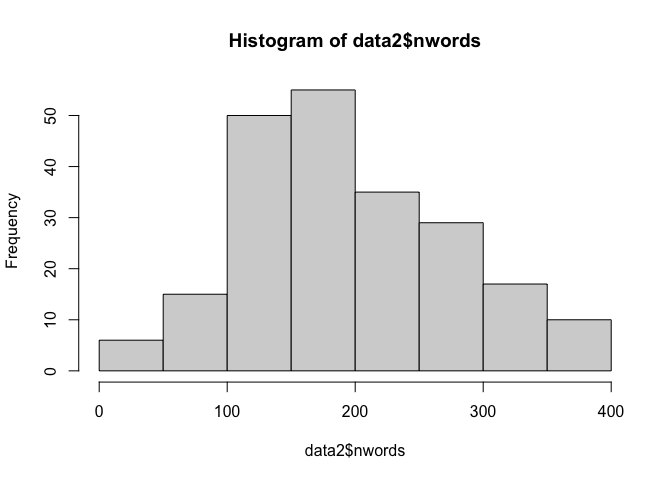
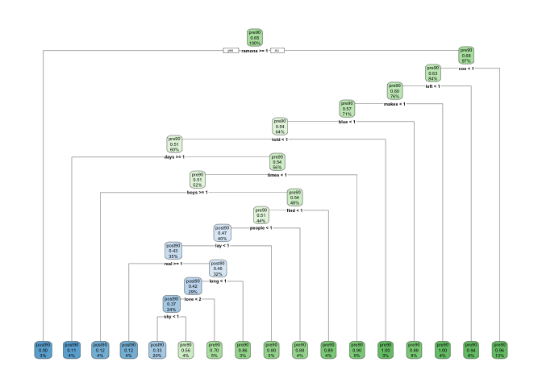
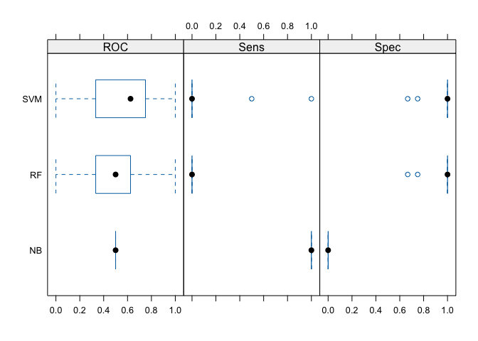
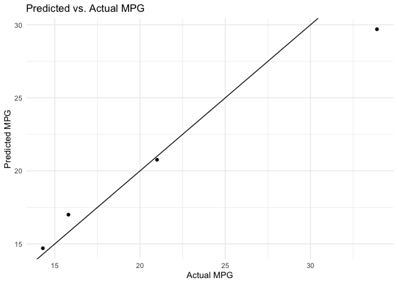
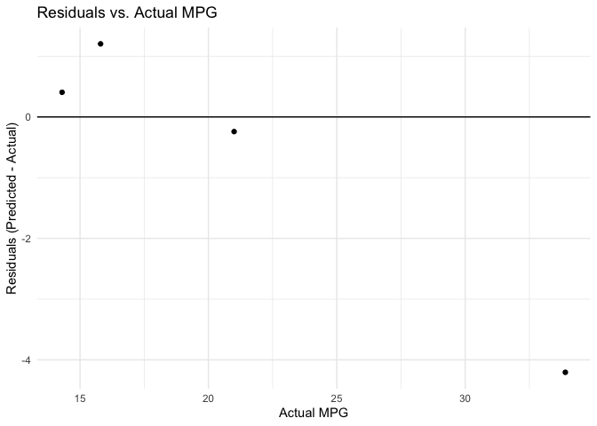

Machine Learning
================
Dr. Ayse D. Lokmanoglu
Lecture 10, (B) April 2, (A) April 7

# R Exercises

------------------------------------------------------------------------

**ALWAYS** Let’s load our libraries

``` r
# General Data Handling & Plotting
library(tidyverse)    # Collection of packages (ggplot2, dplyr, tidyr, etc.) for data manipulation and visualization
library(ggplot2)

# Text Mining
library(tidytext)     # Tokenization and text tidying
library(tm)           # Traditional text mining functions (corpus handling, document-term matrices)
library(SnowballC)    # Word stemming utilities for text data

# Machine Learning Framework
library(caret)        # Unified interface for training and tuning models (classification and regression)
library(caretEnsemble)# Combines multiple models (ensembles) in one framework

# Individual ML/Statistical Methods
library(e1071)        # SVM and other machine learning algorithms (Naive Bayes, etc.)
library(randomForest) # Random Forest algorithm for classification/regression
library(naivebayes)   # Naive Bayes classifier with more modern syntax
library(rpart)        # Recursive partitioning for decision trees
library(rpart.plot)   # Plotting decision trees

# Parallel Computing
library(doParallel)   # Parallel processing backend for caret (and other parallelizable tasks)

# Data Wrangling and Miscellaneous
library(dplyr)        # Part of tidyverse; verb-based data manipulation
library(stopwords)    # Additional stopwords resources beyond the default in tidytext/tm
library(quanteda)     # Framework for quantitative text analysis (tokenization, dfm, etc.)
library(cluster)      # Clustering algorithms (k-means, hierarchical, etc.)

# Date and Time
library(lubridate)    # Easy parsing and manipulation of dates/times

# Model Performance and Diagnostics
library(performance)  # Model checking, diagnostics (residual checks, etc.) for regression and other models
```

## Machine Learning

## 1. Supervised Machine Learning

**Supervised learning** is a machine learning paradigm where models
learn from labeled data. That is, each training example is associated
with a label or target value. The learning algorithm then uses these
examples to infer a function, which can be applied to new, unlabeled
data to make predictions. - In **classification**, labels are discrete
(e.g., *pre90* vs. *post90*).  
- In **regression**, labels are continuous (e.g., predicting a numerical
value such as housing prices or song popularity scores).

Steps: 1. **Data Collection**  
Gather a dataset containing the features (predictors) and the outcome
(target variable).

2.  **Data Preprocessing**  
    Clean and transform the data, handling missing values, outliers, and
    potentially performing feature engineering (e.g., creating new
    variables).

3.  **Split into Training and Test Sets**  
    Typically, 70–80% of the data is used to train the model, and the
    remaining 20–30% is held out to evaluate performance on unseen data.

4.  **Model Training**  
    The chosen algorithm (e.g., Random Forest, SVM) is trained on the
    training set by minimizing errors on these labeled examples.

5.  **Model Tuning**  
    Hyperparameters (e.g., number of trees in a Random Forest) are
    adjusted to improve performance and reduce overfitting.

6.  **Model Evaluation**  
    The model is tested on the hold-out data to see how well it
    generalizes to unseen data.

------------------------------------------------------------------------

## 2. SML - Classification

### 2.1 Preprocess Data

#### 2.1.1 Index, save text and language filtering, remove duplicates

I’ve left several steps commented out to show my original cleaning
process — these include language detection using Google’s `CLD2`, -
duplicate removal, - filtering out short or non-English texts, - and
removing parenthetical metadata from the lyrics.

These are preserved for transparency and reproducibility but are already
completed, so they’re commented out in the current script.

In the current pipeline, I do the following: - Load the cleaned
dataset. - Parse the `release_date` column into proper date format. -
Extract the release `year` from that date. - Convert the
`sentiment_label` into a factor variable for easier analysis. - Filter
out any songs that do not have a valid release year. - Explore the
distribution of songs across years. - Create a new `era` column to
separate songs into two historical periods: pre-1990 and post-1990. -
Convert `era` into a factor variable (`era_fct`) for plotting or
modeling.

``` r
# Load the data
load("../data/Lecture10_Data.Rdata")
# data <- read.csv("../data/david_bowie_lyrics_clean3.csv", stringsAsFactors = FALSE)

########################################################################
### I already cleaned all of this — left it here so you can see below ###
########################################################################

data$song_index <- paste0("song_", seq_len(nrow(data)))
# --> Created a numeric ID for each song, used as a reference index.

data$textBU <- data$text
# --> Backed up the original lyrics column just in case cleaning needed to be reversed.

# data$CLD2 <- cld2::detect_language(data$text)
# --> Used Google's CLD2 package to detect language of the lyrics.

# table(data$CLD2)
# --> Checked how many songs were identified as English vs. other languages.

# data2 <- data |> filter(CLD2 == "en")
# --> Kept only English-language lyrics.

# data3 <- data2 |> distinct(text, .keep_all = TRUE)
# --> Removed any duplicate lyrics (in case a song appeared multiple times).

# data3$text <- gsub("\\s*\\([^\\)]*\\)", "", data3$text)
# --> Removed parenthetical metadata like songwriter credits (e.g., "(Remastered)").

# data3 <- data3 |> filter(nchar(text) > 100)
# --> Removed very short lines or metadata-like rows.

# data3 <- data3 |> drop_na(text) |> drop_na(sentiment)
# --> Dropped any rows that had missing text or sentiment annotations.
# --> After filtering, we had n = 483 clean, English lyrics with sentiment.


# Count number of words per lyric
data$nwords <- stringr::str_count(data$text, "\\w+")

# Visualize distribution
hist(data$nwords, breaks = 10)
```

<!-- -->

``` r
mean(data$nwords)
```

    ## [1] 203.9062

``` r
sd(data$nwords)
```

    ## [1] 95.13123

``` r
# Remove outliers beyond 2 standard deviations
data2 <- data
data2 <- data2[data2$nwords < (mean(data$nwords) + 2 * sd(data$nwords)), ]
data2 <- data2[data2$nwords > (mean(data$nwords) - 2 * sd(data$nwords)), ]

# Summary after filtering
hist(data2$nwords, breaks = 10)
```

<!-- -->

``` r
mean(data2$nwords)
```

    ## [1] 195.3594

``` r
sd(data2$nwords)
```

    ## [1] 82.37673

``` r
########################################################################
### Now we load in the sentiment & date columns and clean for year #####
########################################################################

data3 <- data2 |> 
  mutate(
    date = as.Date(release_date),                # Parse release_date into Date format
    year = year(date)                            # Extract the year as an integer
  ) |> 
  drop_na(year)                                   # Drop songs with unknown/missing release years

### Explore year distribution
table(data3$year)
```

    ## 
    ## 1967 1969 1970 1971 1972 1973 1974 1975 1976 1977 1979 1980 1981 1982 1983 1984 
    ##   13    6    9   11    9   17   10    6    1   10    8    8    1    2    5    5 
    ## 1985 1986 1987 1989 1990 1991 1992 1993 1995 1996 1997 1999 2000 2002 2018 2019 
    ##    1    6    6    2    6    2    1   14   20    1    6    7    1   11    1    2 
    ## 2020 2021 2022 2024 
    ##    2    2    3    2

``` r
max(data3$year) - min(data3$year)
```

    ## [1] 57

``` r
########################################################################
### Create a new column that bins the songs into two eras: pre/post 1990
########################################################################

data3 <- data3 |> 
  mutate(
    era = case_when(
      year <= 1990 ~ "pre90",
      year > 1990 ~ "post90"
    ),
    era = as.factor(era) # Also store era as a factor for plotting/modeling
  )

# Check distribution by era
table(data3$era)
```

    ## 
    ## post90  pre90 
    ##     75    142

------------------------------------------------------------------------

#### 2.1.2 Preprocess the corpus using `tidytext`

``` r
mystopwords <- c(stopwords("en"), stopwords::stopwords(source = "smart"),letters, LETTERS, "chorus", "verse", "david bowie")

mystopwords <- unique(mystopwords)
mystopwords <- tolower(mystopwords)

tidy_data <- data3 |> 
  unnest_tokens(word, text) |>  # tokenizing
  anti_join(data.frame(word=mystopwords)) |> 
  mutate(nchar=nchar(word)) |>  #counting the number of letters
  filter(!grepl("[0-9]{1}", word)) |>  # removing numbers 
  filter(!grepl("\\W", word))  # removing any word containing non letter/number 

# choosing top words by tf-idf
maxndoc=0.9
minndoc=0.00000001

# filter to tokens not too common and not too rare
templength<-length(unique(tidy_data$song_index))
good_common_words <- tidy_data |> 
  count(song_index, word, sort = TRUE) |> 
  group_by(word) |> 
  summarize(doc_freq=n()/templength) |> 
  filter(doc_freq<maxndoc) |> 
  filter(doc_freq>minndoc)

# clean tidy to fit the tokens - NOTE: this is where you might lost indexes
tidy_data_pruned <- tidy_data |>  inner_join(good_common_words)

tidy_data_pruned |> 
  group_by(word) |> 
  summarise(n=n()) |> 
  arrange(desc(n)) |> 
  mutate(word = reorder(word, n)) |> 
  top_n(75) |>     
  ggplot(aes(n, word)) +
  geom_col() +
  labs(y = NULL)
```

<!-- -->

------------------------------------------------------------------------

#### 2.1.3 Now make it dfm

``` r
# DFM-ing it
tidy_dfm <- tidy_data_pruned |> 
  count(song_index, word) |> 
  cast_dfm(song_index, word, n)

docnames(tidy_dfm) <- as.character(docnames(tidy_dfm))  

tidy_dfm@Dim
```

    ## [1]  217 3706

------------------------------------------------------------------------

#### 2.1.4 Convert to data frame

``` r
dtm_df <- convert(tidy_dfm, to = "data.frame")
# head(dtm_df)
```

------------------------------------------------------------------------

### 2.2 Let’s start ML

#### 2.2.1 Let’s check the available ML Algorithms

``` r
# names(getModelInfo())
getModelInfo()$svmLinear$type
```

    ## [1] "Regression"     "Classification"

``` r
getModelInfo()$naive_bayes$type
```

    ## [1] "Classification"

``` r
getModelInfo()$nnet$type
```

    ## [1] "Classification" "Regression"

``` r
getModelInfo()$rf$type
```

    ## [1] "Classification" "Regression"

------------------------------------------------------------------------

#### 2.2.2 Prep for Supervised Models

**Cross validation** is a powerful technique for obtaining a more
reliable estimate of how well your model will generalize. Instead of a
single train/test split, you systematically partition the dataset into
“folds.” A common approach is **k-fold cross validation**:

Instead of a single train/test split, cross validation (often k-fold
cross validation) provides a more robust estimate of a model’s
generalizability. The procedure:

1.  Partition the data into k folds (e.g., 5 or 10).

2.  For each fold in turn:

    - Use one fold as the validation (test) set.
    - Train the model on the remaining k-1 folds.
    - Evaluate performance on the held-out fold.

3.  Average the performance metrics (accuracy, F1, etc.) across all k
    folds.

By systematically cycling through each fold as the validation set, we
use the entire dataset for both training (in parts) and testing (once in
each fold). This reduces the variability of performance estimates due to
a single train/test split. It is especially useful when data is limited
or when we want a more stable evaluation of model tuning.

``` r
dtm_df$doc_id <- as.character(dtm_df$doc_id)
data3$doc_id <- as.character(data3$song_index)
data_out <- left_join(dtm_df, data3[, c("doc_id", "era")], by = "doc_id")

data_out <- dplyr::select(data_out, -doc_id)

colnames(data_out)[which(names(data_out) == "era")] <- "outcome"
data_out$outcome <- as.factor(data_out$outcome)
table(data_out$outcome)
```

    ## 
    ## post90  pre90 
    ##     75    142

``` r
set.seed(42)
train_index <- createDataPartition(data_out$outcome, 
                                   p = 0.25, 
                                   list = FALSE)

data_train <- data_out[train_index, ]
data_test  <- data_out[-train_index, ]


# Always re-factor outcome after splitting just to be safe
data_train$outcome <- as.factor(data_train$outcome)
table(data_train$outcome )
```

    ## 
    ## post90  pre90 
    ##     19     36

``` r
data_test$outcome  <- as.factor(data_test$outcome)
table(data_test$outcome)
```

    ## 
    ## post90  pre90 
    ##     56    106

``` r
# Set up for CV
control <- trainControl(
  method = "cv",
  number = 10,
  classProbs = TRUE,
  summaryFunction = twoClassSummary
)
```

------------------------------------------------------------------------

#### 2.2.4 Train for ML

We now train three different supervised learning models using our
sentiment-labeled lyrics data. 1. Support Vector Machine (SVM) with a
Linear Kernel 2. Random Forest (RF) 3. Naive Bayes (NB)

We compare their performances using cross-validation and evaluate them
on the hold-out test set.

``` r
detectCores()
```

    ## [1] 11

``` r
cls <- makeCluster(4)
registerDoParallel(cls)
```

------------------------------------------------------------------------

##### 2.2.4.1 Support Vector Machine (SVM)

An SVM finds an optimal hyperplane that separates classes with the
largest possible margin. For text data, linear SVMs often work well if
the dataset is sufficiently large and high-dimensional.

- Benefits
  - Effective in high-dimensional spaces.
  - Can handle cases where classes are not perfectly separable, using a
    soft margin.
- Possible Issues
  - May be slower to train with large datasets.
  - If classes are highly imbalanced, the SVM might still skew toward
    the majority class unless class weights are incorporated.

``` r
# SVM
Sys.time()
```

    ## [1] "2025-04-06 19:34:45 EDT"

``` r
svm.train <- train(outcome ~ ., data = data_train,
                   method = 'svmLinear',
                   trControl = control,
                   allowParallel = TRUE,
                   preProc = c("center", "scale"),
                   metric = "ROC")
Sys.time()
```

    ## [1] "2025-04-06 19:34:58 EDT"

------------------------------------------------------------------------

##### 2.2.4.2 Random Forest (RF)

A Random Forest is an ensemble of decision trees. Each tree is built on
a bootstrapped sample of the data, and at each split, only a subset of
predictors is considered. Final predictions come from aggregating (e.g.,
majority vote) over all trees. - Benefits - Naturally handles
high-dimensional data and complex interactions. - Often robust to
noise. - Provides a measure of feature importance.

- Possible Issues
  - Can overfit if not properly tuned (e.g., too many trees may be slow,
    though not usually harmful to performance).
  - May struggle with class imbalance by predominantly predicting the
    majority class.

Decision Trees:

- Is a type of supervised machine learning model used for classification
  and regression. It works by learning decision rules inferred from
  features in the training data.

- The structure looks like a tree:

  - it starts at a root node, splits into branches based on feature
    conditions, and ends at leaf nodes with predicted outcomes.

- Each node in the tree represents a decision based on a feature and a
  threshold

``` r
m <- rpart(outcome ~ ., data = data_out,
           method = "class")
rpart.plot(m)
```

<!-- -->

In our case:

- *This first split is the most informative feature for classifying the
  target - in our casewhether a song or instance is “pre90” or “post90”*

- Root node (the top one) - Ramona

  - Feature: `ramona >= 1`

  - If yes: go left

  - If no: go right

- Internal Nodes

  - E.g., node: `days >= 1`

    - Label prediction: `pre90`

    - Probability: e.g., `0.51` (confidence)

    - Percentage of data in that node: e.g., `60%`

  - What does this all mean?

    - 60% of the samples reach this node

    - Predicts the class `pre90` with 51% confidence

- Leaf Nodes (Bottom)

  - *The final predictions -* these nodes don’t split anymore—they are
    the model’s final prediction

    - Dark blue = `post90`, dark green = `pre90`

- Path Example

<!-- -->

    -   Let’s follow a path from root to leaf:

        -   `ramona >= 1` → **no** → go right\
        -   `cos < 1` → **yes** → go left\
        -   `left < 1` → **yes** → go left\
        -   `makes < 1` → **yes** → go left\
        -   `blue < 1` → **yes** → go left\
        -   `told < 1` → **yes** → go left\
        -   `times < 1` → **yes** → go left\
        -   `find < 1` → **yes** → go left\
        -   `people < 1` → **yes** → go left\
        -   `lay < 1` → **yes** → go left\
        -   `real >= 1` → **no** → go right

    -   Prediction: `post90`, probability = 0.42, 29% of data

    -   This means a sample that follows this exact path is predicted to
        be from post-1990, with 42% confidence, and 29% of the training
        data went through this same path.

Now train:

``` r
# RF
Sys.time()
```

    ## [1] "2025-04-06 19:35:01 EDT"

``` r
rf.train <- train(outcome ~ ., data = data_train,
                  method = 'rf',
                  trControl = control,
                  allowParallel = TRUE,
                  preProc = c("center", "scale"),
                  metric = "ROC")
Sys.time()
```

    ## [1] "2025-04-06 19:35:11 EDT"

``` r
plot(rf.train)
```

<!-- -->

------------------------------------------------------------------------

##### 2.2.4.3 Naive Bayes (NB)

A simple probabilistic classifier that applies Bayes’ theorem and
assumes independence between features (words). Despite its “naive”
independence assumption, it can perform quite well on text data.

- Benefits
  - Fast to train and easy to interpret.
  - Works surprisingly well in many text classification tasks.
- Possible Issues
  - The independence assumption can harm performance if features are
    strongly correlated.
  - May need careful calibration for class imbalance.

``` r
# Naive Bayes
Sys.time()
```

    ## [1] "2025-04-06 19:35:11 EDT"

``` r
nbayes.train <- train(outcome ~ ., data = data_train,
                      method = 'naive_bayes',
                      trControl = control,
                      allowParallel = TRUE,
                      preProc = c("center", "scale"),
                      metric = "ROC")
Sys.time()
```

    ## [1] "2025-04-06 19:35:19 EDT"

``` r
# Stop parallel processing
stopCluster(cls)
```

``` r
# save.image("../data/Lecture10_Data.Rdata")
```

------------------------------------------------------------------------

### 2.3 Evaluating Models

#### 2.3.1 Evaluate Models on Training Set

Performance Metric Definitions (for binary classification)

- **TP**: True Positives — in our case, **True `post90`**  
- **TN**: True Negatives (`pre90` correctly predicted)  
- **FP**: False Positives (`pre90` predicted as `post90`)  
- **FN**: False Negatives (`post90` predicted as `pre90`)

To remind you of indicators:

- **Accuracy**: (TP + TN) / Total  
- **Sensitivity** = **Recall**: TP / Actual Positives  
- **Specificity**: TN / Actual Negatives  
- **Precision**: TP / Predicted Positives  
- **ROC**: Takes into consideration both Sensitivity and Specificity

##### 2.3.1.1 SVM

``` r
confusionMatrix(predict(svm.train, data_train), data_train$outcome)
```

    ## Confusion Matrix and Statistics
    ## 
    ##           Reference
    ## Prediction post90 pre90
    ##     post90      0     0
    ##     pre90      19    36
    ##                                           
    ##                Accuracy : 0.6545          
    ##                  95% CI : (0.5142, 0.7776)
    ##     No Information Rate : 0.6545          
    ##     P-Value [Acc > NIR] : 0.562           
    ##                                           
    ##                   Kappa : 0               
    ##                                           
    ##  Mcnemar's Test P-Value : 3.636e-05       
    ##                                           
    ##             Sensitivity : 0.0000          
    ##             Specificity : 1.0000          
    ##          Pos Pred Value :    NaN          
    ##          Neg Pred Value : 0.6545          
    ##              Prevalence : 0.3455          
    ##          Detection Rate : 0.0000          
    ##    Detection Prevalence : 0.0000          
    ##       Balanced Accuracy : 0.5000          
    ##                                           
    ##        'Positive' Class : post90          
    ## 

|                       | **Reference: post90** | **Reference: pre90** |
|-----------------------|-----------------------|----------------------|
| **Predicted: post90** | 0                     | 0                    |
| **Predicted: pre90**  | 19                    | 36                   |

- TP = 0  

- TN = 36  

- FP = 0  

- FN = 19

- **Accuracy**: 0.6545  

- **Sensitivity (Recall for post90)**: 0.0000  

- **Specificity (Recall for pre90)**: 1.0000  

- **Precision**: NaN (no `post90` predictions made)  

- **Balanced Accuracy**: 0.5000

\*Fails to detect `post90` class entirely. Overpredicts `pre90`.\*\*

##### 2.3.1.2 Random Forest

``` r
confusionMatrix(predict(rf.train, data_train), data_train$outcome)
```

    ## Confusion Matrix and Statistics
    ## 
    ##           Reference
    ## Prediction post90 pre90
    ##     post90     19     0
    ##     pre90       0    36
    ##                                      
    ##                Accuracy : 1          
    ##                  95% CI : (0.9351, 1)
    ##     No Information Rate : 0.6545     
    ##     P-Value [Acc > NIR] : 7.528e-11  
    ##                                      
    ##                   Kappa : 1          
    ##                                      
    ##  Mcnemar's Test P-Value : NA         
    ##                                      
    ##             Sensitivity : 1.0000     
    ##             Specificity : 1.0000     
    ##          Pos Pred Value : 1.0000     
    ##          Neg Pred Value : 1.0000     
    ##              Prevalence : 0.3455     
    ##          Detection Rate : 0.3455     
    ##    Detection Prevalence : 0.3455     
    ##       Balanced Accuracy : 1.0000     
    ##                                      
    ##        'Positive' Class : post90     
    ## 

|                       | **Reference: post90** | **Reference: pre90** |
|-----------------------|-----------------------|----------------------|
| **Predicted: post90** | 19                    | 0                    |
| **Predicted: pre90**  | 0                     | 36                   |

- TP = 19  

- TN = 36  

- FP = 0  

- FN = 0

- **Accuracy**: 1.000  

- **Sensitivity**: 1.000  

- **Specificity**: 1.000  

- **Precision**: 1.000  

- **Balanced Accuracy**: 1.000

**Perfect classification on training set. Detects both classes equally
well.**

##### 2.3.1.3 Naive Bayes

``` r
confusionMatrix(predict(nbayes.train, data_train), data_train$outcome)
```

    ## Confusion Matrix and Statistics
    ## 
    ##           Reference
    ## Prediction post90 pre90
    ##     post90     19    36
    ##     pre90       0     0
    ##                                           
    ##                Accuracy : 0.3455          
    ##                  95% CI : (0.2224, 0.4858)
    ##     No Information Rate : 0.6545          
    ##     P-Value [Acc > NIR] : 1               
    ##                                           
    ##                   Kappa : 0               
    ##                                           
    ##  Mcnemar's Test P-Value : 5.433e-09       
    ##                                           
    ##             Sensitivity : 1.0000          
    ##             Specificity : 0.0000          
    ##          Pos Pred Value : 0.3455          
    ##          Neg Pred Value :    NaN          
    ##              Prevalence : 0.3455          
    ##          Detection Rate : 0.3455          
    ##    Detection Prevalence : 1.0000          
    ##       Balanced Accuracy : 0.5000          
    ##                                           
    ##        'Positive' Class : post90          
    ## 

|                       | **Reference: post90** | **Reference: pre90** |
|-----------------------|-----------------------|----------------------|
| **Predicted: post90** | 19                    | 36                   |
| **Predicted: pre90**  | 0                     | 0                    |

- TP = 19  

- TN = 0  

- FP = 36  

- FN = 0

- **Accuracy**: 0.3455  

- **Sensitivity (Recall for post90)**: 1.0000  

- **Specificity (Recall for pre90)**: 0.0000  

- **Precision**: 0.3455  

- **Balanced Accuracy**: 0.5000

**Predicts only `post90`; completely fails to detect `pre90`.**

##### 2.3.1.4 Summary of all the models:

SVM: - Predicted everything as pre90 in the training set example
provided, suggesting it didn’t capture post90 at all (accuracy ~65%,
sensitivity for post90 = 0).

Random Forest: - Perfect classification on the training set (all post90
and pre90 predicted correctly). This can be a warning sign of
overfitting.

Naive Bayes: - Predicted everything as post90 in that training set
snippet, also indicating a potential imbalance or poor fit (accuracy
~35%).

*These extremes (always pre90 or always post90) suggest that the data
might be limited, imbalanced, or that each model needs additional tuning
(e.g., resampling, class weights).*

------------------------------------------------------------------------

#### 2.3.2 Compare Models with Cross-Validation Resampling

Comparing performance across 10-fold cross validation in terms of: - ROC
(AUC): Higher values imply better overall discrimination between the two
classes. - Sensitivity (Recall): Probability of correctly identifying
post90. - Specificity: Probability of correctly identifying pre90.

``` r
results.cv <- resamples(list(SVM = svm.train,
                             RF = rf.train,
                             NB = nbayes.train))
bwplot(results.cv)
```

<!-- -->

| **Panel** | **Metric** | **Description** |
|----|----|----|
| ROC | Area Under the Curve (AUC) | Combines sensitivity and specificity. Higher values indicate better classification. |
| Sens | Sensitivity (Recall) | Proportion of actual `post90` correctly identified. |
| Spec | Specificity | Proportion of actual `pre90` correctly identified. |

Each filled dot (●) represents the mean estimate, while the vertical
bars indicate confidence intervals. Open circles (○) and boxplots
represent variability across the folds.

Interpretation of the Cross-Validation Results **Random Forest (RF)** -
**ROC**: Low (~0.45) with variability. - **Sensitivity**: Close to **0**
— consistently fails to detect `post90`. - **Specificity**: Very high
(~1.0). - **Conclusion**: Overfits the training set. Fails to generalize
and detect positive class in CV.

**Support Vector Machine (SVM)** - **ROC**: Highest (~0.75–0.8) of all
models. - **Sensitivity**: Still low but better than RF and NB. -
**Specificity**: High (~1.0). - **Conclusion**: Best performance in CV.
Still biased toward `pre90`, but generalizes better.

**Naive Bayes (NB)** - **ROC**: Very low (~0.5). - **Sensitivity**:
Low. - **Specificity**: Moderate to high. - **Conclusion**: Weak and
inconsistent performance. Poor precision and recall.

Summary: - Random Forest typically shows high specificity but very low
sensitivity for post90. - SVM may strike a better balance overall
(higher AUC), but still tends to favor the majority class. - Naive Bayes
often has unstable performance in this scenario, possibly due to heavy
assumptions and the imbalanced data.

Summary Table \| **Model** \| **ROC (AUC)** \| **Sensitivity** \|
**Specificity** \| **Conclusion** \|
\|——————\|———————-\|———————-\|———————-\|——————————————————-\| \|
**Random Forest**\| Low (~0.45) \| Very Low (~0.0) \| Very High (~1.0)
\| Overfits; fails to generalize on `post90` \| \| **SVM** \| Moderate
(~0.75–0.8) \| Low–Moderate \| Very High (~1.0) \| Best generalization;
biased toward `pre90` \| \| **Naive Bayes** \| Low (~0.5) \| Low \|
Moderate–High \| Poor and unstable performance \|

------------------------------------------------------------------------

#### 2.3.3 Feature Importance (Random Forest)

Which words were most influential in predicting era?

``` r
plot(varImp(rf.train), top = 25)
```

<!-- -->

CLASS EXERCISE: Try `varImp(svm.train)` or `varImp(nnet.train)` to
compare across models.

------------------------------------------------------------------------

#### 2.4 Evaluate on Test Set

The most important evaluation: how do our models perform on new data?

In this example: After training our Random Forest on the **training
set**, we use the **test set** to generate predictions. The **confusion
matrix** compares these predictions against the actual labels:

``` r
confusionMatrix(predict(rf.train, data_test), data_test$outcome, mode = "prec_recall")
```

    ## Confusion Matrix and Statistics
    ## 
    ##           Reference
    ## Prediction post90 pre90
    ##     post90      1     0
    ##     pre90      55   106
    ##                                           
    ##                Accuracy : 0.6605          
    ##                  95% CI : (0.5821, 0.7329)
    ##     No Information Rate : 0.6543          
    ##     P-Value [Acc > NIR] : 0.4705          
    ##                                           
    ##                   Kappa : 0.0232          
    ##                                           
    ##  Mcnemar's Test P-Value : 3.305e-13       
    ##                                           
    ##               Precision : 1.000000        
    ##                  Recall : 0.017857        
    ##                      F1 : 0.035088        
    ##              Prevalence : 0.345679        
    ##          Detection Rate : 0.006173        
    ##    Detection Prevalence : 0.006173        
    ##       Balanced Accuracy : 0.508929        
    ##                                           
    ##        'Positive' Class : post90          
    ## 

1.  **Overall Accuracy (66.05%)**
    - This indicates the model’s percentage of correct predictions.
      While 66% may appear acceptable at first glance, it’s only
      marginally above the No Information Rate (65.43%), which is what
      you’d achieve by always predicting the most common class.  
    - Because the p-value for “Accuracy \> NIR” is 0.4705, we cannot
      conclude that the model significantly outperforms naive guessing.
2.  **Kappa (0.0232)**
    - Kappa measures the degree of agreement between predicted labels
      and actual labels, adjusted for the agreement that could happen by
      chance.
    - A Kappa near zero indicates the model is performing at a
      near-random level in terms of differentiating the two classes.
3.  **Confusion Matrix Details**  

- **True Positives (TP)**: 1 (model predicted post90 correctly)  
- **False Negatives (FN)**: 55 (model should have predicted post90 but
  predicted pre90)  
- **False Positives (FP)**: 0 (model incorrectly predicted post90 when
  it was actually pre90)  
- **True Negatives (TN)**: 106 (model predicted pre90 correctly)

4.  **Precision (1.0) and Recall (1.79%) for the “post90” Class**  

- **Precision = 1.0**: Whenever the model predicts “post90,” it is
  correct. However, it predicted “post90” only once (and got that single
  instance right).  
- **Recall = 0.0179 (1.79%)**: This is extremely low, indicating the
  model is missing almost all actual “post90” cases. Out of 56 total
  post90s, it captured only 1.

5.  **F1 Score (0.035)**  

- The F1 combines precision and recall. Despite the perfect precision,
  the recall is so poor that the F1 score is only 0.035. This suggests
  the model is not effectively identifying “post90” instances.

6.  **Practical Implications**  

- The model leans heavily toward predicting “pre90” and rarely
  identifies “post90.” It achieves moderate overall accuracy by almost
  always predicting the majority class.  
- Since “post90” is presumably a class of high interest (and potentially
  the minority class), missing nearly all of those cases compromises the
  model’s utility in most practical applications.

``` r
rm(list = ls()) ### REMOVES ALL VARIABLES USE IT WITH CAUTION
gc() #garbage can to clean your memory
```

    ##           used  (Mb) gc trigger  (Mb) limit (Mb) max used  (Mb)
    ## Ncells 3327281 177.7    5310627 283.7         NA  5310627 283.7
    ## Vcells 5758618  44.0   63673114 485.8      18432 79591392 607.3

------------------------------------------------------------------------

### 2.5 Addressing Class Imbalance

When one class (in our case pre90) is more common than the other
(post90), models tend to predict the majority class. Some methods to
counteract imbalance include:

- Oversampling the Minority Class
  - Techniques like SMOTE (Synthetic Minority Over-sampling Technique)
    create new synthetic examples of the minority class.
- Undersampling the Majority Class
  - Reduces the size of the majority class, though you may lose
    potentially valuable information.
- Class Weighting
  - Many algorithms (including Random Forest and SVM) allow specifying a
    higher weight for the minority class. This penalizes
    misclassifications of post90 more strongly.
- Threshold Tuning
  - Move the classification threshold away from 0.5 to improve recall
    for the minority class. This typically sacrifices some precision but
    can help catch more post90 instances.

------------------------------------------------------------------------

## 3 SML - Regression

In **regression**, the outcome variable is continuous (e.g., predicting
a numerical value such as housing prices or song popularity scores).
We’ll use the same steps as in classification, but with different
algorithms and evaluation metrics.

The steps are very similar to classification: 1. Prepare your data with
all relevant predictors (features) and your continuous response
variable. 2. Split into training and test sets, or use cross validation
to tune models and get reliable performance estimates. 3. Choose an
algorithm (e.g., Random Forest for regression, Linear Regression,
Gradient Boosted Trees, etc.). 4. Evaluate using regression metrics such
as: - RMSE (Root Mean Squared Error) - MAE (Mean Absolute Error) -
𝑅2(Coefficient of Determination)

### 3.1 Preprocess data

We are going to be using `mtcars` data to predict `mpg` (miles per
gallon) from the other columns

``` r
## 1. Load Libraries and Data
data("mtcars")
df <- mtcars
str(df)         
```

    ## 'data.frame':    32 obs. of  11 variables:
    ##  $ mpg : num  21 21 22.8 21.4 18.7 18.1 14.3 24.4 22.8 19.2 ...
    ##  $ cyl : num  6 6 4 6 8 6 8 4 4 6 ...
    ##  $ disp: num  160 160 108 258 360 ...
    ##  $ hp  : num  110 110 93 110 175 105 245 62 95 123 ...
    ##  $ drat: num  3.9 3.9 3.85 3.08 3.15 2.76 3.21 3.69 3.92 3.92 ...
    ##  $ wt  : num  2.62 2.88 2.32 3.21 3.44 ...
    ##  $ qsec: num  16.5 17 18.6 19.4 17 ...
    ##  $ vs  : num  0 0 1 1 0 1 0 1 1 1 ...
    ##  $ am  : num  1 1 1 0 0 0 0 0 0 0 ...
    ##  $ gear: num  4 4 4 3 3 3 3 4 4 4 ...
    ##  $ carb: num  4 4 1 1 2 1 4 2 2 4 ...

### 3.2 Start ML

``` r
detectCores()
```

    ## [1] 11

``` r
cls <- makeCluster(4)
registerDoParallel(cls)
```

#### 3.2.1 Prep data for ML

Partition the data into training (80%) and test (20%) subsets.

``` r
set.seed(123)  # for reproducibility Don't Forget!!! 
train_index <- createDataPartition(df$mpg, p = 0.8, list = FALSE)

train_data <- df[ train_index, ]
test_data  <- df[-train_index, ]

nrow(train_data)
```

    ## [1] 28

``` r
nrow(test_data)
```

    ## [1] 4

#### 3.2.2 Cross Validation

We will split the df into 5 folds, each used once as the validation set
while the model is trained on the remaining 4 folds.

``` r
ctrl <- trainControl(method = "cv", 
                     number = 5)
```

#### 3.2.3 Train the Model

##### 3.2.3.1 TRain for RF

- RMSE (Root Mean Squared Error) measures the average magnitude of
  errors. The lower the RMSE, the better the model’s fit.
- R² (coefficient of determination) indicates how much of the variance
  in mpg is explained by the model. Values closer to 1 are better.
- MAE (Mean Absolute Error) is the average absolute difference between
  predictions and actual values. Again, lower is better.

``` r
set.seed(123)
rf_model <- train(
  mpg ~ .,                # Predict mpg from all other columns
  data       = train_data,
  method     = "rf",      # Random Forest algorithm
  trControl  = ctrl,      # Use 5-fold cross validation
  preProcess = c("center", "scale")  # Standardize predictors
)

rf_model
```

    ## Random Forest 
    ## 
    ## 28 samples
    ## 10 predictors
    ## 
    ## Pre-processing: centered (10), scaled (10) 
    ## Resampling: Cross-Validated (5 fold) 
    ## Summary of sample sizes: 22, 22, 23, 22, 23 
    ## Resampling results across tuning parameters:
    ## 
    ##   mtry  RMSE      Rsquared   MAE     
    ##    2    2.578075  0.8984179  2.207950
    ##    6    2.528496  0.9085195  2.169740
    ##   10    2.527920  0.9198125  2.161508
    ## 
    ## RMSE was used to select the optimal model using the smallest value.
    ## The final value used for the model was mtry = 10.

``` r
# Stop parallel processing
stopCluster(cls)
```

Our results: - `mtry` = 10 yielded the lowest RMSE (2.527920) and the
highest R² (0.9198), making it the best performer among the tested
parameters. - Although all produce fairly good results (R² \> 0.89), the
final chosen model is mtry = 10.

*Using all 10 predictors at every split (i.e., mtry = 10) (our dataset
has 11 columns, and since mpg is our putome we have 10 predictors left)
gives the best trade-off between bias and variance in this tiny dataset
(only 28 samples). Sometimes, especially with fewer data points,
allowing all features to be considered at each split can help the model
capture relationships more effectively.*

### 3.3 Evaluate Models

#### 3.3.1 Predict on Test Data

``` r
predictions <- predict(rf_model, newdata = test_data)
actuals     <- test_data$mpg
head(predictions)
```

    ##  Mazda RX4 Wag     Duster 360 Toyota Corolla Ford Pantera L 
    ##       20.75861       14.70593       29.69472       17.00340

``` r
head(actuals)
```

    ## [1] 21.0 14.3 33.9 15.8

- In the Toyota Corolla e.g., , the model underestimates `mpg` by around
  4.2 (`actual`-`prediction`).
  - That’s a relatively larger error but not unexpected for a higher-mpg
    car in a small dataset.
- The other predictions come within ~0.2 to ~1.2 mpg of their true
  values, reflecting reasonable accuracy.

Overall Performance: The chosen Random Forest model (with mtry = 10)
explains ~92% of the variance in mpg (R²) and maintains an RMSE just
above 2.5 mpg. Errors vary by vehicle, but for the majority, the
predicted mpg is within a few units of the true mpg.

*Despite only having 28 samples, the Random Forest still provides
relatively accurate predictions for most cars, though it can
occasionally miss by a few mpg on specific examples (like the
high-mileage Toyota Corolla).*

#### 3.3.2 Evaluate the Model

One of my favorite packages [`performance`]()

``` r
performance <- postResample(predictions, actuals)
performance
```

    ##      RMSE  Rsquared       MAE 
    ## 2.1997485 0.9928845 1.5140000

1.  RMSE (Root Mean Squared Error) ~ 2.20
    - On average, the model’s predictions deviate from the true mpg by
      about 2.2 mpg.
    - The RMSE penalizes large errors more than small ones, so it is a
      sensitive measure of prediction quality.
2.  Rsquared ~ 0.993
    - he model explains about 99.3% of the variance in mpg on the test
      set.
    - This is an extremely high R2, suggesting the model captures the
      underlying relationships very well.
    - *Keep in mind that a very small dataset can sometimes produce
      artificially high R2 if there is limited variability in the test
      set.*
3.  MAE (Mean Absolute Error) ~ 1.51
    - On average, the absolute difference between the predicted mpg and
      actual mpg is about 1.51 mpg.
    - The MAE is less sensitive to outliers than the RMSE; hence it is
      typically smaller than the RMSE for the same model.

*Since this is a small dataset, consistently check whether the model
might be overfitting to particular samples. Repeated cross validation
and/or additional external datasets can help confirm how robust these
results truly are.*

#### 3.2.3.1 Visualize

1.  Predicted vs. Actual Plot

- Each point corresponds to one data instance.
- The closer points are to the diagonal line (where x = y), the better
  the alignment between the model’s predictions and the actual mpg
  values.
- Points above the diagonal indicate underprediction (actual \>
  predicted), while points below the diagonal represent overprediction
  (predicted \> actual).

``` r
## 1. Predicted vs. Actual Plot

# Create a data frame with actual and predicted mpg values
df_compare <- data.frame(
  actual     = actuals,
  predicted  = predictions
)

ggplot(df_compare, aes(x = actual, y = predicted)) +
  geom_point() +
  geom_abline(intercept = 0, slope = 1) +
  labs(
    title = "Predicted vs. Actual MPG",
    x = "Actual MPG",
    y = "Predicted MPG"
  ) +
  theme_minimal()
```

<!-- -->

2.  Residual plot

- the x-axis is the actual `mpg` and the y-axis is the residual
  (predicted - actual).
- A horizontal reference line at y = 0 shows where predicted equals
  actual.
- Ideally, residuals should be randomly scattered around 0, indicating
  no systematic bias across different ranges of actual `mpg`.

``` r
# Calculate residuals (predicted - actual)
df_compare$residual <- df_compare$predicted - df_compare$actual

ggplot(df_compare, aes(x = actual, y = residual)) +
  geom_point() +
  geom_hline(yintercept = 0) +
  labs(
    title = "Residuals vs. Actual MPG",
    x = "Actual MPG",
    y = "Residuals (Predicted - Actual)"
  ) +
  theme_minimal()
```

<!-- -->

------------------------------------------------------------------------

## CLASS EXERCISES

1.  **Cross Validation and Model Comparison**
    - Fit two classification models (**Random Forest** and **Naive
      Bayes**) on your dataset, using `caret::train()` with
      `method = "cv"`, `number = 5`.  
    - Compare their cross-validated **accuracy**, **sensitivity**, and
      **specificity** using `resamples()` or by printing
      `model$results`.  
    - Discuss which model performed best and why.
2.  **Imbalanced Classes**
    - Check the distribution of your outcome variable (e.g.,
      `table(data$outcome)`).  
    - If your dataset is imbalanced, apply a **simple oversampling**
      strategy (duplicate minority-class examples) to your training
      set.  
    - Retrain the Random Forest and evaluate on the original,
      **unmodified** test set. Compare the new recall and precision for
      the minority class against the old results.
3.  **Regression Analysis**
    - Convert your outcome variable to **numeric** (e.g., `score` or
      `mpg`) if it is not already.  
    - Fit a **Random Forest** regression model with
      `trainControl(method = "cv", number = 5)`.  
    - Obtain **RMSE** and **R²** using `postResample()`. Interpret what
      these values say about your model’s fit.
4.  **Residual Diagnostics**
    - Create a data frame with `actual` and `predicted` values from your
      regression model.  
    - Generate a **ggplot** scatter plot of **Predicted vs. Actual**
      (with a reference line `y = x`).  
    - Add a **Residual Plot** (`residual = predicted - actual`) vs. the
      **actual** outcome.  
    - Briefly interpret any patterns you notice in the residuals (e.g.,
      do they fan out, suggesting heteroscedasticity?).
5.  **Decision Tree Visualization**
    - Using `rpart(outcome ~ ., data = data_train, method = "class")`,
      fit a **single** decision tree classifier (where `outcome` is a
      factor).  
    - Plot it using `rpart.plot()`.  
    - Identify the top 2-3 splits in the tree and explain how each split
      is partitioning the data. Do these splits make intuitive sense
      based on your domain knowledge?

------------------------------------------------------------------------

## Leture 10 Cheat Sheet

| **Function/Concept** | **Description** | **Code Example** |
|----|----|----|
| **`createDataPartition()`** (caret) | Splits data into training and test (or validation) sets while preserving the distribution of the outcome. | `r<br>set.seed(123)<br>train_index <- createDataPartition(data_out$outcome, p = 0.8, list = FALSE)<br>data_train <- data_out[train_index, ]<br>data_test  <- data_out[-train_index, ]` |
| **`trainControl()`** (caret) | Defines the resampling method (e.g., k-fold cross validation), performance metrics, and other parameters for training. | `r<br>control <- trainControl(method = "cv", number = 10, classProbs = TRUE, summaryFunction = twoClassSummary)` |
| **`train()`** (caret) | Trains a model (classification or regression) using the specified method (e.g., `"rf"`, `"svmLinear"`, `"naive_bayes"`), resampling scheme, and tuning parameters. | `r<br>rf_model <- train(outcome ~ ., data = data_train, method = "rf", trControl = control, preProc = c("center","scale"), metric = "ROC")` |
| **`confusionMatrix()`** (caret) | Computes a confusion matrix and related statistics (accuracy, precision, recall, F1, etc.) for **classification** tasks. | `r<br>confusionMatrix(predict(rf_model, data_test), data_test$outcome, mode = "prec_recall")` |
| **`postResample()`** (caret) | Compares regression predictions against actual values to compute **RMSE**, **R^2**, **MAE**, etc. | `r<br>performance <- postResample(pred = predictions, obs = actuals)<br>performance  # RMSE, R^2, MAE` |
| **`rpart()`** + **`rpart.plot()`** | Builds and plots a single **decision tree**. Useful for understanding how tree-based models make splits in a smaller tree. | `r<br>library(rpart)<br>library(rpart.plot)<br>m <- rpart(Class ~ ., data = Sonar, method = "class")<br>rpart.plot(m)` |
| **`randomForest()`** (randomForest) | Fits a **Random Forest** ensemble of decision trees for classification or regression. For deeper insights, see also **`varImpPlot()`**, **`partialPlot()`**, or extracting single trees with **`getTree()`**. | `r<br>library(randomForest)<br>rf_model <- randomForest(outcome ~ ., data = data_out, ntree = 100)` |
| **`partialPlot()`** (randomForest) | Shows how the Random Forest’s predictions change as one predictor varies, holding other predictors at average values. | `r<br>partialPlot(rf_model, data = data_train, x.var = "wt", which.class = "post90")` |
| **`varImp()`** or **`varImpPlot()`** (caret / randomForest) | Ranks feature importance, highlighting which predictors most influence classification or regression. | `r<br>plot(varImp(rf_model), top = 10)` |
| **`predict()`** | Generates predictions for both classification and regression models on new data. | `r<br>new_preds <- predict(rf_model, newdata = data_test)` |
| **Turning Continuous into Classes** | Binning or thresholding a numeric outcome to create a **factor** for classification. Useful if you must produce a confusion matrix for what is originally a continuous target. | `r<br>df$mpg_level <- factor(ifelse(df$mpg >= 20, "HighMPG", "LowMPG"))` |
| **Regression Metrics** (`RMSE`, `MAE`, `R^2`) | Standard measures of regression performance. Lower RMSE and MAE indicate better fit, higher $R^2$ means more variance explained. | Calculated automatically via `postResample()` or your own code (e.g., manually computing `mean((pred-obs)^2)`, etc.). |
| **Classification Metrics** (Accuracy, Precision, Recall, F1) | Evaluate classification success. **`confusionMatrix()`** from `caret` summarizes these, along with **Kappa** and balanced accuracy. | Provided in the confusion matrix output, e.g., `Accuracy : 0.66`, `Kappa : 0.02`, `Sensitivity`, `Specificity`, etc. |
