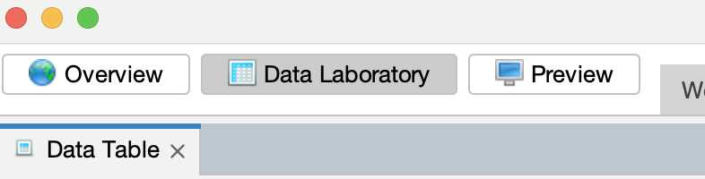
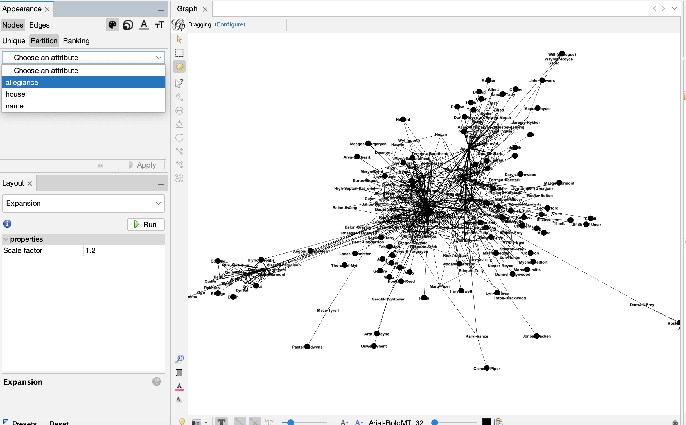
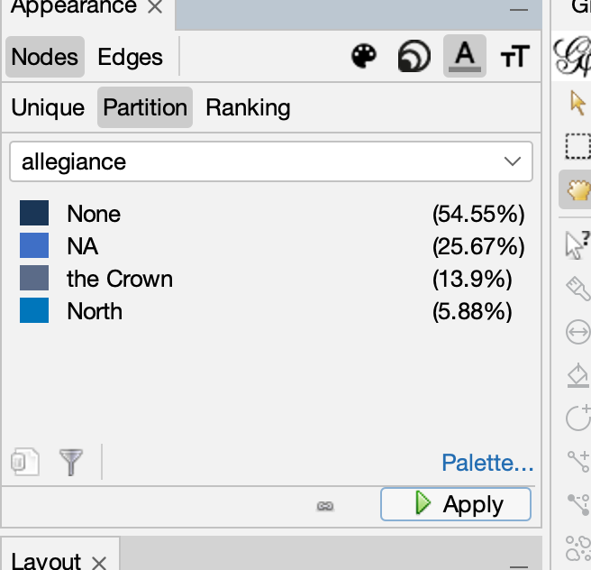
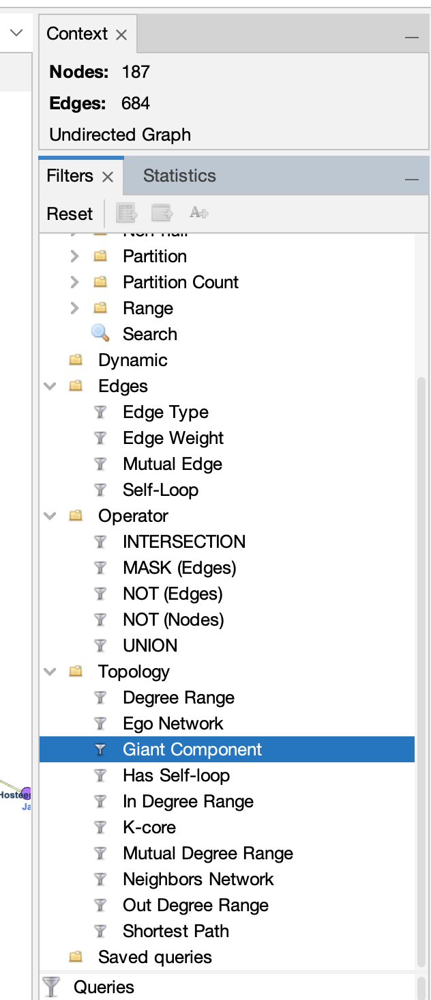
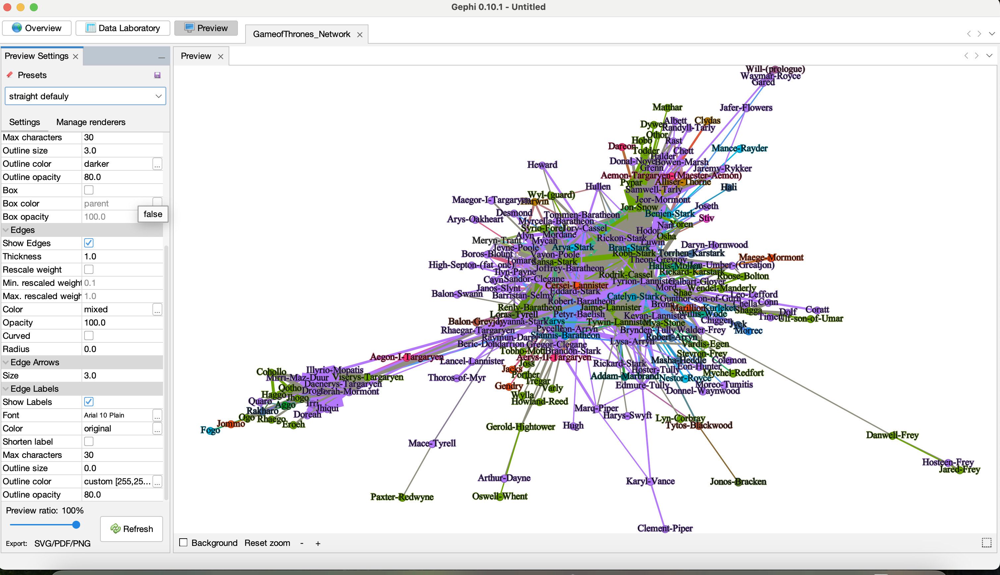

```{r setup, include=FALSE}
knitr::opts_chunk$set(
  echo = TRUE,
  message = FALSE, 
  warning = FALSE
)
```

# Networks

# R Exercises

------------------------------------------------------------------------

**ALWAYS** Let's load our libraries

```{r}
library(tidyverse)
library(dplyr)
library(igraph)
```

## 1. Create a network

We will use the [`igraph` package](https://r.igraph.org/).

### 1.1 Small Undirected Network

Create a network with three nodes and three edges

-   The edges vector describes connections: 1–2, 2–3, and 3–1.

-   n = 3 creates three nodes (numbered 1 to 3). - directed = FALSE
    makes the graph undirected.

```{r}
g1 <- graph(edges = c(1,2, 2,3, 3,1), n = 3, directed = FALSE)
plot(g1)

```

```{r}
vcount(g1)   # Number of nodes
ecount(g1)   # Number of edges

```

------------------------------------------------------------------------

### 1.2 Directed Network with Named Nodes

-   The graph is `directed` (arrows go one way).
-   The edges are: Alice → Bob → Carol → Alice
-   `Igraph` will automatically create nodes based on names

```{r}
# Named graph (no need to specify number of nodes)
g2 <- graph(c("Alice", "Bob", "Bob", "Carol", "Carol", "Alice"), directed = TRUE)
plot(g2)

```

------------------------------------------------------------------------

#### 1.2.1 `graph_from_literal()`

Easier syntax:

-   `--` for undirected edges

-   `+` for directed edges

-   `:` to refer to multiple nodes (`A:B`)

*Undirected*:

```{r}
g3 <- graph_from_literal(Alice -- Bob, Bob -- Carol, Carol -- Alice)
plot(g3)

```

Also remember the length edges don't matter, see below will give the
same graph:

```{r}
g3b <- graph_from_literal(Alice --------- Bob, Bob -- Carol, Carol -- Alice)
plot(g3b)

```

Also make them disconnected:

```{r}
g3c <- graph_from_literal(Alice --------- Bob, Bob -- Carol, Alice, Argos)
plot(g3c)
```

*Directed*

```{r}
g4 <- graph_from_literal(Alice + Bob, Bob + Carol, Carol + Alice)
plot(g4)
```

Disconnected version:

```{r}
g4b <- graph_from_literal( Alice +-+ Bob --+ Henna +-- Argos,
                     Storm --+ Milo:Hoshi )
plot(g4b)

```

*Multiple Nodes*

```{r}
g5 <- graph_from_literal(A:B:C -- X:Y)
plot(g5)

```

### 1.3 Add Node Attributes

Each of our nodes represents a person, and we want to store some basic
info about them.

We can add attributes using `V()` — a function that returns all vertices
(nodes) in the graph.

```{r}
# Assign gender
V(g2)$gender <- c("female", "male", "female")

# Assign house 
V(g2)$house <- c("Stark", "Lannister", "Targaryen")

vertex_attr(g2)
```

### 1.4 Visualize with Attributes

```{r}
# Color by gender
V(g2)$color <- ifelse(V(g2)$gender == "female", "tomato", "skyblue")

# Size by house (just illustrative — not meaningful scaling)
V(g2)$size <- c(25, 20, 25)

# Add labels manually
V(g2)$label <- V(g2)$name

plot(g2, vertex.label.color = "black",
     edge.arrow.size = 0.5, vertex.label.cex = 0.8,
     main = "Network with Attributes")

```

### 1.5 Igraph network object cheat sheet

```{r}
g2
```

Graph Type Flags (in the header):

-   D – Directed graph
-   U – Undirected graph
-   N – Named graph (nodes have a name attribute)
-   W – Weighted graph (edges have a weight attribute)
-   B – Bipartite graph (nodes have a type attribute for 2-mode
    networks)

Node and Edge Count:

-   The two numbers after the type flags (e.g., 7 12) show:

    -   7 nodes (vertices)

    -   12 edges (connections)

Attribute Flags, these indicate what types of attributes the graph
carries:

-   (g/c) — Graph-level character attribute (e.g., name = "Alice")

-   (v/c) — Vertex-level character attribute (e.g., gender = "male")

-   (e/n) — Edge-level numeric attribute (e.g., weight = 10)

------------------------------------------------------------------------

## 2 Common Network Structures and Models in igraph

The `igraph` package provides functions to generate network types

## 2.1

***Empty Graph - A graph with nodes but no edges.***

```{r}
eg <- make_empty_graph(50)
plot(eg, vertex.size = 10, vertex.label = NA)
```

***Fully Connected (Complete) Graph - Every node is connected to every
other node.***

```{r}
fg <- make_full_graph(50)
plot(fg, vertex.size = 10, vertex.label = NA)

```

***Star Network - A central hub connected to all other nodes***

```{r}
st <- make_star(50)
plot(st, vertex.size = 10, vertex.label = NA)

```

***Tree Network - A hierarchical branching structure — good for modeling
organizations or evolutionary relationships.***

```{r}
tr <- make_tree(50, children = 3, mode = "undirected")
plot(tr, vertex.size = 10, vertex.label = NA)

```

***Ring Network - Each node is connected to two neighbors, forming a
closed loop.***

```{r}
rn <- make_ring(50)
plot(rn, vertex.size = 10, vertex.label = NA)

```

## 2.2 Random Graph Models

***Erdos-Rényi Random Graph - Connects nodes randomly. You specify how
many nodes and how many total edges.***

```{r}
er <- sample_gnm(n = 140, m = 50)
plot(er, vertex.size = 6, vertex.label = NA)

```

***Watts-Strogatz Small-World Model - Simulates networks with local
clustering and short path lengths, often seen in social or biological
systems.***

```{r}
sw <- sample_smallworld(dim = 2, size = 10, nei = 1, p = 0.1)
plot(sw, vertex.size = 6, vertex.label = NA, layout = layout_in_circle)

```

***Barabási-Albert Scale-Free Model - Generates networks with a few
highly connected nodes (hubs) and many nodes with few connections.***

```{r}
ba <- sample_pa(n = 100, power = 1, m = 1, directed = FALSE)
plot(ba, vertex.size = 6, vertex.label = NA)

```

***Random Walk - A process where you move from one node to another based
on the edges. This can be used to simulate diffusion or search processes
in networks.***

```{r}
rw <- sample_gnm(n = 100, m = 50)
plot(rw, vertex.size = 6, vertex.label = NA)
```

------------------------------------------------------------------------

## 2.3 Special Graphs

***Zachary’s Karate Club - A famous real-world network of friendships at
a university karate club.***

```{r}
zach <- graph("Zachary")
plot(zach, vertex.size = 10)

```

## 2.4 Network Operations

***Rewiring a Graph You can randomize or reshape a graph by rewiring
edges.***

```{r}
rn.rewired <- rewire(rn, each_edge(prob = 0.1))
plot(rn.rewired, vertex.size = 10, vertex.label = NA)

```

***Connecting Local Neighborhoods - Add new edges between nodes that are
within a certain distance from each other.***

```{r}
rn.neigh <- connect.neighborhood(rn, 5)
plot(rn.neigh, vertex.size = 8, vertex.label = NA)

```

***Combining Graphs - Use `%du%` (disjoint union) to merge two graphs
without overlapping their nodes.***

```{r}
plot(rn, vertex.size = 10, vertex.label = NA)
plot(tr, vertex.size = 10, vertex.label = NA)
plot(rn %du% tr, vertex.size = 10, vertex.label = NA)

```

***Subgraph Extraction - Extract a subgraph based on certain
criteria.***

```{r}
subg <- induced_subgraph(rn, V(rn)[1:10])
plot(subg, vertex.size = 10, vertex.label = NA)
```

Let's clean it all

```{r}
rm(list = ls())

```

------------------------------------------------------------------------

## 3 Real World Data

### 3.1 Network Data:

-   `Edge list` is a two-column (or more) table where each row
    represents a connection — called an edge — between two nodes (also
    called vertices).

Load our dataset of Game of Thrones characters from:
<https://www.kaggle.com/code/mmmarchetti/game-of-thrones-network-analysis/input>

```{r}
data <- readr::read_csv("../data/book1.csv")
head(data)
```

In our dataset:

-   `Source`: the character initiating the interaction

-   `Target`: the character receiving the interaction

-   `Weight`: how often the interaction occurs (e.g., how many times
    they appear together)

In other words, each row tells us: Character A (`Source`) interacted
with Character B (`Target`) this many times (`Weight`).

------------------------------------------------------------------------

### 3.2 Build the Graph

We have a data frame we will use the `graph_from_data_frame()`. This
function creates a network from a data frame where:

-   The first two columns represent the edges (connections),

-   Any additional columns (like Weight) are treated as edge attributes.

```{r}
g <- graph_from_data_frame(data, directed = FALSE)
class(g)

```

Why `directed = FALSE`: - B/c the interactions are `undirected` (check
`data$type`) — just co-appearances, not who spoke first.

-   Each character becomes a `node`
-   Each interaction becomes an `edge`
-   Weight is stored as an `edge attribute` — how strong the connection
    is

------------------------------------------------------------------------

### 3.3 Plot the Graph

Very basic network graph, where: - `Vertex` size to be small and
uniform - `vertex.size = 5` - `Edge` width scaled to Weight -
`edge.width = E(g)$weight / 2`

```{r}

plot(g,
     vertex.size = 5,
     vertex.label = NA,          # hide names for clarity
     edge.width = E(g)$weight / 2,
     main = "Game of Thrones Network")
```

------------------------------------------------------------------------

#### 3.3.1 Let's add some color

```{r}
plot(g,
     vertex.size = 5,
     vertex.color = "magenta",
     vertex.frame.color="gold", 
     vertex.label.color="black",     
     vertex.label = NA,          # hide names for clarity
     edge.width = E(g)$weight / 2,
     edge.color = "gray80",
     main = "Game of Thrones Network")

```

------------------------------------------------------------------------

### 3.4 Basic Network Statistics

```{r}
vcount(g)   # number of characters (nodes)
ecount(g)   # number of interactions (edges)
summary(g)

```

------------------------------------------------------------------------

### 3.5 Add Character Attributes (House and Allegiance)

We will add more data to our network by adding extra information about
each character, including their House and Allegiance.

```{r}

characters <- read.csv("../data/GOT_updated_characters.csv")
head(characters)

```

To attach this information to the nodes in our graph, we need to:

1.  Extract node names from the graph

2.  Join with the characters data frame

3.  Assign attributes back to the graph using `V()`

```{r}
vertex_data <- data.frame(name = V(g)$name)

vertex_data <- merge(vertex_data, characters, by.x = "name", by.y = "character", all.x = TRUE)

V(g)$house <- vertex_data$house
V(g)$allegiance <- vertex_data$allegiance

```

Let's check

```{r}
V(g)$house[1:10]

V(g)$allegiance[1:10]

```

------------------------------------------------------------------------

### 3.6 Degree Centrality

*Degree* is the number of direct connections a node has.

```{r}
deg <- degree(g)
hist(deg, breaks = 20, col = "steelblue", main = "Degree Histogram")

```

To visualize degree on the network, by changing vertex size:

```{r}
V(g)$size <- deg / max(deg) * 10
plot(g, 
     # vertex.label = NA, 
     main = "Node Size by Degree")

```

------------------------------------------------------------------------

### 3.7 Betweenness Centrality

*Betweenness* measures how often a node sits on the shortest path
between others. It’s a proxy for **brokerage** or **gatekeeping** roles.

Let's change it again by scaling the size to betweenness.

```{r}
bet <- betweenness(g)
V(g)$size <- bet / max(bet) * 12
plot(g, 
     # vertex.label = NA,
     main = "Node Size by Betweenness")

```

------------------------------------------------------------------------

## 4 Clustering & Communities

### 4.1 Transitivity (Clustering Coefficient)

How likely is it that two of a character’s neighbors are also connected?

```{r}
transitivity(g, type = "global")

```

------------------------------------------------------------------------

### 4.2. Community Detection (Louvain Method)

Identify clusters of characters who interact more within the group than
outside:

```{r}
comms <- cluster_louvain(g)
plot(comms, g, 
     # vertex.label = NA, 
     main = "Louvain Communities")

```

------------------------------------------------------------------------

## 5. Gephi

### 5.1 Exporting to Gephi

[Gephi](https://gephi.org/) is a powerful, open-source software tool
designed specifically for interactive visualization and exploration of
networks.

It provides a rich interface for analyzing structural properties,
applying dynamic layouts, filtering, and producing high-quality visuals
of complex networks.

While `igraph` in R is excellent for building and analyzing networks,
Gephi allows for more control over **visual layout**, **styling**, and
**interactivity**, which makes it especially useful when preparing
network graphics for presentations or publications.

To export our graph to Gephi, we can use the `write_graph()` function
from `igraph`:

```{r}

write_graph(g, file = "../data/GameofThrones_Network.graphml", format = "graphml")
```

------------------------------------------------------------------------

### 5.2 Opening in Gephi

To open the network in Gephi:

1.  Launch Gephi

2.  Click on "Open Project" and select your .graphml file

3.  Your network will appear in the Overview tab


------------------------------------------------------------------------

### 5.3 Quick Overview of the Gephi Interface

-   Overview Tab: where you layout and manipulate the network

-   Data Laboratory: a spreadsheet view of your nodes and edges

-   Preview Tab: lets you render publication-ready visuals




------------------------------------------------------------------------

### 5.4 Copy name to label

In Data Labaroty tab copy names to label


In overview


------------------------------------------------------------------------

### 5.4 Layouts

A layout is a mathematical algorithm that determines **where the nodes
and edges appear on the screen**.

-   Different layouts help highlight different network structures.

-   You can access them from the Layout panel on the left in the
    Overview tab.

**Common layouts:**

-   `ForceAtlas2`: A force-directed layout ideal for medium-sized
    networks. Nodes repel each other while edges act like springs
    pulling connected nodes together. Helps reveal **clusters and
    hubs**.

-   `Fruchterman-Reingold`: Another force-directed layout, good for
    **smaller networks**. Balances visual clarity and aesthetics.

-   `Yifan Hu`: Designed for **large-scale networks**. Very efficient
    and tends to spread things out nicely.

-   `Circular Layout`: Places nodes in a circle — good for showing
    **regular structures or bipartite graphs**.
    
    


------------------------------------------------------------------------

### 5.5 Color & Size

Color:

-   You can visually distinguish groups in your network by coloring
    nodes based on an attribute (e.g., book, community, type).

-   Go to the **Appearance panel**

    -   Choose **"Nodes"**, then "Color"

    -   Select an attribute like `community`, `gender`, or `house`

    -   Gephi will automatically assign colors

-   Use this to show communities, factions, roles, or types in your
    network.
    







Size:

-   Larger nodes can represent more "important" nodes — those with more
    connections or higher centrality.

-   Go to **Appearance \> Nodes \> Size**

-   Select a metric like:

    -   `Degree` (number of direct connections)

    -   `Betweenness` (how much a node connects others)

    -   `PageRank`, `Eigenvector centrality`, etc.

    -   Adjust the **min/max size range**

-   Larger nodes = more influence (based on the metric you choose).


------------------------------------------------------------------------

### 5.6 Filter Network by Attributes

-   You can filter nodes and edges based on attributes (e.g., only show
    characters from a specific house).
-   Open the **Filters panel** (right side)
-   Drag filters like:
    -   `Degree Range` to focus on central nodes
    -   `Edge Weight` to hide weak/rare interactions
    -   `Giant Component` to only show the largest connected cluster
-   Click **Filter** to apply
-   Filters help reduce clutter and zero in on interesting parts of the
    network.
    



------------------------------------------------------------------------

### 5.7 Exporting Visuals

Once your network looks great, you can export it for reports, websites,
or presentations. - Go to the **Preview tab** - Click **Refresh** to
render - Use **Settings** to tweak fonts, arrows, borders, labels -
Export as: - `PNG`: for images - `SVG`: for vector graphics (good for
Illustrator or Inkscape) - `PDF`: for print-quality output

Use exports for publication-ready visuals or interactive tools.




