Text as Data: Topic Modeling
================
Dr. Ayse D. Lokmanoglu
Lecture 9, (B) March 26, (A) March 31

# R Exercises

------------------------------------------------------------------------

**ALWAYS** Let’s load our libraries

``` r
library(tidyverse)
library(tidytext)
library(ggplot2)
library(stopwords)
library(ldatuning)
library(dplyr)
library(quanteda)
library(stm)
library(topicmodels)
```

## 1. Intro to Topic Modeling

Topic modeling is an unsupervised machine learning technique that
identifies latent themes in a collection of text documents. The most
widely used approach is Latent Dirichlet Allocation (LDA), which assumes
each document is a mixture of topics, and each topic is a mixture of
words.

Why Use LDA? - Helps uncover hidden structure in large text corpora -
Organizes vast amounts of text into interpretable themes - Useful for
content analysis, social media monitoring, and recommendation systems

 *image from:
<https://www.tidytextmining.com/topicmodeling>*

- Latent Dirichlet Allocation (LDA) is one of the most widely used
  algorithms for topic modeling. Without delving into the complex
  mathematics behind it, we can conceptualize LDA through two key
  principles:
  1.  Every document is a mixture of topics. Each document contains
      words from multiple topics in different proportions. For instance,
      in a model with two topics, we could say:
      - “Document 1 is 80% Topic A and 20% Topic B.”
      - “Document 2 is 40% Topic A and 60% Topic B.”
  2.  Every topic is a mixture of words. Each topic consists of words
      that commonly appear together. For example, in a two-topic model
      focused on news:
      - The politics topic might include words like policy, elections,
        and laws.
      - The sports topic might contain words such as soccer, basketball,
        and tournament.
      - Some words, like race, may appear in both topics but with
        different frequencies.
- LDA uses a probabilistic approach to simultaneously determine the
  composition of topics within each document and the key words that
  define each topic. This method enables us to uncover hidden themes in
  large text datasets without prior labeling.

LDA vs. STM

- LDA (Latent Dirichlet Allocation): A probabilistic model that assigns
  words to topics based on co-occurrence patterns.

- STM (Structural Topic Modeling): Extends LDA by allowing the inclusion
  of metadata (e.g., date, author) to influence topic distribution.

------------------------------------------------------------------------

## 2. Preprocessing Text Data

### 2.1 Download the data from

\*Download the new data from
[Github](https://github.com/aysedeniz09/Intro_Comp_Social_Science/blob/main/data/Lecture9_post-LDAk40.rdata)

#### 2.1.2 Save the data to the folder where your script is

In mine it is saved under data folder in the main directory, so I say
first go to the main directory with .. then to the data folder).

``` r
load("../data/Lecture9_post-LDAk40.Rdata")
```

------------------------------------------------------------------------

### 2.2 Let’s take a look at the data

``` r
str(data)
```

    ## 'data.frame':    18512 obs. of  19 variables:
    ##  $ post_type                     : chr  "Link" "Other" "Link" "Link" ...
    ##  $ headline                      : chr  "HBO’s ‘The White Lotus’ Is an Intoxicating Rabbit Hole With a Jennifer Coolidge Performance for the Ages: TV Review" "Photos from NOLA Cupcakes's post" "What to stream in July: Hawaii satire ‘White Lotus,’ nail-biter ‘A Quiet Place 2’ - Red Deer Advocate" "'The White Lotus' Is the Must-See Show of the Summer" ...
    ##  $ excerpt                       : chr  "Jennifer Coolidge creates some of \"The White Lotus’\" most memorable moments by the sheer force of her charism"| __truncated__ "Try NOLA New SABLÉ boxes TODAY with a lot of your favorite flavors; Hazelnut Milk Choco, White Choco, Lotus, Je"| __truncated__ "Monsters lurk among us in July’s streaming highlights.\n\nhttps://www.reddeeradvocate.com/entertainment/what-to"| __truncated__ "\"Enlightened\" creator Mike White returns to HBO a darkly hilarious wealth satire set at a luxury resort." ...
    ##  $ fb_data.total_engagement_count: int  796 208 1 27 0 10 112 12 10 1 ...
    ##  $ fb_data.reactions.comments    : int  21 11 0 0 0 0 5 1 0 0 ...
    ##  $ fb_data.reactions.likes       : int  693 148 1 23 0 10 88 6 8 1 ...
    ##  $ fb_data.reactions.shares      : int  26 9 0 2 0 0 11 2 2 0 ...
    ##  $ fb_data.reactions.loves       : int  56 40 0 0 0 0 6 1 1 0 ...
    ##  $ fb_data.reactions.wows        : int  0 0 0 0 0 0 0 2 0 0 ...
    ##  $ fb_data.reactions.hahas       : int  0 0 0 0 0 0 2 0 0 0 ...
    ##  $ fb_data.reactions.sads        : int  0 0 0 1 0 0 0 0 0 0 ...
    ##  $ fb_data.reactions.angrys      : int  0 0 0 1 0 0 0 0 0 0 ...
    ##  $ source.language               : chr  "en" "en" "en" "en" ...
    ##  $ date_time                     : POSIXct, format: "2021-07-01 21:25:09" "2021-07-01 13:06:35" ...
    ##  $ date                          : Date, format: "2021-07-02" "2021-07-01" ...
    ##  $ CLD2                          : chr  "en" "en" "en" "en" ...
    ##  $ text                          : chr  "Jennifer Coolidge creates some of \"The White Lotus’\" most memorable moments by the sheer force of her charism"| __truncated__ "Try NOLA New SABLÉ boxes TODAY with a lot of your favorite flavors; Hazelnut Milk Choco, White Choco, Lotus, Je"| __truncated__ "Monsters lurk among us in July’s streaming highlights.\n\nhttps://www.reddeeradvocate.com/entertainment/what-to"| __truncated__ "\"Enlightened\" creator Mike White returns to HBO a darkly hilarious wealth satire set at a luxury resort." ...
    ##  $ post_index                    : int  1 2 3 4 5 6 7 8 9 10 ...
    ##  $ textBU                        : chr  "Jennifer Coolidge creates some of \"The White Lotus’\" most memorable moments by the sheer force of her charism"| __truncated__ "Try NOLA New SABLÉ boxes TODAY with a lot of your favorite flavors; Hazelnut Milk Choco, White Choco, Lotus, Je"| __truncated__ "Monsters lurk among us in July’s streaming highlights.\n\nhttps://www.reddeeradvocate.com/entertainment/what-to"| __truncated__ "\"Enlightened\" creator Mike White returns to HBO a darkly hilarious wealth satire set at a luxury resort." ...

**Note: The data already has a post_index column and a language
filtering. I am putting that code below so that you can run it on your
own in the future.**

------------------------------------------------------------------------

### 2.3 Index, save text and language filtering, remove duplicates

``` r
data$post_index <- seq_len(nrow(data)) #my index column
data$textBU <- data$text # text backup

data$CLD2<-cld2::detect_language(data$text) ## a package by Google
table(data$CLD2)
data2 <- data |>  filter(CLD2=="en")
data3 <- data2 |> 
  distinct(text, .keep_all = TRUE)
```

------------------------------------------------------------------------

## 3. Tokenization and Stopword Removal

### 3.1 You can see I am using 2 stopwords lists.

``` r
mystopwords<-c(stopwords("en"),stopwords(source = "smart"),
               "thewhitelotus", "series", "hbo", "https",
               "season", "show", "shows") # you can add more stopwords here

mystopwords <- unique(mystopwords)
mystopwords <- tolower(mystopwords)
```

------------------------------------------------------------------------

### 3.2 Tidy Tokens

``` r
# creating tidy tokens
tidy_data <- data3 |> 
  unnest_tokens(word, text) |>  # tokenizing
  anti_join(data.frame(word=mystopwords)) |> 
  mutate(nchar=nchar(word)) |>  #counting the number of letters
  filter(nchar>2) |>  # remove from minumum number of chars
  filter(!grepl("[0-9]{1}", word)) |>  # removing numbers 
  filter(!grepl("\\W", word))  # removing any word containing non letter/number 
```

------------------------------------------------------------------------

### 3.3 TF-IDF (remember from \[Lecture

3\](<https://github.com/aysedeniz09/Intro_Comp_Social_Science/blob/main/LectureSlides/bigdata_Lecture3.md>))

``` r
# choosing top words by tf-idf
maxndoc=0.5
minndoc=0.00001

# filter to tokens not too common and not too rare
templength<-length(unique(tidy_data$post_index))
good_common_words <- tidy_data |> 
  count(post_index, word, sort = TRUE) |> 
  group_by(word) |> 
  summarize(doc_freq=n()/templength) |> 
  filter(doc_freq<maxndoc) |> 
  filter(doc_freq>minndoc)
```

------------------------------------------------------------------------

### 3.4 Clean tidy and check the top words to see if we want to go back to

Step 3.1 and add other stopwords

``` r
# clean tidy to fit the tokens - NOTE: this is where you might lost indexes
tidy_data_pruned <- tidy_data |>  inner_join(good_common_words)
```

``` r
tidy_data_pruned |> 
  group_by(word) |> 
  summarise(n=n()) |> 
  arrange(desc(n)) |> 
  mutate(word = reorder(word, n)) |> 
  top_n(75) |>     
  ggplot(aes(n, word)) +
  geom_col() +
  labs(y = NULL)
```

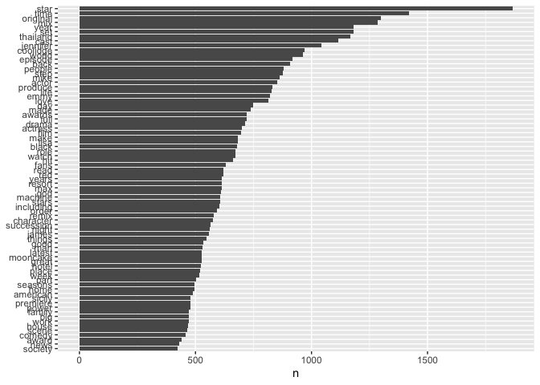<!-- -->

If we are happy with the stopwords continue to next step

------------------------------------------------------------------------

### 3.5 Term Document

``` r
# DFM-ing it
tidy_dfm <- tidy_data_pruned |> 
  count(post_index, word) |> 
  cast_dfm(post_index, word, n)
```

3.5.1 Check the dimensions

``` r
tidy_dfm@Dim
```

    ## [1] 18330 47001

You can see we lost some rows in pruning the data!!

------------------------------------------------------------------------

### 3.6 Convert to LDA object, clean your space and save your R image!!

``` r
full_data<- convert(tidy_dfm, to = "topicmodels")
```

``` r
rm(good_common_words, tidy_data, tidy_data_pruned, tidy_dfm, maxndoc, minndoc, templength)
```

## 4. Finding the Optimal Number of Topics (K)

### 4.1 [Ldatuning](https://github.com/nikita-moor/ldatuning) Package

*This takes time and effort so I will show you the results, you can do
it yourself at home!*

``` r
mycores <- parallel::detectCores()-2 # we are leaving 2 cores of your computer free so you can run a processor
# we will try several k's (sequence from 5 to 100)

Sys.time()
result <- FindTopicsNumber(
  full_data,
  topics = seq(5,200,by=5), # Specify how many topics you want to try.
  metrics = c("Griffiths2004", "CaoJuan2009", "Arun2010", "Deveaud2014"),
  method = "Gibbs",
  control = list(seed = 3333),
  mc.cores = mycores, # Specify the number of cores that you computer has to achieve the best performance. 
  verbose = TRUE
)
Sys.time()
```

``` r
FindTopicsNumber_plot(result)  
```

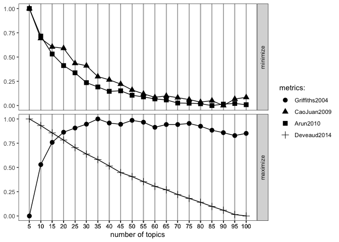<!-- -->

``` r
# ggsave("../images/FindK_Results_upto100.jpeg", bg="white", width=12, height=8, dpi=300) ## this is how to save the image
```

So what do we think the number of topics we should try is?

| Metric | Optimization Goal | Visualization | e.g. from our Results |
|----|----|----|----|
| **Griffiths2004** | **Maximize** | Bottom panel, circles | Peaks around **40–50** topics before plateauing. |
| **Deveaud2014** | **Maximize** | Bottom panel, plus signs | Decreases, suggesting **lower values** indicate worse coherence. Lower topic numbers are better. |
| **CaoJuan2009** | **Minimize** | Top panel, triangles | Steadily decreases, stabilizing around **40–50** topics. |
| **Arun2010** | **Minimize** | Top panel, squares | Should be minimized; flattens around **40** topics. |

So what do we think? Let’s try 35, 40 and 50 topics!

------------------------------------------------------------------------

## 5. LDA Model

LDA converts the document-word matrix (we had above as `tidy_dfm`) into
two other matrices: 1. Topic-Word matrix (Beta (β)) 2. Document-Topic
matrix (Gamma (γ))


*image from:
<https://cdn.analyticsvidhya.com/wp-content/uploads/2021/06/26864dtm.webp>*.

### 5.1 Train the LDA Model with the optimal topics

``` r
whitelotus_LDA_40 <- LDA(full_data, 
                         k = 40, 
                         method = "Gibbs",
                         control = list(verbose=500, 
                                        seed = 9898)) ### we set seed for reproducibility
# save.image("../data/Lecture9_post-LDAk40.rdata")
```

#### 5.1.1 Let’s look inside the LDA model

``` r
str(whitelotus_LDA_40)
```

    ## Formal class 'LDA_Gibbs' [package "topicmodels"] with 16 slots
    ##   ..@ seedwords      : NULL
    ##   ..@ z              : int [1:503373] 21 16 11 17 2 16 16 25 7 22 ...
    ##   ..@ alpha          : num 1.25
    ##   ..@ call           : language LDA(x = full_data, k = 40, method = "Gibbs", control = list(verbose = 500,      seed = 9898))
    ##   ..@ Dim            : int [1:2] 18384 47007
    ##   ..@ control        :Formal class 'LDA_Gibbscontrol' [package "topicmodels"] with 14 slots
    ##   .. .. ..@ delta        : num 0.1
    ##   .. .. ..@ iter         : int 2000
    ##   .. .. ..@ thin         : int 2000
    ##   .. .. ..@ burnin       : int 0
    ##   .. .. ..@ initialize   : chr "random"
    ##   .. .. ..@ alpha        : num 1.25
    ##   .. .. ..@ seed         : int 9898
    ##   .. .. ..@ verbose      : int 500
    ##   .. .. ..@ prefix       : chr "/var/folders/33/522564b51l5_brw54g32nyzr0000gn/T//RtmpC4sSxw/file35562a2c8589"
    ##   .. .. ..@ save         : int 0
    ##   .. .. ..@ nstart       : int 1
    ##   .. .. ..@ best         : logi TRUE
    ##   .. .. ..@ keep         : int 0
    ##   .. .. ..@ estimate.beta: logi TRUE
    ##   ..@ k              : int 40
    ##   ..@ terms          : chr [1:47007] "charisma" "coolidge" "creates" "force" ...
    ##   ..@ documents      : chr [1:18384] "1" "2" "3" "4" ...
    ##   ..@ beta           : num [1:40, 1:47007] -12.1 -11.9 -11.7 -12 -12.1 ...
    ##   ..@ gamma          : num [1:18384, 1:40] 0.0202 0.0296 0.0195 0.0202 0.0388 ...
    ##   ..@ wordassignments:List of 5
    ##   .. ..$ i   : int [1:369769] 1 1 1 1 1 1 1 1 1 1 ...
    ##   .. ..$ j   : int [1:369769] 1 2 3 4 5 6 7 8 9 10 ...
    ##   .. ..$ v   : num [1:369769] 6 16 20 17 39 16 16 25 7 22 ...
    ##   .. ..$ nrow: int 18384
    ##   .. ..$ ncol: int 47007
    ##   .. ..- attr(*, "class")= chr "simple_triplet_matrix"
    ##   ..@ loglikelihood  : num -3900866
    ##   ..@ iter           : int 2000
    ##   ..@ logLiks        : num(0) 
    ##   ..@ n              : int 503373

We are interested in `@terms`, `@documents`, `@beta` & `@gamma`.

------------------------------------------------------------------------

### 5.2 The Beta & Gamma Matrices

- Beta (β) : The per-topic-per-word probabilities. Beta is the
  proportion of the topic that is made up of words from the vocabulary.
- Gamma (γ): The per-document-per-topic probability. Gamma is the
  proportion of the document that is made up of words from the assigned
  topic.

------------------------------------------------------------------------

#### 5.2.1 Top Words per Topic - The Beta (β) Matrix using Tidy

``` r
WL_topics <- tidy(whitelotus_LDA_40, matrix = "beta")
head(WL_topics)
```

    ## # A tibble: 6 × 3
    ##   topic term           beta
    ##   <int> <chr>         <dbl>
    ## 1     1 charisma 0.00000535
    ## 2     2 charisma 0.00000663
    ## 3     3 charisma 0.00000793
    ## 4     4 charisma 0.00000614
    ## 5     5 charisma 0.00000581
    ## 6     6 charisma 0.000169

How do we interpret this: The word charisma has: - **Topic 1:**
$5.353692 \times 10^{-6}$ - **Topic 2:** $6.625281 \times 10^{-6}$ -
**Topic 3:** $7.932290 \times 10^{-6}$ - **Topic 4:**
$6.143374 \times 10^{-6}$ - **Topic 5:** $5.806291 \times 10^{-6}$ -
**Topic 6:** $1.694387 \times 10^{-4}$ - … till **Topic 40**

In order to get the highest probabilities we can use `slice_max()`

``` r
WL_top_terms <- WL_topics |> 
  group_by(topic) |> 
  slice_max(beta, n = 10) |> 
  ungroup() |> 
  arrange(topic, -beta)

WL_top_terms |> 
  filter(topic < 10) |> ## for visualization purposes
  mutate(term = reorder_within(term, beta, topic)) |> 
  ggplot(aes(beta, term, fill = factor(topic))) +
  geom_col(show.legend = FALSE) +
  facet_wrap(~ topic, scales = "free") +
  scale_y_reordered()
```

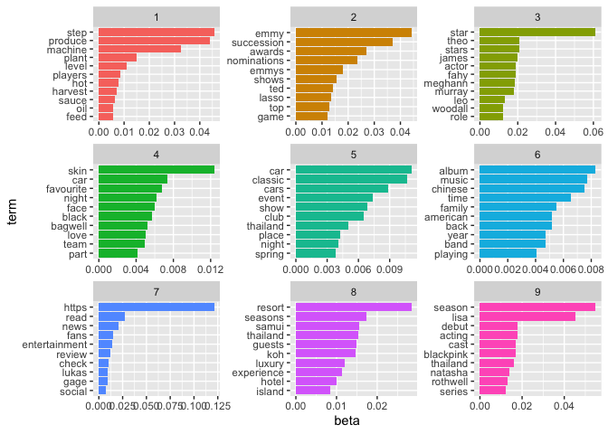<!-- -->

We can also identify distinguishing terms between two topics, by
pivoting wider from topics, computing the logarithmic ratio —\> which
tells us how much more a word is associated with topic 2 versus topic 1,
i.e.,: - log_ratio \> 0 → word is more associated with topic 2 -
log_ratio \< 0 → word is more associated with topic 1

``` r
beta_wide <- WL_topics |> 
  mutate(topic = paste0("topic", topic)) |> ## add topic before number since you cannot have numeric column names in R
  pivot_wider(names_from = topic, values_from = beta) |>   # Pivot the data wider: each topic becomes a separate column with its beta
  filter(topic1 > .001 | topic2 > .001) |> # Keep only rows (terms) that have non-negligible presence in either topic1 or topic2
  mutate(log_ratio = log2(topic2 / topic1))  # Calculate the log ratio of topic2 to topic1

head(beta_wide)
```

    ## # A tibble: 6 × 42
    ##   term    topic1  topic2  topic3  topic4  topic5  topic6  topic7  topic8  topic9
    ##   <chr>    <dbl>   <dbl>   <dbl>   <dbl>   <dbl>   <dbl>   <dbl>   <dbl>   <dbl>
    ## 1 hbo    5.35e-6 7.96e-3 7.93e-6 6.14e-6 5.81e-6 5.47e-6 7.95e-6 5.63e-6 5.86e-3
    ## 2 call   5.35e-6 1.66e-3 7.93e-6 6.14e-6 5.81e-6 1.15e-4 7.95e-6 2.31e-4 7.31e-5
    ## 3 choco… 3.11e-3 6.63e-6 7.93e-6 6.14e-6 5.81e-6 5.47e-6 7.95e-6 5.63e-6 6.65e-6
    ## 4 jam    3.97e-3 6.63e-6 7.93e-6 6.14e-6 6.39e-5 1.69e-4 7.95e-6 5.63e-6 6.65e-6
    ## 5 milk   3.54e-3 6.63e-6 7.93e-6 2.52e-4 5.81e-6 5.47e-6 7.95e-6 5.63e-6 6.65e-6
    ## 6 enter… 5.35e-6 3.39e-3 7.93e-6 6.14e-6 4.12e-4 6.01e-5 1.38e-2 5.63e-6 1.40e-3
    ## # ℹ 32 more variables: topic10 <dbl>, topic11 <dbl>, topic12 <dbl>,
    ## #   topic13 <dbl>, topic14 <dbl>, topic15 <dbl>, topic16 <dbl>, topic17 <dbl>,
    ## #   topic18 <dbl>, topic19 <dbl>, topic20 <dbl>, topic21 <dbl>, topic22 <dbl>,
    ## #   topic23 <dbl>, topic24 <dbl>, topic25 <dbl>, topic26 <dbl>, topic27 <dbl>,
    ## #   topic28 <dbl>, topic29 <dbl>, topic30 <dbl>, topic31 <dbl>, topic32 <dbl>,
    ## #   topic33 <dbl>, topic34 <dbl>, topic35 <dbl>, topic36 <dbl>, topic37 <dbl>,
    ## #   topic38 <dbl>, topic39 <dbl>, topic40 <dbl>, log_ratio <dbl>

Visualize it:

``` r
beta_wide |> 
  dplyr::filter(log_ratio > -7.5 & log_ratio < 7.5) |> ## make the viusalization more readable
  ggplot( aes(x = log_ratio, y = reorder(term, log_ratio))) +
  geom_col() +
  labs(
    x = "Log2 ratio of beta in topic 2 / topic 1",
    y = NULL,
    title = "Terms between Topic 1 and Topic 2"
  ) +
  theme_minimal()
```

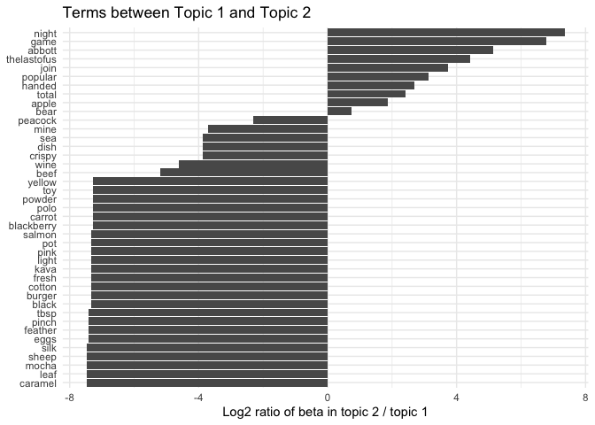<!-- -->

------------------------------------------------------------------------

#### 5.2.2 Top Words per Topic - The Beta (β) Matrix using Base R

``` r
mybeta<-data.frame(whitelotus_LDA_40@beta)
# head(mybeta)
```

Now we need to add column names and row names

``` r
# the number of rows in the mybeta matrix
nrow(mybeta)  # the number of terms in the topic-word distribution matrix
```

    ## [1] 40

``` r
# the number of columns in the mybeta matrix
ncol(mybeta)  # the number of topics in the model
```

    ## [1] 47007

``` r
# assign column names to mybeta using the terms from the LDA model
colnames(mybeta) <- whitelotus_LDA_40@terms  # Each column represents a topic, and we label them with the words

# transpose the mybeta matrix so that words become rows and topics become columns
mybeta <- t(mybeta)  # now rows represent topics and columns represent words

# apply the exponential function to each element of the matrix
mybeta <- exp(mybeta)  # Converts log probabilities to actual probability values

head(mybeta)
```

    ##                  [,1]         [,2]        [,3]         [,4]         [,5]
    ## charisma 5.353692e-06 6.625281e-06 7.93229e-06 6.143374e-06 5.806291e-06
    ## coolidge 5.353692e-06 6.625281e-06 7.93229e-06 6.143374e-06 5.806291e-06
    ## creates  5.353692e-06 6.625281e-06 7.93229e-06 6.143374e-06 5.806291e-06
    ## force    5.353692e-06 6.625281e-06 7.93229e-06 6.143374e-06 5.806291e-06
    ## hbo      5.353692e-06 7.956962e-03 7.93229e-06 6.143374e-06 5.806291e-06
    ## jennifer 5.353692e-06 6.625281e-06 7.93229e-06 6.143374e-06 5.806291e-06
    ##                  [,6]         [,7]         [,8]         [,9]        [,10]
    ## charisma 1.694387e-04 7.945525e-06 5.634215e-06 6.649953e-06 6.261858e-06
    ## coolidge 6.012342e-05 7.945525e-06 5.634215e-06 6.649953e-06 6.261858e-06
    ## creates  5.465765e-06 7.945525e-06 5.634215e-06 1.396490e-04 6.888044e-05
    ## force    5.465765e-06 7.945525e-06 5.634215e-06 6.649953e-06 6.261858e-06
    ## hbo      5.465765e-06 7.945525e-06 5.634215e-06 5.858609e-03 6.888044e-05
    ## jennifer 5.465765e-06 7.945525e-06 5.634215e-06 6.649953e-06 6.261858e-06
    ##                 [,11]        [,12]        [,13]        [,14]        [,15]
    ## charisma 3.685182e-06 5.733715e-06 7.671830e-06 4.265174e-06 7.352563e-06
    ## coolidge 3.685182e-06 5.733715e-06 7.671830e-06 4.265174e-06 7.352563e-06
    ## creates  1.879443e-04 5.733715e-06 7.671830e-06 4.265174e-06 7.352563e-06
    ## force    3.685182e-06 5.733715e-06 7.671830e-06 4.265174e-06 7.352563e-06
    ## hbo      3.685182e-06 5.733715e-06 1.611084e-04 4.265174e-06 7.352563e-06
    ## jennifer 3.685182e-06 8.657909e-04 7.671830e-06 4.265174e-06 7.352563e-06
    ##                 [,16]        [,17]        [,18]        [,19]        [,20]
    ## charisma 8.150159e-06 2.792072e-06 8.088194e-06 6.089504e-06 5.106809e-06
    ## coolidge 7.898319e-02 2.792072e-06 8.088194e-06 6.089504e-06 5.106809e-06
    ## creates  8.150159e-06 2.792072e-06 8.088194e-06 6.089504e-06 3.625834e-04
    ## force    8.150159e-06 7.566514e-04 8.088194e-06 6.089504e-06 1.281809e-03
    ## hbo      5.786613e-04 2.792072e-06 1.698521e-04 6.089504e-06 5.106809e-06
    ## jennifer 8.354727e-02 2.792072e-06 8.088194e-06 6.089504e-06 5.106809e-06
    ##                 [,21]        [,22]        [,23]        [,24]        [,25]
    ## charisma 9.399885e-05 7.868625e-06 5.758478e-06 3.552057e-06 8.495671e-06
    ## coolidge 4.476135e-06 7.868625e-06 5.758478e-06 3.552057e-06 8.495671e-06
    ## creates  4.923749e-05 7.868625e-06 5.758478e-06 3.552057e-06 9.345239e-05
    ## force    4.476135e-06 7.868625e-06 5.758478e-06 5.008401e-04 8.495671e-06
    ## hbo      4.476135e-06 7.868625e-06 5.758478e-06 3.552057e-06 8.495671e-06
    ## jennifer 4.476135e-06 7.868625e-06 5.758478e-06 3.552057e-06 8.495671e-06
    ##                 [,26]        [,27]        [,28]        [,29]        [,30]
    ## charisma 7.200616e-06 6.289822e-06 5.705581e-06 5.284658e-06 8.227947e-06
    ## coolidge 7.200616e-06 6.289822e-06 5.705581e-06 5.284658e-06 8.227947e-06
    ## creates  7.200616e-06 6.289822e-06 2.909846e-04 5.284658e-06 8.227947e-06
    ## force    7.200616e-06 6.289822e-06 5.705581e-06 3.223641e-04 8.227947e-06
    ## hbo      4.911540e-02 6.289822e-06 5.705581e-06 5.813124e-05 8.227947e-06
    ## jennifer 7.200616e-06 6.289822e-06 5.705581e-06 5.284658e-06 8.227947e-06
    ##              [,31]        [,32]        [,33]        [,34]        [,35]
    ## charisma 7.886e-06 8.451871e-06 7.726960e-06 4.455792e-06 8.943184e-06
    ## coolidge 7.886e-06 8.451871e-06 7.726960e-06 4.455792e-06 8.943184e-06
    ## creates  7.886e-06 8.451871e-06 7.726960e-06 4.455792e-06 8.943184e-06
    ## force    7.886e-06 8.451871e-06 7.726960e-06 3.163612e-04 8.943184e-06
    ## hbo      7.886e-06 8.451871e-06 1.592526e-02 4.455792e-06 8.943184e-06
    ## jennifer 7.886e-06 8.451871e-06 7.726960e-06 4.455792e-06 8.943184e-06
    ##                 [,36]        [,37]        [,38]        [,39]        [,40]
    ## charisma 7.685982e-06 7.366103e-06 2.348096e-06 7.625613e-06 5.995312e-06
    ## coolidge 7.685982e-06 7.366103e-06 2.348096e-06 7.625613e-06 5.995312e-06
    ## creates  7.685982e-06 7.366103e-06 2.348096e-06 7.625613e-06 5.995312e-06
    ## force    7.685982e-06 7.366103e-06 3.076006e-04 7.625613e-06 4.256671e-04
    ## hbo      7.685982e-06 7.366103e-06 2.348096e-06 5.765726e-02 1.259015e-04
    ## jennifer 7.685982e-06 7.366103e-06 2.348096e-06 7.625613e-06 1.259015e-04

We can display using wordcloud:

``` r
# Select a topic index for visualization
i = 4  # Choose a random topic (Topic 4 in this case)

# Create a data frame of words and their probabilities for the selected topic
wordfreq <- data.frame(word = rownames(mybeta), freq = mybeta[, i])

# Generate a word cloud to visualize word importance in Topic 4
wordcloud2::wordcloud2(wordfreq)  # Larger words indicate higher probability in the topic
```

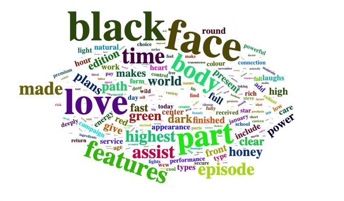<!-- -->

``` r
# Apply a transformation to reduce the impact of highly frequent words
wordfreq <- data.frame(word = rownames(mybeta), freq = (mybeta[, i])^(0.3))  
# Raising probabilities to the power of 0.3 reduces the range, making less frequent words more visible

# Generate another word cloud with adjusted scaling
wordcloud2::wordcloud2(wordfreq)  # Helps to balance word size differences
```

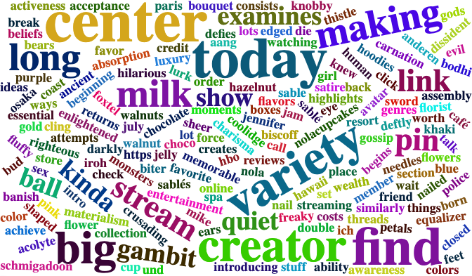<!-- -->

------------------------------------------------------------------------

#### 5.2.3 Top Documents per Topic - The Gamma (γ) Matrix using Tidy

``` r
WL_documents <- tidy(whitelotus_LDA_40, matrix = "gamma")
head(WL_documents)
```

    ## # A tibble: 6 × 3
    ##   document topic  gamma
    ##   <chr>    <int>  <dbl>
    ## 1 1            1 0.0202
    ## 2 2            1 0.0296
    ## 3 3            1 0.0195
    ## 4 4            1 0.0202
    ## 5 5            1 0.0388
    ## 6 6            1 0.0236

How do we interpret this? - Each value in this table shows the
**estimated proportion of words in a specific document that are
attributed to a specific topic**. This comes from the **gamma matrix**
of the LDA model, which gives the document-topic distribution. In our
case, e.g. the `head()`:

- **Document 1**: $\gamma_{1,1} = 0.02016129$  
- **Document 2**: $\gamma_{2,1} = 0.02960526$  
- **Document 3**: $\gamma_{3,1} = 0.01953125$  
- **Document 4**: $\gamma_{4,1} = 0.02016129$  
- **Document 5**: $\gamma_{5,1} = 0.03879310$  
- **Document 6**: $\gamma_{6,1} = 0.02358491$

This means, for example, that **approximately 2% of the words in
Document 1** are estimated to be generated from **Topic 1**, while
**Document 5** has a slightly stronger association with Topic 1 (about
**3.9%** of its words).

Visualization - we can boxplot according to documents

``` r
WL_documents |> 
  mutate(document = as.numeric(document)) |> 
  filter(document < 5 & topic < 4) |>  #again for visualization 
  ggplot(aes(factor(topic), gamma)) +
  geom_boxplot() +
  facet_wrap(~ document) +
  labs(x = "topic", y = expression(gamma))
```

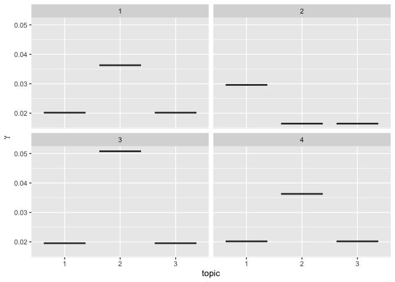<!-- -->

------------------------------------------------------------------------

#### 5.2.4 Top Documents per Topic - The Gamma (γ) Matrix using Base R

Because we **pruned** the data-set before term document matrix, we need
to make sure we remove the documents we deleted

``` r
nrow(whitelotus_LDA_40@gamma)
```

    ## [1] 18384

``` r
ncol(whitelotus_LDA_40@gamma)
```

    ## [1] 40

``` r
nrow(data3) - nrow(whitelotus_LDA_40@gamma)
```

    ## [1] 128

So we pruned 128 documents, so lets create a short dataframe

``` r
data_short<-data3
missing_docs<-setdiff(data3$post_index,whitelotus_LDA_40@documents)
length(missing_docs) ### so its the same
```

    ## [1] 128

``` r
data_short<-data_short[-which(data_short$post_index %in% missing_docs),]
nrow(data_short) - nrow(whitelotus_LDA_40@gamma)## great
```

    ## [1] 0

Now let’s combine the gamma values with our main document to have the
text and the gamma values

``` r
meta_theta_df<-cbind(data_short, whitelotus_LDA_40@gamma)

### I will also add an X before all the topic names

col1 = which(names(meta_theta_df) == "1") #first topic
col40 = which(names(meta_theta_df) == "40") #last topic


colnames(meta_theta_df)[col1:col40] <- paste0("X", colnames(meta_theta_df)[col1:col40]) #you can also paste topic_ here or whatever you want
colnames(meta_theta_df)
```

    ##  [1] "post_type"                      "headline"                      
    ##  [3] "excerpt"                        "fb_data.total_engagement_count"
    ##  [5] "fb_data.reactions.comments"     "fb_data.reactions.likes"       
    ##  [7] "fb_data.reactions.shares"       "fb_data.reactions.loves"       
    ##  [9] "fb_data.reactions.wows"         "fb_data.reactions.hahas"       
    ## [11] "fb_data.reactions.sads"         "fb_data.reactions.angrys"      
    ## [13] "source.language"                "date_time"                     
    ## [15] "date"                           "CLD2"                          
    ## [17] "text"                           "post_index"                    
    ## [19] "textBU"                         "X1"                            
    ## [21] "X2"                             "X3"                            
    ## [23] "X4"                             "X5"                            
    ## [25] "X6"                             "X7"                            
    ## [27] "X8"                             "X9"                            
    ## [29] "X10"                            "X11"                           
    ## [31] "X12"                            "X13"                           
    ## [33] "X14"                            "X15"                           
    ## [35] "X16"                            "X17"                           
    ## [37] "X18"                            "X19"                           
    ## [39] "X20"                            "X21"                           
    ## [41] "X22"                            "X23"                           
    ## [43] "X24"                            "X25"                           
    ## [45] "X26"                            "X27"                           
    ## [47] "X28"                            "X29"                           
    ## [49] "X30"                            "X31"                           
    ## [51] "X32"                            "X33"                           
    ## [53] "X34"                            "X35"                           
    ## [55] "X36"                            "X37"                           
    ## [57] "X38"                            "X39"                           
    ## [59] "X40"

For example, we can do theme by day, and visualize theme by day

``` r
meta_theta_daily <- meta_theta_df |> 
  pivot_longer(cols = starts_with("X"), names_to = "topic", values_to = "gamma") |>
  group_by(date, topic) |> 
  summarise(mean_gamma = mean(gamma), .groups = "drop") |> 
  ungroup()


meta_theta_daily |> 
  filter(topic %in% (
    meta_theta_daily |> 
      group_by(topic) |> 
      summarise(avg = mean(mean_gamma), .groups = "drop") |> 
      slice_max(order_by = avg, n = 5) |> 
      pull(topic)
  )) |> 
  ggplot(aes(x=date))+
  geom_col(aes(y=mean_gamma,fill=topic),position = "fill",width = 4)+
  scale_x_date(date_breaks="2 months", date_labels = "%b-%Y")+
  xlab("")+
  ylab("Prevalance")+
  ggthemes::theme_wsj(color="white")+
  theme(text=element_text(size=10,family="Times"),
        title=element_text(size=10,family="Times"),
        axis.text.x=element_text(angle=60, size=8, hjust=1, family="Times"),
        axis.text.y=element_text(size=8, family="Times"),
        axis.title.x=element_text(vjust=-0.25, size=8, family="Times"),
        axis.title.y=element_text(vjust=-0.25, size=8, family="Times"),
        legend.position="bottom", legend.box="vertical", legend.margin=margin(),
        legend.key = element_rect(fill="white"), legend.background = element_rect(fill=NA),
        legend.text=element_text(size=8, family="Times"))
```

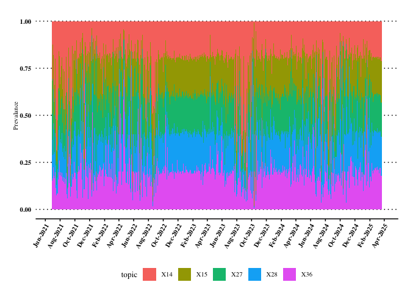<!-- -->

Or another way

``` r
theme_by_date <- meta_theta_df |> 
  group_by(date) |> 
  summarise(across(starts_with("X"), mean))

ggplot(theme_by_date, aes(x=date))+
  geom_smooth(aes(y=X2),se=FALSE,color="black")+
  geom_smooth(aes(y=X5),se=FALSE,color="blue")+
  geom_smooth(aes(y=X7),se=FALSE,color="red")+
  theme_bw() +
  theme(text=element_text(size=10,family="Times"),
        title=element_text(size=10,family="Times"),
        axis.text.x=element_text(angle=60, size=8, hjust=1, family="Times"),
        axis.text.y=element_text(size=8, family="Times"),
        axis.title.x=element_text(vjust=-0.25, size=8, family="Times"),
        axis.title.y=element_text(vjust=-0.25, size=8, family="Times"),
        legend.position="bottom", legend.box="vertical", legend.margin=margin(),
        legend.key = element_rect(fill="white"), legend.background = element_rect(fill=NA),
        legend.text=element_text(size=8, family="Times"))
```

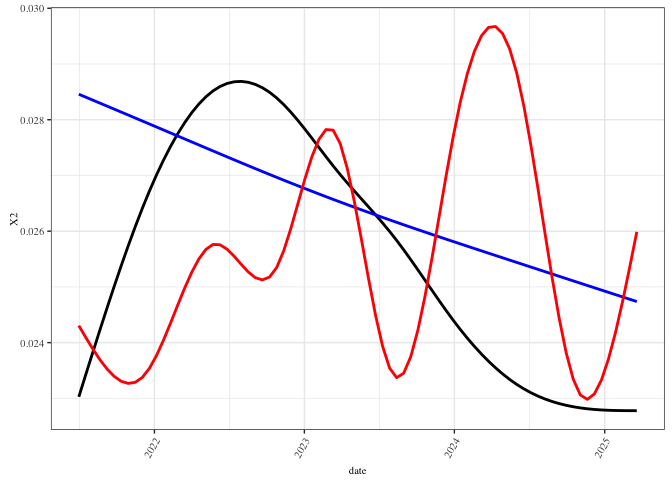<!-- -->

Or we can get the top words and topics in highest facebook likes? Let’s
do it together

------------------------------------------------------------------------

### 5.3 How to write the matrices to excel to analyze them!

First - top terms

``` r
nwords=30 ## however many words you want

# create a container 
topwords <- mybeta[1:nwords,]
str(topwords)
```

    ##  num [1:30, 1:40] 5.35e-06 5.35e-06 5.35e-06 5.35e-06 5.35e-06 ...
    ##  - attr(*, "dimnames")=List of 2
    ##   ..$ : chr [1:30] "charisma" "coolidge" "creates" "force" ...
    ##   ..$ : NULL

``` r
for (i in 1:whitelotus_LDA_40@k) {
  tempframe <- mybeta[order(-mybeta[,i]),]
  tempframe <- tempframe[1:nwords,]
  tempvec<-as.vector(rownames(tempframe))
  topwords[,i]<-tempvec
}

rownames(topwords)<-c(1:nwords)
topwords <- as.data.frame(topwords)

# openxlsx::write.xlsx(topwords,"../data/Lecture9_Topwords.xlsx")
```

Top texts —-\>

``` r
# make theta
### do this again if you haven't done so above
# data_short<-data3
# missing_docs<-setdiff(data3$post_index,whitelotus_LDA_40@documents)
# length(missing_docs) ### so its the same
# data_short<-data_short[-which(data_short$post_index %in% missing_docs),]

which(names(data_short) == "text") # text column
```

    ## [1] 17

``` r
meta_theta_df2<-cbind(data_short[which(names(data_short) == "text") ], whitelotus_LDA_40@gamma)

###meta_theta_df2 should have number of topics + 1 (text column) number of columns
ncol(meta_theta_df2)
```

    ## [1] 41

``` r
# again - how many texts?
ntext=50

# and loop
toptexts <- mybeta[1:ntext,]
for (i in 1:whitelotus_LDA_40@k) {
  print(i)
  tempframe <- meta_theta_df2[order(-meta_theta_df2[,i+1]),]
  tempframe <- tempframe[1:ntext,]
  tempvec<-as.vector(unlist(tempframe[,1]))
  toptexts[,i]<-tempvec
}
```

    ## [1] 1
    ## [1] 2
    ## [1] 3
    ## [1] 4
    ## [1] 5
    ## [1] 6
    ## [1] 7
    ## [1] 8
    ## [1] 9
    ## [1] 10
    ## [1] 11
    ## [1] 12
    ## [1] 13
    ## [1] 14
    ## [1] 15
    ## [1] 16
    ## [1] 17
    ## [1] 18
    ## [1] 19
    ## [1] 20
    ## [1] 21
    ## [1] 22
    ## [1] 23
    ## [1] 24
    ## [1] 25
    ## [1] 26
    ## [1] 27
    ## [1] 28
    ## [1] 29
    ## [1] 30
    ## [1] 31
    ## [1] 32
    ## [1] 33
    ## [1] 34
    ## [1] 35
    ## [1] 36
    ## [1] 37
    ## [1] 38
    ## [1] 39
    ## [1] 40

``` r
rownames(toptexts)<-c(1:ntext)
toptexts <- as.data.frame(toptexts)

# openxlsx:: write.xlsx(toptexts,"../data/Lecture9_TopTexts.xlsx")

# save.image("../data/Lecture9_All_Data.Rdata") ### this is how to save your work!! 
```

Delete all variables before we start the new section

``` r
rm(list = ls()) ### REMOVES ALL VARIABLES USE IT WITH CAUTION
gc() #garbage can to clean your memory
```

    ##           used  (Mb) gc trigger  (Mb) limit (Mb) max used  (Mb)
    ## Ncells 3215003 171.7    5214417 278.5         NA  5214417 278.5
    ## Vcells 5692638  43.5   41440827 316.2      18432 51798875 395.2

------------------------------------------------------------------------

## 6. STM Model

Structural Topic Modeling (STM) extends traditional topic models (like
LDA) by allowing you to include document-level metadata (e.g., time,
publication, author) as covariates that can influence: - Topic
prevalence: How often topics appear in a document. - Topic content: The
words used to describe a topic.

We will be using the [`stm` package](https://github.com/bstewart/stm).

### 6.1 Train the STM Model with the optimal topics

Our class example will be our White Lotus Data, and our covariate will
be year of the posts.

Load the data from:
[Link](https://github.com/aysedeniz09/Intro_Comp_Social_Science/blob/main/data/Lecture9_stm_AllData.Rdata)

#### 6.1.1 Preprocess Data:

First exact same steps as LDA

``` r
load("../data/Lecture9_stm_AllData.Rdata")
data$post_index <- seq_len(nrow(data)) #my index column
data$textBU <- data$text # text backup
data$CLD2<-cld2::detect_language(data$text) ## a package by Google
table(data$CLD2)
```

    ## 
    ##    en 
    ## 26837

``` r
data2 <- data |>  filter(CLD2=="en")
data3 <- data2 |> 
  distinct(text, .keep_all = TRUE)

data_removed <- anti_join(data2, data3)

nrow(data2) - nrow(data3)
```

    ## [1] 8325

``` r
## add a year column

data3$year <- year(data3$date)
## make it factorial 
data3$year <- as.factor(data3$year)
```

Then we format the data to fit the STM model

``` r
processed <- textProcessor(data3$text, metadata = data3)
```

    ## Building corpus... 
    ## Converting to Lower Case... 
    ## Removing punctuation... 
    ## Removing stopwords... 
    ## Removing numbers... 
    ## Stemming... 
    ## Creating Output...

``` r
out <- prepDocuments(processed$documents, processed$vocab, processed$meta)
```

    ## Removing 28701 of 48694 terms (28701 of 431073 tokens) due to frequency 
    ## Removing 18 Documents with No Words 
    ## Your corpus now has 18487 documents, 19993 terms and 402372 tokens.

``` r
docs <- out$documents
vocab <- out$vocab
meta <- out$meta
```

#### 6.1.2 Finding the Optimal Number of Topics

Choosing the right number of topics (K) is crucial. Too few topics may
merge distinct themes, while too many may split coherent ideas. In
`stm`, we use the `searchK()` function to compare multiple models based
on quantitative criteria:

``` r
k_result <- searchK(documents = docs, 
                    vocab = vocab, 
                    data = meta, 
                    K = c(5, 10, 15, 20), 
                    prevalence = ~ year + fb_data.total_engagement_count, 
                    init.type = "Spectral")
```

``` r
plot(k_result)
```

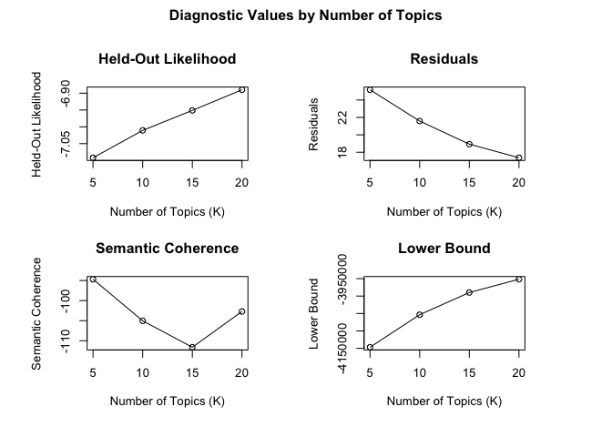<!-- -->

Also plot:

``` r
### i first unlist the results list:
df_k <- k_result$results |> 
  mutate(K = unlist(K),
         exclusivity = unlist(exclus),
         semantic_coherence = unlist(semcoh))

### then plot
ggplot(df_k, aes(x = K)) +
  geom_line(aes(y = exclusivity, color = "Exclusivity"), size = 1) +
  geom_point(aes(y = exclusivity, color = "Exclusivity"), size = 2) +
  geom_line(aes(y = semantic_coherence, color = "Semantic Coherence"), size = 1) +
  geom_point(aes(y = semantic_coherence, color = "Semantic Coherence"), size = 2) +
  labs(title = "Model Diagnostics: Exclusivity vs Semantic Coherence",
       x = "Number of Topics (K)",
       y = "Score",
       color = "Metric") +
  theme_minimal()
```

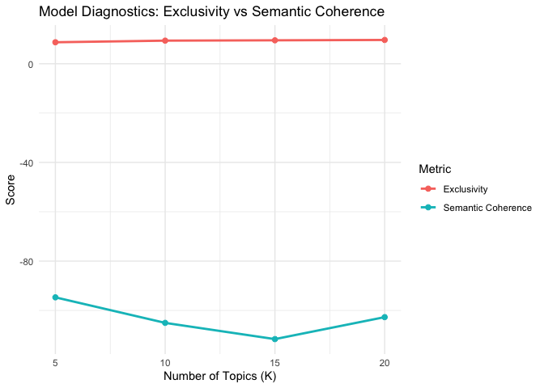<!-- -->

| Metric | Best K | Notes |
|----|----|----|
| Held-Out Likelihood | 20 | Increases steadily with K |
| Residuals | 20 | Decreases steadily, lowest at K = 20 |
| Semantic Coherence | 5–10 | Highest at K = 5, drops with K, small bump at 20 |
| Exclusivity | 20 | Increases consistently, highest at K = 20 |

So looks like 20 is the more optimal topic, but we can also try 15

------------------------------------------------------------------------

#### 6.1.2 Fitting the STM Model

``` r
# K = 15 and K = 20
stm_k15 <- stm(documents = docs, vocab = vocab, K = 15,
               prevalence = ~ year, data = meta,
               init.type = "Spectral", max.em.its = 75)

stm_k20 <- stm(documents = docs, vocab = vocab, K = 20,
               prevalence = ~ year, data = meta,
               init.type = "Spectral", max.em.its = 75)


# Label top words
labelTopics(stm_k15)
labelTopics(stm_k20)
```

``` r
# save.image("../data/Lecture9_stm_AllData.Rdata")
```

##### Comparative Plot

``` r
# Plot summaries
par(mfrow = c(1, 2))  # 
plot(stm_k15, main = "K = 15 Topics")
plot(stm_k20, main = "K = 20 Topics")
```

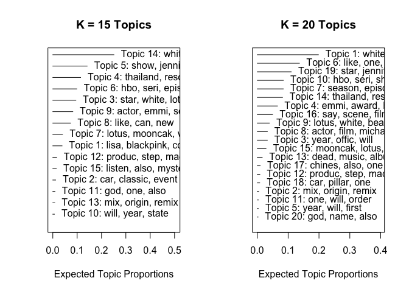<!-- -->

``` r
par(mfrow = c(1, 1))  # reset your plotting area
```

The above 2 panel plot shows the **expected topic proportions** for each
fitted model: - The x-axis represents how frequently a topic appears
across the corpus. - Each topic label includes its top 3 words for quick
interpretation.

##### Key points:

- K = 15: Topics appear broader and more semantically rich (e.g., “lisa,
  blackpink” or “star, white”).
- K = 20: Some topics are narrower and more specific (e.g., “god, name,
  also”), but there’s visible overlap (e.g., several “car”-related
  topics).

What do we think?

*I’m going to continue with k=15*

------------------------------------------------------------------------

### 6.2 Interpret the STM Model

#### 6.2.1 Top Words per Topic - The Beta (β) Matrix using Tidy

Very similar to LDA we can use the `tidytext` to get our two matrices

``` r
WL_STM_topics <- tidy(stm_k15, matrix = "beta")
head(WL_STM_topics)
```

    ## # A tibble: 6 × 3
    ##   topic term      beta
    ##   <int> <chr>    <dbl>
    ## 1     1 ---   1.07e-79
    ## 2     2 ---   7.04e- 5
    ## 3     3 ---   2.18e-16
    ## 4     4 ---   9.38e-42
    ## 5     5 ---   3.54e-52
    ## 6     6 ---   3.56e-63

``` r
WL_STM_top_terms <- WL_STM_topics |> 
  group_by(topic) |> 
  top_n(10, beta) |> 
  ungroup() |> 
  arrange(topic, -beta)


WL_STM_top_terms |> 
  mutate(term = reorder_within(term, beta, topic)) |> 
  ggplot(aes(beta, term, fill = factor(topic))) +
  geom_col(show.legend = FALSE) +
  facet_wrap(~ topic, scales = "free") +
  scale_y_reordered()
```

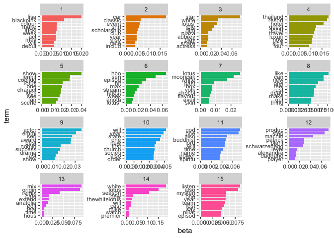<!-- -->

We can also identify distinguishing terms between two topics, by
pivoting wider from topics, computing the logarithmic ratio —\> which
tells us how much more a word is associated with topic 2 versus topic 1,
i.e.,: - log_ratio \> 0 → word is more associated with topic 2 -
log_ratio \< 0 → word is more associated with topic 1

``` r
beta_wide_STM <- WL_STM_topics |> 
  mutate(topic = paste0("topic", topic)) |> ## add topic before number since you cannot have numeric column names in R
  pivot_wider(names_from = topic, values_from = beta) |>   # Pivot the data wider: each topic becomes a separate column with its beta
  filter(topic1 > .001 | topic2 > .001) |> # Keep only rows (terms) that have non-negligible presence in either topic1 or topic2
  mutate(log_ratio = log2(topic2 / topic1))  # Calculate the log ratio of topic2 to topic1

head(beta_wide_STM)
```

    ## # A tibble: 6 × 17
    ##   term      topic1    topic2    topic3   topic4    topic5    topic6   topic7
    ##   <chr>      <dbl>     <dbl>     <dbl>    <dbl>     <dbl>     <dbl>    <dbl>
    ## 1 across 0.0000389 1.21e-  3 2.09e- 14 1.26e- 3 5.85e- 23 3.09e-  4 1.45e- 4
    ## 2 act    0.00717   1.46e-  4 6.54e- 10 8.56e-27 1.05e- 14 1.37e-  8 5.11e-44
    ## 3 album  0.00112   7.88e- 14 2.32e- 44 1.28e-51 1.64e- 41 3.73e- 44 1.67e-60
    ## 4 ale    0.00157   2.11e-129 3.75e-135 7.77e-93 2.48e-121 7.30e-146 1.40e-69
    ## 5 also   0.00378   4.59e-  3 3.78e-  8 4.99e- 4 5.87e-  4 4.18e-  3 2.41e- 3
    ## 6 alway  0.000370  1.11e-  3 1.19e- 15 1.47e- 7 2.19e-  3 1.89e- 13 1.38e- 4
    ## # ℹ 9 more variables: topic8 <dbl>, topic9 <dbl>, topic10 <dbl>, topic11 <dbl>,
    ## #   topic12 <dbl>, topic13 <dbl>, topic14 <dbl>, topic15 <dbl>, log_ratio <dbl>

Visualize it:

``` r
beta_wide_STM |> 
  dplyr::filter(log_ratio > -1 & log_ratio < 1) |> ## make the viusalization more readable
  ggplot( aes(x = log_ratio, y = reorder(term, log_ratio))) +
  geom_col() +
  labs(
    x = "Log2 ratio of beta in topic 2 / topic 1",
    y = NULL,
    title = "Terms between Topic 1 and Topic 2"
  ) +
  theme_minimal()
```

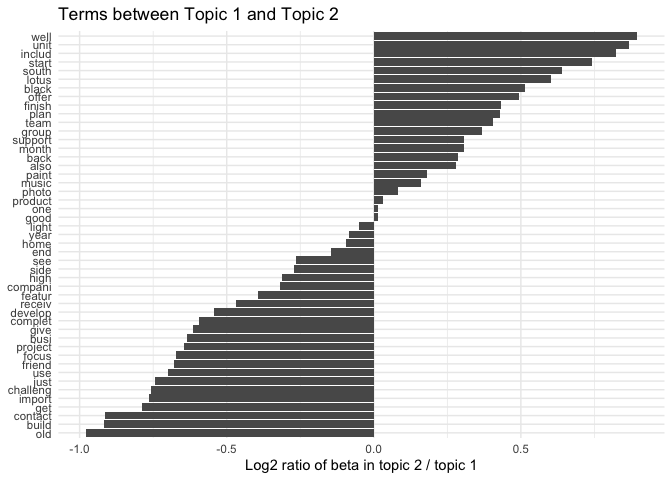<!-- -->

#### 6.2.2 Top Words per Topic - The Beta (β) Matrix using Base R

``` r
mybetaSTM_log <- stm_k15$beta$logbeta ## these are logged values
mybetaSTM <- as.data.frame(mybetaSTM_log[[1]])
# head(mybeta)
```

Now we need to add column names and row names

``` r
# the number of rows in the mybeta matrix
nrow(mybetaSTM)  # the number of terms in the topic-word distribution matrix
```

    ## [1] 15

``` r
# the number of columns in the mybeta matrix
ncol(mybetaSTM)  # the number of topics in the model
```

    ## [1] 19993

``` r
# assign column names to mybeta using the terms from the LDA model
colnames(mybetaSTM) <- stm_k15$vocab  # Each column represents a topic, and we label them with the words

# transpose the mybeta matrix so that words become rows and topics become columns
mybeta <- t(mybetaSTM)
# apply the exponential function to each element of the matrix
mybeta <- exp(mybeta)  # Converts log probabilities to actual probability values
```

We can display using wordcloud:

``` r
# Select a topic index for visualization
i = 4  # Choose a random topic (Topic 4 in this case)

# Create a data frame of words and their probabilities for the selected topic
wordfreq <- data.frame(word = rownames(mybeta), freq = mybeta[, i])

# Generate a word cloud to visualize word importance in Topic 4
wordcloud2::wordcloud2(wordfreq)  # Larger words indicate higher probability in the topic
```

<!-- -->

``` r
# Apply a transformation to reduce the impact of highly frequent words
wordfreq <- data.frame(word = rownames(mybeta), freq = (mybeta[, i])^(0.3))  
# Raising probabilities to the power of 0.3 reduces the range, making less frequent words more visible

# Generate another word cloud with adjusted scaling
wordcloud2::wordcloud2(wordfreq)  # Helps to balance word size differences
```

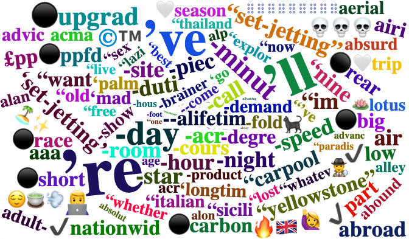<!-- -->

#### 6.2.3 Top Documents per Topic - The Gamma (γ) Matrix using Tidy

``` r
WL_STM_documents <- tidy(stm_k15, matrix = "gamma",
                     document_names = data3$post_index)
head(WL_STM_documents)
```

    ## # A tibble: 6 × 3
    ##   document topic   gamma
    ##      <int> <int>   <dbl>
    ## 1        1     1 0.0118 
    ## 2        2     1 0.00731
    ## 3        3     1 0.00991
    ## 4        4     1 0.0132 
    ## 5        5     1 0.0725 
    ## 6        6     1 0.0132

Visualization - we can boxplot according to documents

``` r
WL_STM_documents |> 
  mutate(document = as.numeric(document)) |> 
  filter(document < 5 & topic < 4) |>  #again for visualization 
  ggplot(aes(factor(topic), gamma)) +
  geom_boxplot() +
  facet_wrap(~ document) +
  labs(x = "topic", y = expression(gamma))
```

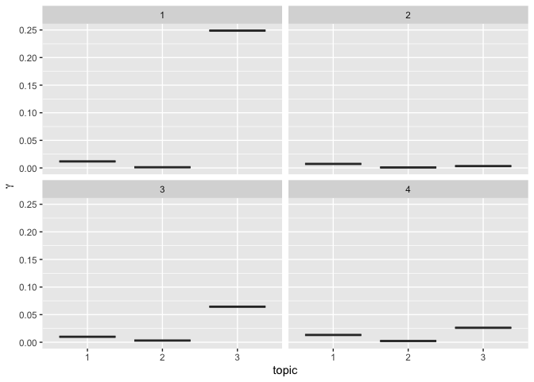<!-- -->

------------------------------------------------------------------------

#### 6.2.4 Top Documents per Topic - The Gamma (γ) Matrix using Base R

Let’s combine the gamma values (for STM its the theta column) with our
main document to have the text and the gamma values

``` r
topic_proportions <- as.data.frame(stm_k15$theta)
colnames(topic_proportions) <- paste0("X", 1:ncol(topic_proportions))
meta_theta_df_STM <- cbind(meta, topic_proportions)
```

For example, we can do theme by day, and visualize theme by day

``` r
meta_theta_daily_STM <- meta_theta_df_STM |> 
  pivot_longer(cols = starts_with("X"), names_to = "topic", values_to = "gamma") |>
  group_by(date, topic) |> 
  summarise(mean_gamma = mean(gamma), .groups = "drop") |> 
  ungroup()


meta_theta_daily_STM |> 
  filter(topic %in% (
    meta_theta_daily_STM |> 
      group_by(topic) |> 
      summarise(avg = mean(mean_gamma), .groups = "drop") |> 
      slice_max(order_by = avg, n = 5) |> 
      pull(topic)
  )) |> 
  ggplot(aes(x=date))+
  geom_col(aes(y=mean_gamma,fill=topic),position = "fill",width = 4)+
  scale_x_date(date_breaks="2 months", date_labels = "%b-%Y")+
  xlab("")+
  ylab("Prevalance")+
  ggthemes::theme_wsj(color="white")+
  theme(text=element_text(size=10,family="Times"),
        title=element_text(size=10,family="Times"),
        axis.text.x=element_text(angle=60, size=8, hjust=1, family="Times"),
        axis.text.y=element_text(size=8, family="Times"),
        axis.title.x=element_text(vjust=-0.25, size=8, family="Times"),
        axis.title.y=element_text(vjust=-0.25, size=8, family="Times"),
        legend.position="bottom", legend.box="vertical", legend.margin=margin(),
        legend.key = element_rect(fill="white"), legend.background = element_rect(fill=NA),
        legend.text=element_text(size=8, family="Times"))
```

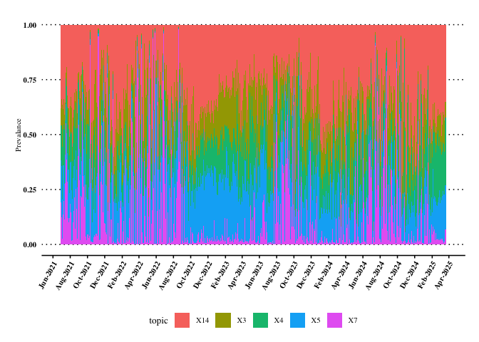<!-- -->

Or another way

``` r
theme_by_date_STM <- meta_theta_df_STM |> 
  group_by(date) |> 
  summarise(across(starts_with("X"), mean))

ggplot(theme_by_date_STM, aes(x=date))+
  geom_smooth(aes(y=X2),se=FALSE,color="black")+
  geom_smooth(aes(y=X5),se=FALSE,color="blue")+
  geom_smooth(aes(y=X7),se=FALSE,color="red")+
  theme_bw() +
  theme(text=element_text(size=10,family="Times"),
        title=element_text(size=10,family="Times"),
        axis.text.x=element_text(angle=60, size=8, hjust=1, family="Times"),
        axis.text.y=element_text(size=8, family="Times"),
        axis.title.x=element_text(vjust=-0.25, size=8, family="Times"),
        axis.title.y=element_text(vjust=-0.25, size=8, family="Times"))
```

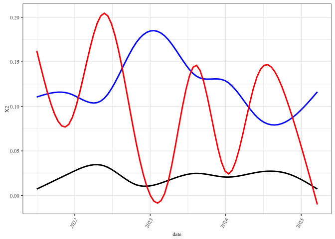<!-- -->

#### 6.2.5 Topic Correlation

Topic Correlation Graph: The topic correlation graph helps us understand
how topics co-occur across documents.

This visualization comes from `topicCorr()` and shows:

- **Nodes**: Each node represents a topic.

- **Edges (dashed lines)**: Statistically significant correlations
  between topics.

- **Clusters**: Topics that frequently appear together form tight
  clusters.

``` r
topic_correlation <- topicCorr(stm_k15)  

plot(topic_correlation)
```

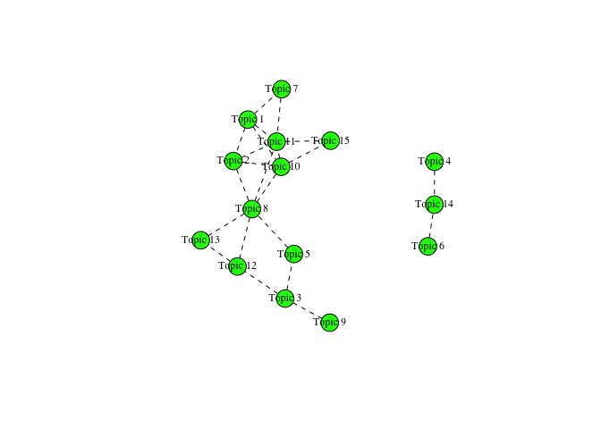<!-- -->

1.  Clusters and Connectivity
    - One large **dense cluster** connects Topics 1, 2, 5, 7, 8, 10, 13,
      and 15. This suggests these topics are often discussed together —
      potentially reflecting a shared theme or narrative thread.
    - A separate cluster (Topics 4, 6, 14) is more isolated — indicating
      a more **self-contained discourse**.
2.  Central Nodes
    - **Topic 8** and **Topic 10** are highly connected. These are
      likely general themes that overlap with many others.
    - Such nodes are often **good starting points** for identifying core
      discourses in the dataset.
3.  Peripheral Topics
    - Topics like **Topic 6** or **Topic 9** are more disconnected,
      implying they represent **niche** or **specific** themes that
      don’t often mix with the broader conversation.

------------------------------------------------------------------------

#### 6.3 Estimating Covariate Effect

In our case our covariate in our model was year

``` r
prep_k15 <- estimateEffect(1:15 ~ year, stm_k15, meta = meta, uncertainty = "Global")
summary(prep_k15)
```

    ## 
    ## Call:
    ## estimateEffect(formula = 1:15 ~ year, stmobj = stm_k15, metadata = meta, 
    ##     uncertainty = "Global")
    ## 
    ## 
    ## Topic 1:
    ## 
    ## Coefficients:
    ##              Estimate Std. Error t value Pr(>|t|)    
    ## (Intercept)  0.052291   0.003600  14.527  < 2e-16 ***
    ## year2022    -0.023758   0.003965  -5.993 2.10e-09 ***
    ## year2023    -0.011743   0.004119  -2.851  0.00436 ** 
    ## year2024     0.036673   0.004638   7.907 2.78e-15 ***
    ## year2025    -0.001818   0.004294  -0.423  0.67198    
    ## ---
    ## Signif. codes:  0 '***' 0.001 '**' 0.01 '*' 0.05 '.' 0.1 ' ' 1
    ## 
    ## 
    ## Topic 2:
    ## 
    ## Coefficients:
    ##              Estimate Std. Error t value Pr(>|t|)    
    ## (Intercept)  0.022595   0.002665   8.478   <2e-16 ***
    ## year2022    -0.002853   0.003002  -0.950   0.3419    
    ## year2023     0.007016   0.002803   2.503   0.0123 *  
    ## year2024     0.007175   0.003228   2.223   0.0262 *  
    ## year2025    -0.006726   0.002976  -2.260   0.0238 *  
    ## ---
    ## Signif. codes:  0 '***' 0.001 '**' 0.01 '*' 0.05 '.' 0.1 ' ' 1
    ## 
    ## 
    ## Topic 3:
    ## 
    ## Coefficients:
    ##             Estimate Std. Error t value Pr(>|t|)    
    ## (Intercept) 0.063829   0.003681  17.339  < 2e-16 ***
    ## year2022    0.022839   0.004198   5.440 5.39e-08 ***
    ## year2023    0.069260   0.004431  15.630  < 2e-16 ***
    ## year2024    0.017098   0.004464   3.830 0.000128 ***
    ## year2025    0.004481   0.004238   1.057 0.290353    
    ## ---
    ## Signif. codes:  0 '***' 0.001 '**' 0.01 '*' 0.05 '.' 0.1 ' ' 1
    ## 
    ## 
    ## Topic 4:
    ## 
    ## Coefficients:
    ##              Estimate Std. Error t value Pr(>|t|)    
    ## (Intercept)  0.106415   0.004471  23.804  < 2e-16 ***
    ## year2022    -0.020497   0.005147  -3.983 6.85e-05 ***
    ## year2023    -0.003075   0.005287  -0.581   0.5609    
    ## year2024    -0.012783   0.005390  -2.371   0.0177 *  
    ## year2025     0.034873   0.005107   6.829 8.85e-12 ***
    ## ---
    ## Signif. codes:  0 '***' 0.001 '**' 0.01 '*' 0.05 '.' 0.1 ' ' 1
    ## 
    ## 
    ## Topic 5:
    ## 
    ## Coefficients:
    ##              Estimate Std. Error t value Pr(>|t|)    
    ## (Intercept)  0.109260   0.003855  28.341  < 2e-16 ***
    ## year2022     0.048764   0.004444  10.973  < 2e-16 ***
    ## year2023     0.033874   0.004411   7.679 1.68e-14 ***
    ## year2024    -0.024276   0.004703  -5.162 2.47e-07 ***
    ## year2025    -0.009377   0.004550  -2.061   0.0393 *  
    ## ---
    ## Signif. codes:  0 '***' 0.001 '**' 0.01 '*' 0.05 '.' 0.1 ' ' 1
    ## 
    ## 
    ## Topic 6:
    ## 
    ## Coefficients:
    ##              Estimate Std. Error t value Pr(>|t|)    
    ## (Intercept)  0.069279   0.003710  18.676   <2e-16 ***
    ## year2022     0.010493   0.004200   2.499   0.0125 *  
    ## year2023    -0.007218   0.004183  -1.726   0.0844 .  
    ## year2024     0.043068   0.004608   9.346   <2e-16 ***
    ## year2025     0.065235   0.004321  15.096   <2e-16 ***
    ## ---
    ## Signif. codes:  0 '***' 0.001 '**' 0.01 '*' 0.05 '.' 0.1 ' ' 1
    ## 
    ## 
    ## Topic 7:
    ## 
    ## Coefficients:
    ##              Estimate Std. Error t value Pr(>|t|)    
    ## (Intercept)  0.119917   0.006168  19.440  < 2e-16 ***
    ## year2022    -0.062363   0.006671  -9.349  < 2e-16 ***
    ## year2023    -0.059231   0.006674  -8.874  < 2e-16 ***
    ## year2024    -0.050748   0.007152  -7.096 1.33e-12 ***
    ## year2025    -0.088929   0.006721 -13.231  < 2e-16 ***
    ## ---
    ## Signif. codes:  0 '***' 0.001 '**' 0.01 '*' 0.05 '.' 0.1 ' ' 1
    ## 
    ## 
    ## Topic 8:
    ## 
    ## Coefficients:
    ##              Estimate Std. Error t value Pr(>|t|)    
    ## (Intercept)  0.103657   0.004403  23.542  < 2e-16 ***
    ## year2022    -0.019319   0.004807  -4.019 5.87e-05 ***
    ## year2023    -0.024070   0.005058  -4.759 1.96e-06 ***
    ## year2024    -0.042127   0.004852  -8.682  < 2e-16 ***
    ## year2025    -0.036919   0.004812  -7.672 1.77e-14 ***
    ## ---
    ## Signif. codes:  0 '***' 0.001 '**' 0.01 '*' 0.05 '.' 0.1 ' ' 1
    ## 
    ## 
    ## Topic 9:
    ## 
    ## Coefficients:
    ##              Estimate Std. Error t value Pr(>|t|)    
    ## (Intercept)  0.061700   0.003986  15.481  < 2e-16 ***
    ## year2022     0.051263   0.004501  11.388  < 2e-16 ***
    ## year2023     0.052430   0.004590  11.423  < 2e-16 ***
    ## year2024     0.014949   0.004905   3.047  0.00231 ** 
    ## year2025    -0.027752   0.004420  -6.279 3.49e-10 ***
    ## ---
    ## Signif. codes:  0 '***' 0.001 '**' 0.01 '*' 0.05 '.' 0.1 ' ' 1
    ## 
    ## 
    ## Topic 10:
    ## 
    ## Coefficients:
    ##               Estimate Std. Error t value Pr(>|t|)    
    ## (Intercept)  0.0154935  0.0018772   8.254   <2e-16 ***
    ## year2022    -0.0038526  0.0020738  -1.858   0.0632 .  
    ## year2023    -0.0027973  0.0019869  -1.408   0.1592    
    ## year2024     0.0001919  0.0022493   0.085   0.9320    
    ## year2025    -0.0015392  0.0020755  -0.742   0.4583    
    ## ---
    ## Signif. codes:  0 '***' 0.001 '**' 0.01 '*' 0.05 '.' 0.1 ' ' 1
    ## 
    ## 
    ## Topic 11:
    ## 
    ## Coefficients:
    ##              Estimate Std. Error t value Pr(>|t|)    
    ## (Intercept)  0.025982   0.001964  13.229  < 2e-16 ***
    ## year2022    -0.008733   0.002249  -3.884 0.000103 ***
    ## year2023    -0.009771   0.002246  -4.350 1.37e-05 ***
    ## year2024    -0.008743   0.002470  -3.539 0.000402 ***
    ## year2025    -0.013921   0.002112  -6.591 4.49e-11 ***
    ## ---
    ## Signif. codes:  0 '***' 0.001 '**' 0.01 '*' 0.05 '.' 0.1 ' ' 1
    ## 
    ## 
    ## Topic 12:
    ## 
    ## Coefficients:
    ##              Estimate Std. Error t value Pr(>|t|)    
    ## (Intercept)  0.030821   0.002322  13.276  < 2e-16 ***
    ## year2022    -0.016932   0.002536  -6.678 2.50e-11 ***
    ## year2023    -0.017124   0.002669  -6.416 1.43e-10 ***
    ## year2024    -0.013002   0.002649  -4.908 9.26e-07 ***
    ## year2025     0.010956   0.002677   4.092 4.30e-05 ***
    ## ---
    ## Signif. codes:  0 '***' 0.001 '**' 0.01 '*' 0.05 '.' 0.1 ' ' 1
    ## 
    ## 
    ## Topic 13:
    ## 
    ## Coefficients:
    ##              Estimate Std. Error t value Pr(>|t|)    
    ## (Intercept)  0.023982   0.001471  16.303   <2e-16 ***
    ## year2022    -0.013925   0.001509  -9.229   <2e-16 ***
    ## year2023    -0.013606   0.001504  -9.049   <2e-16 ***
    ## year2024    -0.013156   0.001564  -8.409   <2e-16 ***
    ## year2025    -0.014886   0.001574  -9.458   <2e-16 ***
    ## ---
    ## Signif. codes:  0 '***' 0.001 '**' 0.01 '*' 0.05 '.' 0.1 ' ' 1
    ## 
    ## 
    ## Topic 14:
    ## 
    ## Coefficients:
    ##              Estimate Std. Error t value Pr(>|t|)    
    ## (Intercept)  0.176957   0.004744  37.304  < 2e-16 ***
    ## year2022     0.040274   0.005470   7.363 1.87e-13 ***
    ## year2023    -0.010713   0.005550  -1.930   0.0536 .  
    ## year2024     0.048207   0.005601   8.608  < 2e-16 ***
    ## year2025     0.048024   0.005604   8.570  < 2e-16 ***
    ## ---
    ## Signif. codes:  0 '***' 0.001 '**' 0.01 '*' 0.05 '.' 0.1 ' ' 1
    ## 
    ## 
    ## Topic 15:
    ## 
    ## Coefficients:
    ##              Estimate Std. Error t value Pr(>|t|)    
    ## (Intercept)  0.017833   0.002718   6.561 5.48e-11 ***
    ## year2022    -0.001374   0.002987  -0.460    0.646    
    ## year2023    -0.003422   0.003016  -1.134    0.257    
    ## year2024    -0.002496   0.003144  -0.794    0.427    
    ## year2025     0.038288   0.003088  12.400  < 2e-16 ***
    ## ---
    ## Signif. codes:  0 '***' 0.001 '**' 0.01 '*' 0.05 '.' 0.1 ' ' 1

To plot it in ggplot we need to create a dataframe

``` r
eff_summary <- summary(prep_k15, topics = 1) # getting the summary
eff_df <- as.data.frame(eff_summary$tables[[1]]) #getting the first item of the list
eff_df$year <- rownames(eff_df) #making the year into a column

ggplot(eff_df, aes(x = year, y = Estimate)) +
  geom_col(fill = "#619CFF") +
  geom_errorbar(aes(ymin = Estimate - 1.96 * `Std. Error`, 
                    ymax = Estimate + 1.96 * `Std. Error`), 
                width = 0.2) +
  geom_hline(yintercept = 0, linetype = "dashed", color = "gray40") +
  labs(title = "Effect of Year on Topic 1 Prevalence",
       x = "Year",
       y = "Estimated Effect") +
  theme_minimal()
```

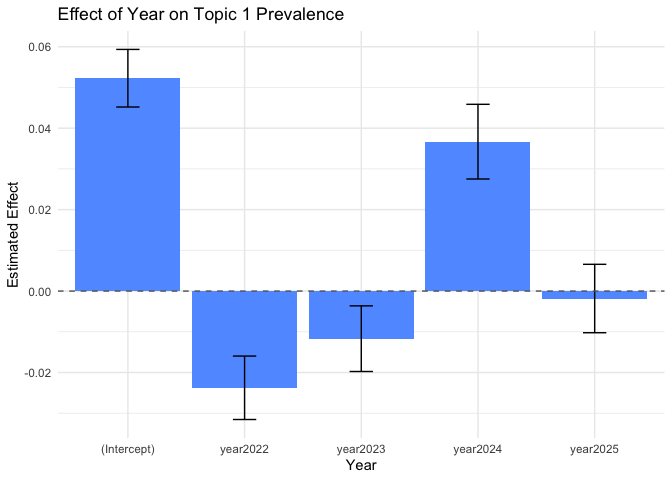<!-- -->

- The bar chart shows how the prevalence of Topic 1 changes across
  different years, relative to the baseline (Intercept).
- The values represent expected differences in topic proportion across
  years, as estimated by STM’s `estimateEffect()` function.

How to interpret this:

- **(Intercept)**: The baseline prevalence of Topic 1 (corresponds to
  the first year in your dataframe (check from the factor)). The
  estimated effect is **positive and significant**.

- **year2022**: Topic 1 became **less prevalent** compared to the
  baseline. The **negative estimate** with confidence intervals not
  crossing 0 suggests this difference is **statistically significant**.

- **year2023**: Topic 1 remained **less prevalent** than baseline, but
  the estimate is **closer to zero**, and the CI overlaps with 0 — the
  effect may **not be significant**.

- **year2024**: Topic 1 sees a **resurgence** with a positive effect —
  and the confidence interval suggests this **could be significant**.

- **year2025**: The effect is **minimal and not significant** (near
  zero, CI includes 0).

------------------------------------------------------------------------

## Class Exercises

Use the white lotus data, 1. Fit an LDA model with 10 topics using
`topicmodels::LDA`.

2.  Fit an STM model with 10 topics using `stm::stm` and include a
    metadata variable (e.g., `year`).

3.  Use `tidytext::tidy()` to extract top words (`beta`) from both
    models.

4.  Plot top 5 words per topic using `ggplot2::geom_col()`.

5.  **LDA vs STM**: Compare the top words and documents between the LDA
    and STM models. What are the key differences in terms of topics and
    themes?

6.  Extract per-document topic probabilities (`gamma`) for both models.

    - For LDA: use `tidy(lda_model, matrix = "gamma")`
    - For STM: use
      `tidy(stm_model, matrix = "gamma", document_names = meta$post_index)`

7.  Join with metadata (e.g., `year`, `source`) and visualize:

    - Plot how topic proportions vary over time using
      `facet_wrap(~ topic)`
    - Which topics vary most by year?

- Are topic trends consistent across models?

6.  **Interpretation**: What do the top words and documents suggest
    about the underlying themes in the White Lotus dataset?

------------------------------------------------------------------------

## Lecture 9 Cheat Sheet

## 🧾 Topic Modeling Cheatsheet (LDA + STM)

| **Function / Concept** | **Description** | **Code Example** |
|----|----|----|
| `unnest_tokens()` | Tokenizes text into individual words. | `tokens <- data |> unnest_tokens(word, text)` |
| `anti_join(stop_words)` | Removes common stopwords. | `tokens <- tokens |> anti_join(stop_words)` |
| `cast_dtm()` | Converts tidy text to Document-Term Matrix. | `dtm <- tokens |> count(doc_id, word) |> cast_dtm(doc_id, word, n)` |
| `LDA()` | Fits Latent Dirichlet Allocation model. | `lda_model <- LDA(dtm, k = 20)` |
| `tidy(matrix = "beta")` | Word-topic probabilities for LDA or STM. | `beta <- tidy(lda_model, matrix = "beta")` |
| `tidy(matrix = "gamma")` | Document-topic proportions. | `gamma <- tidy(stm_model, matrix = "gamma", document_names = meta$post_index)` |
| `ggplot() + facet_wrap()` | Visualizes top words per topic. | `top_terms |> ggplot(aes(beta, term)) + geom_col() + facet_wrap(~ topic)` |
| `FindTopicsNumber()` | Finds optimal number of LDA topics. | `FindTopicsNumber(dtm, topics = 5:30, metrics = c("Griffiths2004"))` |
| `textProcessor()` | Cleans and tokenizes text for STM. | `processed <- textProcessor(data$text, metadata = data)` |
| `prepDocuments()` | Prepares documents, vocab, metadata for STM. | `out <- prepDocuments(processed$documents, processed$vocab, processed$meta)` |
| `stm()` | Fits STM with or without metadata covariates. | `stm_model <- stm(documents, vocab, K = 15, prevalence = ~ year, data = meta)` |
| `labelTopics()` | Displays top words per STM topic. | `labelTopics(stm_model)` |
| `searchK()` | Evaluates STM model fit for multiple K. | `searchK(documents, vocab, K = c(5, 10, 15), data = meta)` |
| `stm_model$theta` | Accesses gamma (document-topic proportions). | `theta <- stm_model$theta` |
| `stm_model$beta` | Accesses log-prob topic-word matrix. | `beta_log <- stm_model$beta[[1]]; beta <- exp(as.matrix(beta_log))` |
| `estimateEffect()` | Estimates topic prevalence by metadata. | `eff <- estimateEffect(1:10 ~ year, stm_model, meta)` |
| `summary()` on `estimateEffect` | Extracts estimated effects and CIs. | `summary(eff, topics = 1)$tables$year |> as.data.frame()` |
| `ggplot() + geom_col()` | Plots estimated topic effects by group. | `ggplot(eff_df, aes(x = year, y = Estimate)) + geom_col()` |
| `topicCorr()` | Calculates topic-topic correlation network. | `tc <- topicCorr(stm_model); plot(tc)` |
| `setdiff()` | Finds dropped documents from preprocessing. | `setdiff(data3$post_index, meta$post_index)` |
